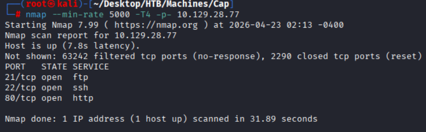
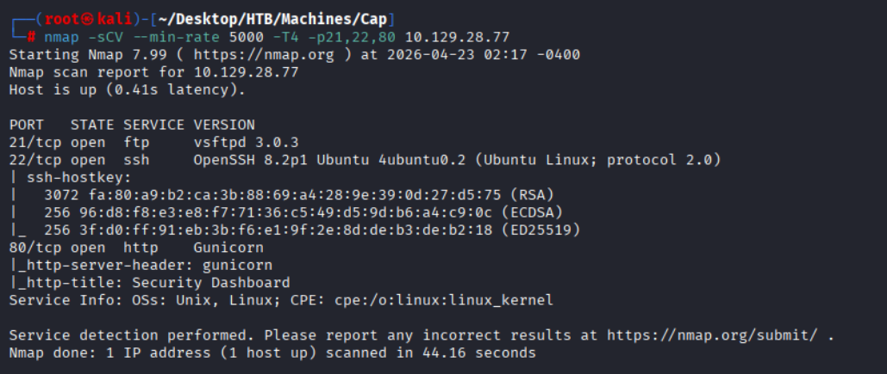
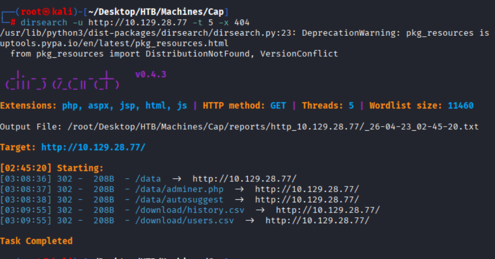
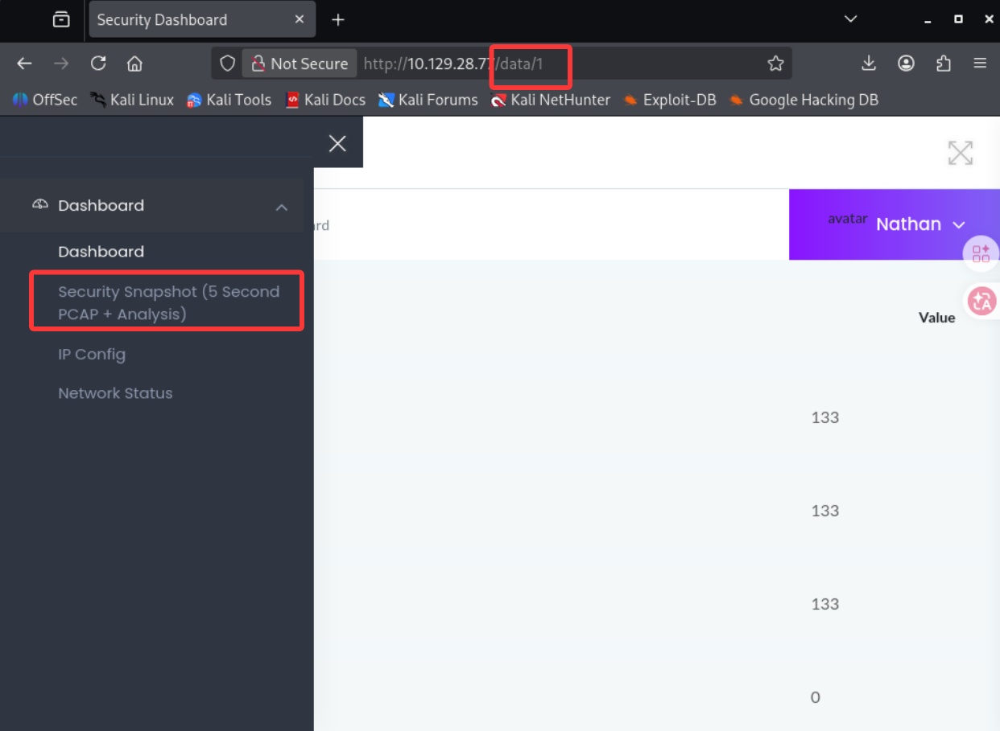
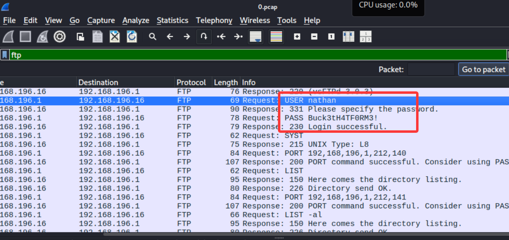
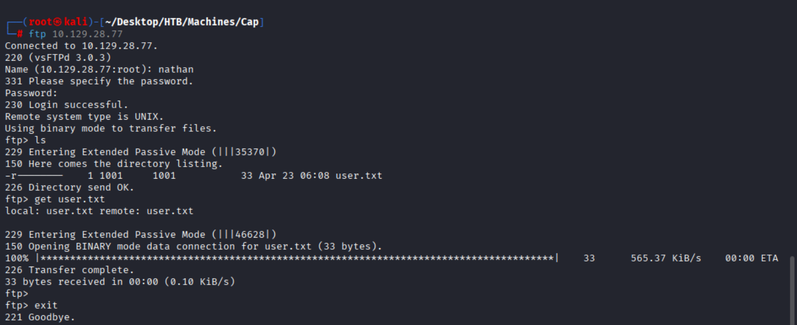
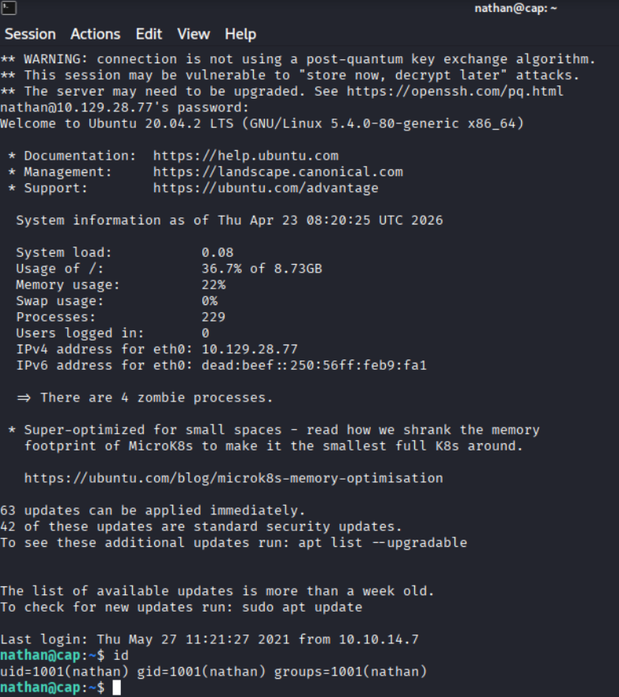
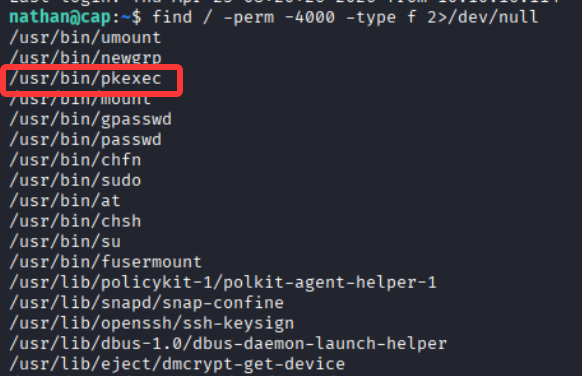
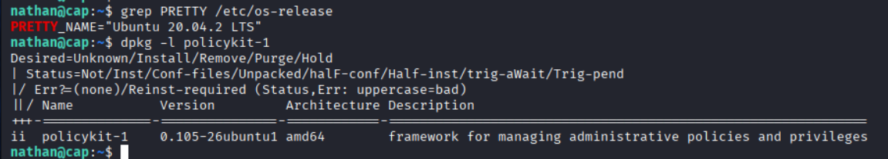
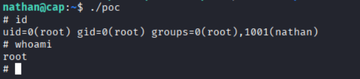

# HTB Machines Cap

## 信息收集

###　端口扫描

```bash
nmap --min-rate 5000 -T4 -p- 10.129.28.77
```



#### 详细扫描

```bash
nmap -sCV --min-rate 5000 -T4 -p21,22,80 10.129.28.77
```



### 目录扫描

```bash
dirsearch -u http://10.129.28.77
```



### Website

访问`http://10.129.28.77`其中**Security Snapshot**的路径值得我们注意



遍历`/data/id`后发现有**0**、**1**和**2**

其中**0**的数据包泄露凭证`nathan:Buck3tH4TF0RM3!`



### FTP



## nathan

### SSH

凭证复用`nathan:Buck3tH4TF0RM3!`



## root

### CVE-2021-4034 (Pkexec SUID LPE)


```bash
find / -perm -4000 -type f 2>/dev/null
```

需要注意的是`pkexec`具有SUID权限



---

[https://github.com/arthepsy/CVE-2021-4034](https://github.com/arthepsy/CVE-2021-4034)

- **CVE-2021-4034**
  - **漏洞描述**
    - 该漏洞潜伏于 Linux 核心组件 Polkit（原名 PolicyKit）的 pkexec 程序中长达十年之久，是一个经典的由于环境变量越界读取导致的本地提权（LPE）漏洞。
  - **利用条件**
    - pkexec 命令必须在 SUID 模式下运行。
    - 完整的tty权限
  - **影响范围**
    - Debain stretch policykit-1 < 0.105-18+deb9u2
    - Debain buster policykit-1 < 0.105-25+deb10u1
    - Debain bookworm, bullseye policykit-1 < 0.105-31.1
    - Ubuntu 21.10 (Impish Indri) policykit-1 < 0.105-31ubuntu0.1
    - Ubuntu 21.04 (Hirsute Hippo) policykit-1 Ignored (reached end-of-life)
    - Ubuntu 20.04 LTS (Focal Fossa) policykit-1 < 0.105-26ubuntu1.2
    - Ubuntu 18.04 LTS (Bionic Beaver) policykit-1 < 0.105-20ubuntu0.18.04.6
    - Ubuntu 16.04 ESM (Xenial Xerus) policykit-1 < 0.105-14.1ubuntu0.5+esm1
    - Ubuntu 14.04 ESM (Trusty Tahr) policykit-1 < 0.105-4ubuntu3.14.04.6+esm1
    - CentOS 6 polkit < polkit-0.96-11.el6_10.2 
    - CentOS 7 polkit < polkit-0.112-26.el7_9.1
    - CentOS 8.0 polkit < polkit-0.115-13.el8_5.1
    - CentOS 8.2 polkit < polkit-0.115-11.el8_2.2
    - CentOS 8.4 polkit < polkit-0.115-11.el8_4.2   

```bash
# 检查系统版本
grep PRETTY /etc/os-release
# 检查policykit版本
dpkg -l policykit-1
```

当前靶机在影响范围中



---

#### 提权

```bash
# 靶机内编译并执行poc
gcc poc.c -o poc
./poc
```

