# HTB Season8 Cobblestone WriteUp

## 1. 信息收集

### 1.1 端口扫描

```bash
nmap -sS -sV -O -A -T4 -p- 10.10.11.81
```

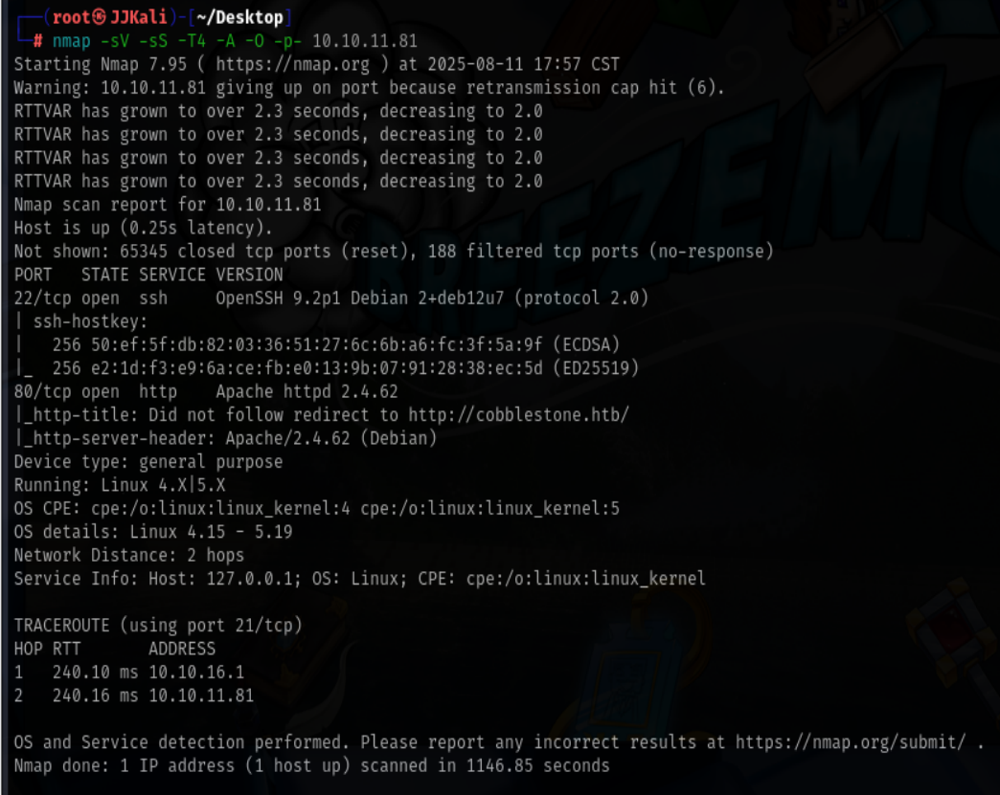

结果:

端口22：OpenSSH 9.2p1
端口80：Apache httpd 2.4.62

### 1.2 网站页面分析

#### 1.2.1 首页


访问10.10.11.81跳转至http://cobblestone.htb/
手动添加host域名解析

```
10.10.11.81 cobblestone.htb
```

访问http://cobblestone.htb/

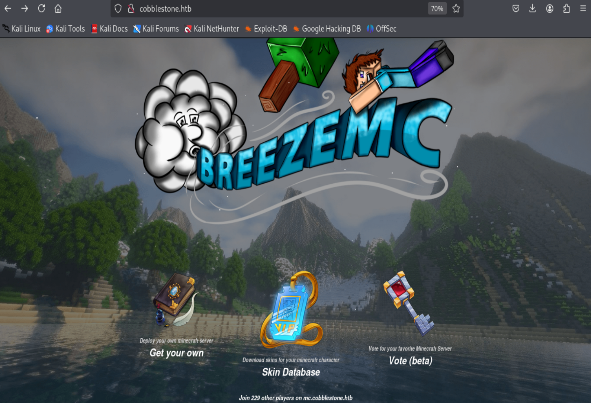

发现三个可以交互的图标和底部的新域名mc.cobblestone.htb

添加host域名解析

```
10.10.11.81 mc.cobblestone.htb
```

访问mc.cobblestone.htb后发现和cobblestone.htb的页面一模一样

#### 1.2.2 Get your own

尝试访问Get your own后得到一个新的域名deploy.cobblestone.htb

添加host域名解析

```
10.10.11.81 deploy.cobblestone.htb
```

访问deploy.cobblestone.htb得到网站团队的界面

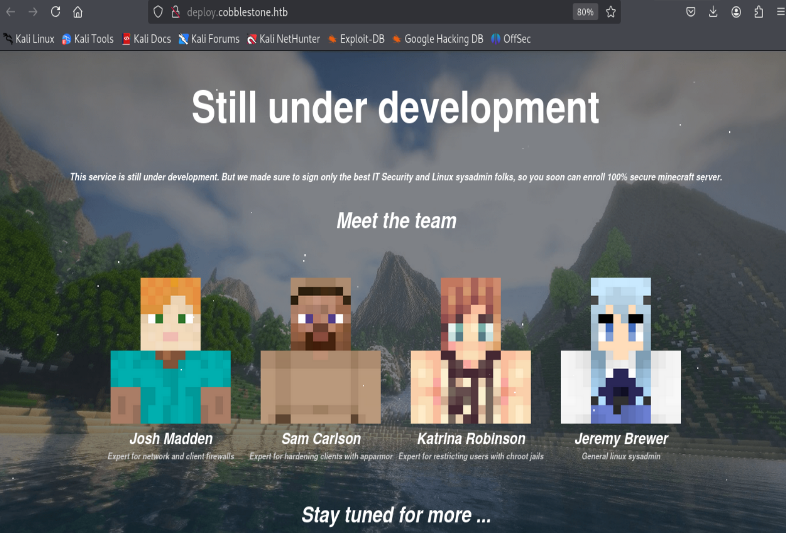

收集一下团队成员的名字,后面可能能用到

#### 1.2.3 Skin Database

尝试访问Skin Database后进入skins.php,不过需要登录,我们随便注册一个用户进入

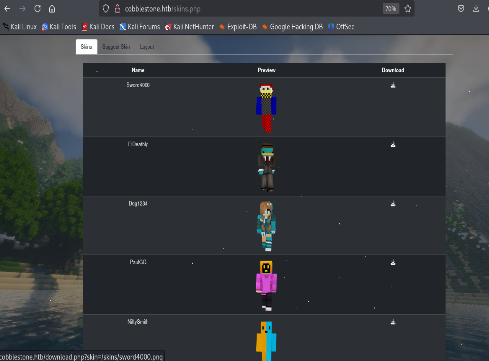

可以发现是通过get请求获取下载的路径参数,后续可以尝试修改get参数,看看是否能造成任意文件下载,还存在皮肤上传建议功能,上传数据可控并且回显提交至管理员,可能暂时存储于数据库,看看后续是否能造成sql注入

#### 1.2.4 Vote(bate)

尝试访问Vote(bate)后得到一个新的域名vote.cobblestone.htb

添加host域名解析

```
10.10.11.81 vote.cobblestone.htb
```

访问vote.cobblestone.htb后需要登录,使用上一个域名注册的用户发现不可行,这里推断应该是两个网站使用不同的数据库进行登录验证,注册登录后发现是一个投票页面,但是功能不完善,不能投票只能查看投票结果

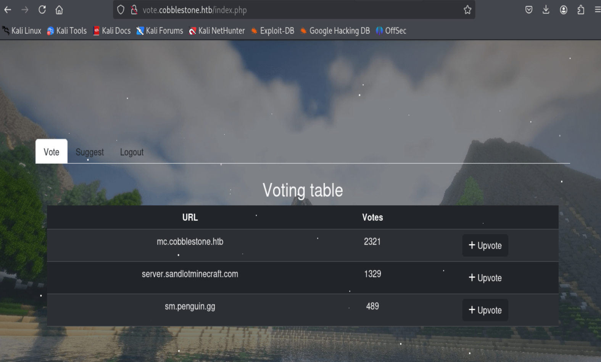

随机点击一个url后发现,url中包含了一个id参数,尝试修改id参数,发现可以回显不同url的投票结果,id参数可能存在sql注入，suggest界面可以添加url，输入url参数，可以回显对应url的添加结果，但是投票功能未实现，url可控可能存在sql注入


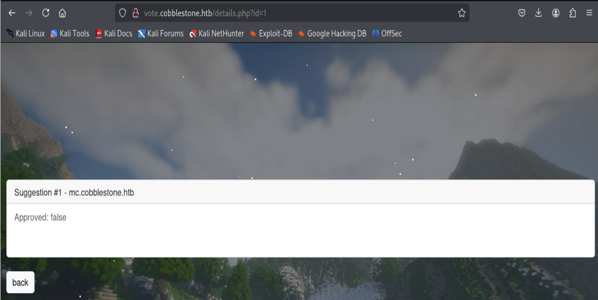

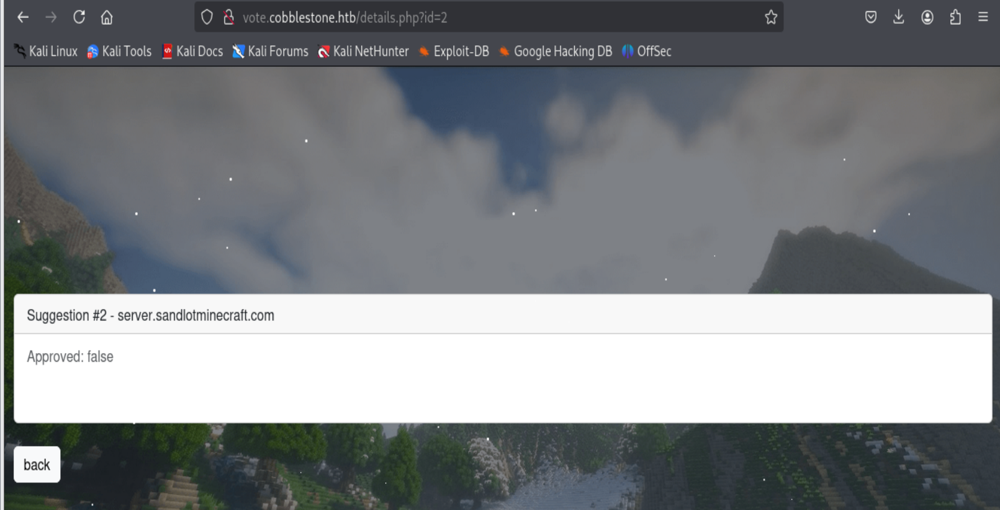

### 1.3 目录扫描

#### 1.3.1 首页扫描

```bash
dirbsearch -u 'http://cobblestone.htb'
```

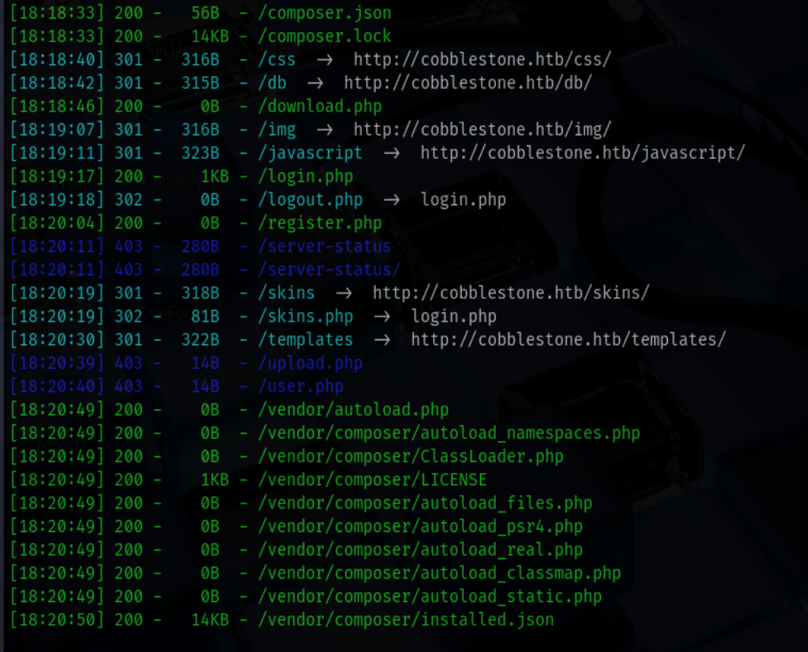

发现download.php用途应该是和skins.php联动下载皮肤
compose.lock中发现使用twig模板,版本为3.14,搜索该版本漏洞后发现可能存在模板注入，注入点可能存在vote界面,存在upload.php和user.php无权访问应该是管理员界面

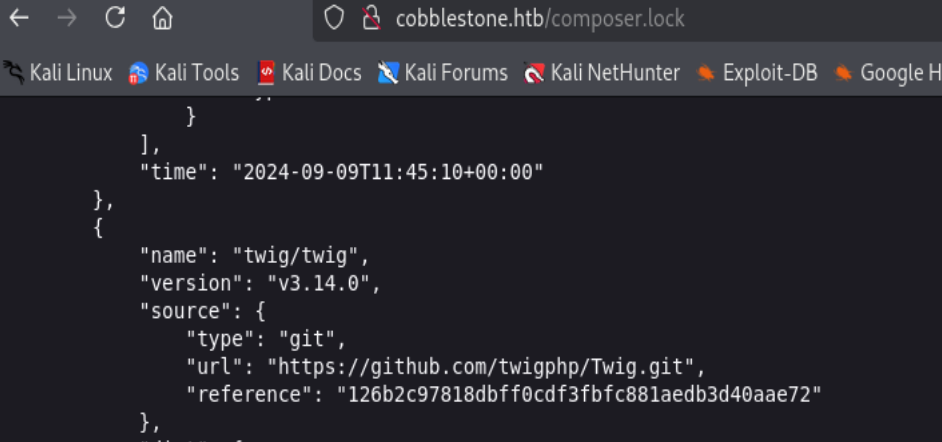

其余暂无发现可利用的途径

#### 1.3.2 Get your own与vote(bate)页面扫描

扫描结果和首页基本一致

## 2. 漏洞利用

### 2.1 模板注入

可以传参的点目前只有vote界面,尝试在vote界面注入payload,无果,暂时放放

### 2.2 sql注入

#### 2.2.1 vote界面

对id进行测试发现过滤严格注入无果，尝试对url进行测试，发现可以注入

抓post请求包,进行sqlmap测试

```bash
sqlmap -r 1.txt --dbs --batch
```

结果如下:

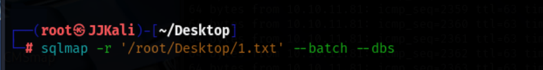

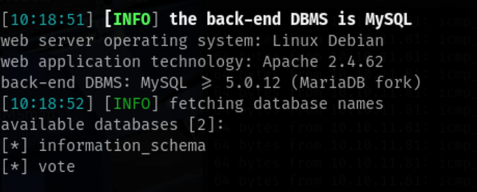

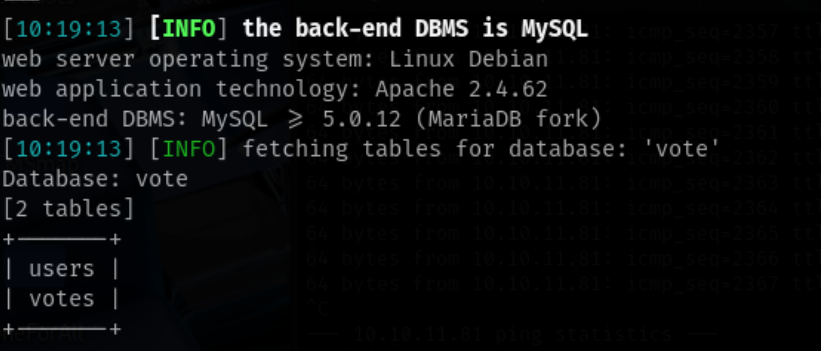

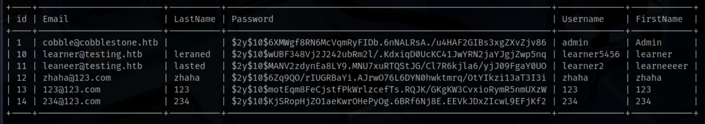

使用john爆破,爆破太漫长,先放着

```bash
john 1.txt rockyou.txt
```

#### 2.2.2 skin界面

对skin界面进行测试,无果

## 3. 查看他人writeup后总结

成功注入后，没有利用sqlmap进行数据库权限查询，导致漏了数据库的file权限，后续没有利用file权限进行提权，导致这次靶场的失利！！！


